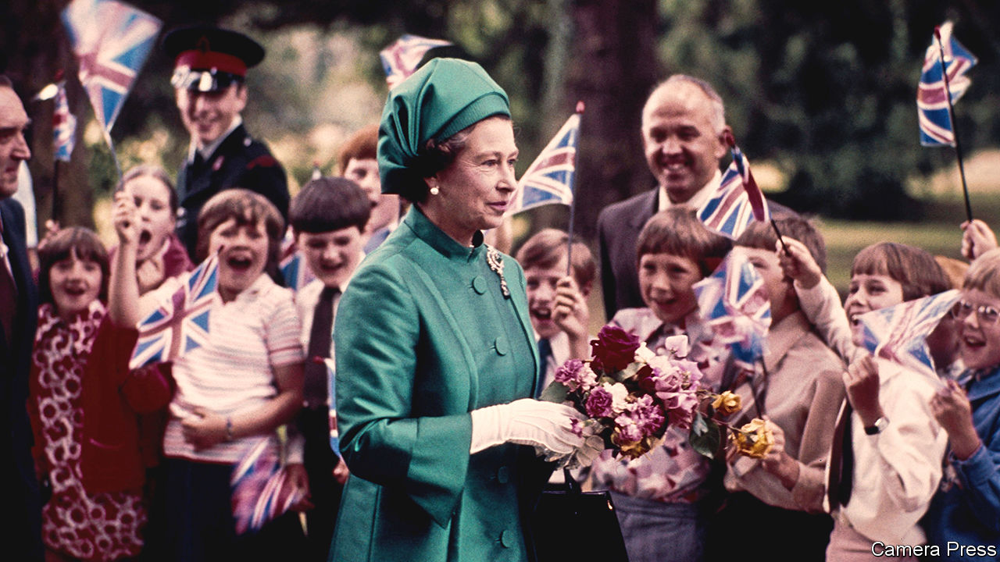

###### Another country

# How Britain has changed since Elizabeth II was crowned in 1953 

##### Fewer children, fewer coal miners, less cabbage 

 

> Sep 8th 2022 

Somewhere in britain, half a dozen people gathered at a farm to watch Queen Elizabeth II’s coronation on television. “It’s a tiring day for her. Two and a half hours in the abbey. It’s the whole day really,” said one. “I expect she packs herself up a couple of sandwiches,” commented another. Someone added: “I wish some of the ladies-in-waiting would trip over—give us a bit of fun.” Then: “They put a canopy over her when she’s anointed, that’s nice for her.”

This scene, which was recorded by an informant for Mass Observation (a kind of benign sociological spy network), could be a clip from “The Royle Family”, a 1990s sitcom in which people sit around watching tv, or a more recent variation, “Gogglebox”. In 1953, as today, British viewers could not help but focus on the most mundane matters—sandwiches and the canopy. They were snarky, though they stopped short of outright irreverence. In some ways they have not changed greatly since.


Their country, however, has been transformed. In 1953 Britons lived and worked in ways that seem as peculiar today as the late Victorians would have seemed to those watching the coronation on fuzzy black-and-white television screens. Because Britain has such good historical data, it is possible to see just how different it was (see charts on the next page).

The young queen ruled over a less populous, younger country. Of Britain’s 50.6m people in 1953, fully 21.6m were under the age of 30, and 8m were 60 or older—a ratio of 2.7 to one. Look at film from that era, and the hordes of children are as striking as the ubiquity of hats. The population has since grown, to more than 67m, and aged. The ratio of young to old is 1.4 to one and falling.

The queen had married at the age of 21 and given birth to her first child, Charles, at 22. In that she was fairly typical. In 1953, 65% of births were to women younger than 30, compared with 40% today. A mere 5% were outside marriage; today the proportion is 51%. But Elizabeth went on to have three more children, which made her unusual. The average woman born, like her, in 1926 had 2.2 children. Monarchs are wise to overdo it: English history is littered with examples of the havoc caused when the line of succession is unclear.

Elizabeth was also unusual in having a job, albeit a singular one. Women were 32% of the employed population in 1953; today, they are 48%. It was especially rare for a mother of young children to work outside her home. The 1951 census revealed that only about one in six did.

Her first public role, before the speech-giving began, was in the Auxiliary Territorial Service, where she learned to repair and drive ambulances and jeeps. And she spent much of her life in the company of current and former servicemen. In that sense, she was typical of her generation. In the coronation year the British government still expected men to do national service. That would continue for another decade. The armed forces sucked up an enormous share of state spending. In 1953-54, fully 9% of national income went on defence—one and a half times as much as on the National Health Service and public education combined.

A few foods, particularly meats and dairy products, were still subject to wartime rationing in 1953. And British diets were unremittingly stodgy. The average person—man, woman and child—ate 63 ounces (1.8kg) of fresh potatoes per week, almost five times as much as they do today. The second-most-important vegetable was cabbage. People got through six ounces of the stuff per week, six times more than modern Britons. Kitchens must have smelled sulphurous.

People may not have noticed that, because two other smells were everywhere. One was burning tobacco. Almost all men and many women smoked: a survey in 1951 found that 87% of male doctors over the age of 35 indulged. The other was burning coal. The rock powered Britain’s factories and trains, generated its electricity and heated its homes. In 1953 the country mined 230m tonnes—more than four tonnes per person. Fully 700,000 people worked in the coal industry. But by 2021 Britain hewed just 1m tonnes.


Britain has changed profoundly in a few ways that are not recorded. It was, for example, a much whiter country in 1953. But it is not known precisely how white, because the census did not ask about race until 1991. Less was known about people’s faith in the mid-20th century than is known today, although religion was much more important. Same-sex partnerships were shrouded in secrecy. 

In just a few ways, British society seems to be moving back to the patterns of 1953. Then divorces were rare: only 30,000 took place. The number rose relentlessly, peaking at just over 160,000 in 1992—the year that two of the queen’s children separated from their spouses. But divorce has become rarer again, probably largely because people hesitate to marry until they are pretty sure of their partner. These days the annual number of divorces hovers around 100,000. London’s population is about the same today as it was in the mid-20th century. In the interim it lost 2m people (as working-class people were moved out to suburban new towns) and then regained about the same number.

Elizabeth II’s seven decades on the throne set a record that seems unlikely to be surpassed. As a result, successive coronation-watchers may never again be so different. Barring dramatic social upheaval, or inventions that greatly prolong life, Britain will surely change less during the reigns of Charles III, William V or George VII than it did under Elizabeth II.■

