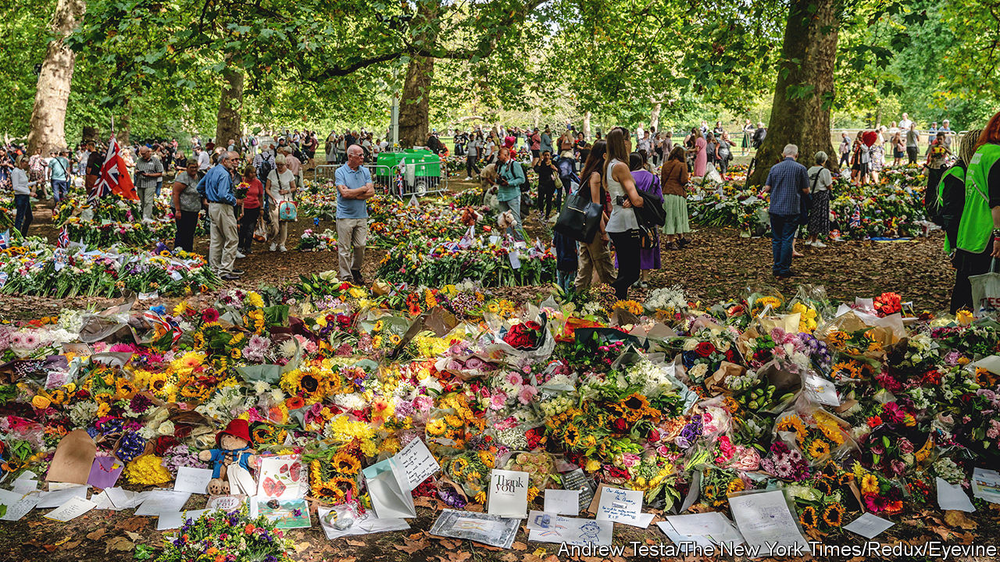

###### Of royals and sentiments

# How the death of Elizabeth II has affected Britain 

##### The crowds of mourners aren’t a good guide 

 

> Sep 14th 2022 

Half a dozen middle-aged and old women are loitering after the end of an Anglican church service in Steeple Bumpstead, a village in Essex. All of them are feeling rather shaky. They have just sung the national anthem, with the unfamiliar line “God save the king,” and it brought them up short. Besides, the  has changed Britain in some way, says Edna Jackson: “There’s something floating around in the ether that’s completely different.”

In Edinburgh and London, the machinery of  has clattered along, following plans worked out long before the queen’s death on September 8th. Amid much ceremony, her coffin has been transported to St Giles’ Cathedral in Edinburgh, then to Westminster Hall. Grieving Britons have arrived in London with flowers and food to sustain them as they queue to pay their respects. A few protesters have been unnecessarily hassled by the police. 

Britain can put on a good show. But the capital pomp matters less than the provincial mood. A monarchy stripped of almost all its powers is important less for what it does than for how it makes people feel. The essential thing is what floats around in the ether: the sentiments and understandings about the head of state that . Though strong now, these seem likely to weaken. 

In Steeple Bumpstead many people use exactly the same words when talking about the queen: “She’s always been there.” The queen was rather like an old-fashioned slide rule: a fixed object against which they position their own histories. As a young child, Sue Dare was dressed as a doll for the coronation in 1953, and won a prize. “She’s always been in my life,” she says. 

A 70-year reign provided many excuses for gatherings. During the Platinum Jubilee festivities in June the village put on a classic car show, Morris dancers, a procession, a blazing beacon, live music, a scarecrow competition and much cake—an impressive schedule for a settlement of fewer than 2,000 people. At such events, opinions about the monarchy are almost irrelevant. Kerry Barnes, chairman of the parish council, says the point was less to celebrate the monarch than to bring people together: “I don’t want to give the impression that we’re a bunch of royalists here.” 

The queen connected Britons from very different backgrounds. Beverly Lindsay, a businesswoman and deputy lieutenant of the West Midlands (an honorary position), was taught to speak “the queen’s English” as a child in Jamaica. She describes Elizabeth II as a glue holding Britain together. Joan Hunter, who also grew up in Jamaica, took comfort from the queen’s televised speech during the covid-19 lockdown in 2020. On September 9th she brought flowers and a Jamaican flag to St Philip’s Cathedral in Birmingham.

The messy, bloody process of decolonisation continued into Elizabeth II’s reign. But Ms Lindsay and Ms Hunter argue that she helped to reset the relationship with Commonwealth countries like Jamaica (which became independent in 1962). For post-war migrants, the queen’s evident devotion to the Commonwealth was helpful because it implicitly informed white Britons why they had come to the country. They were not mere immigrants seeking jobs, but members of a community moving within a union. 

Heaven Crawley of the un University Centre for Policy Research, a think-tank, finds that the monarchy is one of the few things that asylum-seekers tend to know about Britain (football is another). Royal tours can linger in immigrants’ minds long after Britons forget about them. At a mosque in Birmingham, a Sudanese man who arrived in Britain 15 years ago says he felt well disposed towards the queen because she visited Sudan. That was in 1965, when he was a baby. 

The queen also helped bind the countries of the United Kingdom. “Scotland was special to her and she was special to Scotland,” declared Nicola Sturgeon, the country’s first minister. During the campaign for Scottish independence in 2014, the Scottish National Party that Ms Sturgeon now leads said that the queen could remain head of state if Scotland left the uk. But many snp members (and indeed about two in five Scots) are republicans, and this position might change. “Once things have settled, it may be the time is right for the party to discuss whether a monarchy would be best for an independent Scotland,” says one of Ms Sturgeon’s colleagues, delicately. 

Only about a quarter of all Britons are republicans. Young people are far less fervent in their support for the monarchy than others—the British Social Attitudes Survey found in 2021 that 14% of 18- to 34-year-olds thought it was very important for the country to have one, compared with 44% of people aged 55 or older. But people seem to become keener on royals as they age. It is worth remembering that middle-aged and old Britons once listened to anti-royal songs by the Sex Pistols, the Smiths and the Stone Roses. 

It seems unlikely that a majority of Britons will soon conclude that the monarchy should be abolished. But they may pour less affection into the monarch. Charles III, who is 73, will struggle to connect with as many people as Elizabeth II did, simply because he has less time. In 2018 YouGov, a pollster, found that 31% of people (and 49% of over-64s) had seen the queen in person, against 16% for him. 

Anabelle Byron, a student who is rehearsing with her k-pop group near Birmingham Central Library, thinks of the queen almost as a pop-culture figure. She was amused by a video made for the Platinum Jubilee which featured the queen and Paddington, a talking animated bear. (Others have evoked the same video by bringing jars of marmalade to commemorations of the queen, to the authorities’ distress.) Ms Byron is not opposed to the monarchy. She just finds it uninteresting now that the queen is gone. 

Others have sharper views. In Steeple Bumpstead, Kathleen and Peter Anderson have laid flowers from their garden at a memorial for the queen. “We’re quite big royalists,” says Mrs Anderson. She goes on to explain that she cannot forgive Charles for his treatment of Diana, his first wife, and would not have been distressed if the crown had bypassed him. 

The  has made a strong start. Three-fifths of Britons saw or heard Charles III’s first televised speech, in which he pledged to serve the country and said that he would have less time to devote to his charities and causes—a nod to his famously opinionated past. Of those hearing the speech, 94% approved. That Britons need to judge a monarch’s performance at all is something of a novelty, however. He has not always been there. ■

