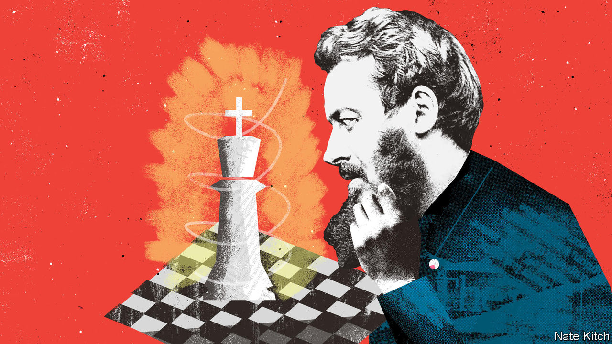

###### Bagehot

# The monarchy’s secret weapon: insincerity 

##### What would Walter Bagehot think? 

 

> Sep 14th 2022 

“King’s body guard! Slow march!” Like a deck of cards come to life, the Yeomen of the Guard slowly entered Westminster Hall. Two by two they shuffled into the 12th-century building at precisely 10.03am, just as the schedule demanded, medals jangling with each step. On each side of the room, mps, cabinet ministers, lords, journalists (including your correspondent), clerks and flunkies watched them go. A blare of trumpets signalled the arrival of King Charles III, who walked briskly and took a seat on a throne, next to his wife, Camilla, the queen consort.

On September 12th, on the steps of Westminster Hall, a tableau of the British constitution was set out in all its glorious absurdity. On the left side sat the House of Lords, an unelected chamber, complete with its Speaker wearing dark robes and gold braid. To the right, the House of Commons, their elected comrades. In the middle, but figuratively above, sat the new monarch. 

It was a scene that Walter Bagehot, a former editor of this newspaper, would have recognised. His short text, “The English Constitution”, has proved one of the most enduring on the topic. Writing about the constitution is tricky. “The difficulty is that the object is in constant change,” wrote Bagehot. The constitution that Bagehot first described in 1865 was completely superseded by 1922, never mind the realities of 2022. The constitution is a moving target. But Bagehot still hits more often than he misses. 

Bagehot was a pragmatist more than a monarchist. He knew the mix of monarchy, aristocracy and democracy was not a universal template. But it worked for Britain. “Yesterday’s institutions are by far the best for today,” he wrote. “They are the most ready, the most influential, the most easy to get obeyed.” Countries benefiting from a fresh start, whether America or France, could afford to think of things from first principles. Britain had no such luck. The British constitution is broke, runs the logic, so don’t fix it.

King Charles would do well to reread him. It is, argued Bagehot, the job of the monarch to be boring and, even better, slightly thick. Prince Charles was far too interesting. He wrote a peculiar book of political philosophy that hailed sacred geometry, the red squirrel, Islamic art and Malthusianism and attacked modern architecture, the scientific revolution and the concept of gdp. King Charles had best learn to keep schtum.

Bagehot argued that the monarchy needed mystique. “Its mystery is its life,” he wrote, in possibly his most famous sentence. “We must not let in daylight upon magic.” This is advice King Charles has shunned. He allowed cameras into the accession council, where he made his oaths in front of former prime ministers and a Facebook employee in the shape of Sir Nick Clegg, a former deputy prime minister. The upside was transparency. The downside is that the new monarch has already had two public hissy fits involving malfunctioning pens, which have gone viral. 

Pomp has replaced power, as Bagehot predicted. “The more democratic we get, the more we shall get to like state and show, which have ever pleased the vulgar,” he wrote. When monarchs meddled, coronations and royal funerals were moments of recrimination and farce, argued David Cannadine, a historian. In 1830, the  began its obituary of George IV: “There never was an individual less regretted by his fellow creatures than this deceased king.” Victoria’s coronation was so haphazard that people talked throughout it, the officiants lost their place and the Archbishop of Canterbury attempted to put a ring on the wrong regal finger. By contrast, Elizabeth II’s death has been a mark of constitutional efficiency, coupled with Pravda-esque praise from the press and, at times, odd responses from her subjects. (One woman claimed she had been to see the deceased queen’s coffin in Edinburgh seven times.)

Gentle affection for the monarch is as deep as thinking runs on the topic. A strength of the constitution was that it had, in Bagehot’s words, “a comprehensible element for the vacant many, as well as complex laws and notions for the inquiring few”. Bagehot was not an enthusiastic democrat. Yet monarchy evolved from a showpiece for the “vacant many” into an apolitical symbol of the nation in its democratic era. A lack of political imagination keeps it there. Britons are disturbed by the thought of an elected head of state, as in America or France. The alternative of an elected but still apolitical president, as in Ireland, is overlooked.

Dignified and efficient

At heart, Bagehot argued, monarchy is mild deceit. “The coexistence of a queen’s seeming prerogative and a Downing Street’s real government is just suited to such a country as this, in such an age as ours,” he wrote. It still is. Such irony is a pressure valve. Frankness is fatal for a monarchy, when such an idea is absurd from first principles. Heavy-handed policing of protests against the monarchy have done more harm to the institution than good. Monarchy works better with a wink, not a snarl. 

And so it leads to a scene where Sir Lindsay Hoyle, the Speaker of the House of Commons, can happily joke in front of the new king about James II being dethroned in 1688. “It is perhaps very British to celebrate revolutions by presenting an address to [a monarch]. But those revolutions led to our constitutional freedoms, set out the foundation for a stable monarchy, which protects liberty.” Charles grinned and bore it. As well he should. Beneath his feet lurked a plaque reminding him that the first of his name was found guilty of treason at that spot, before being executed just down the street. 

After a rendition of “God Save the King”, the king left, with the people who actually ran the country bowing and scraping as he went. “Our constitution is full of curious oddities, which are impeding and mischievous, and ought to be struck out,” wrote Bagehot. What was true in the 19th century is just as true today. Most likely, it will still be true tomorrow. ■


