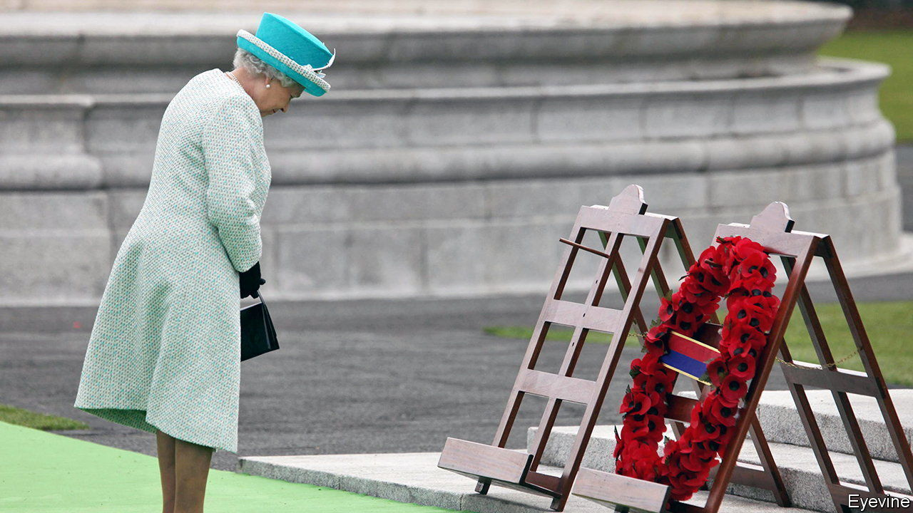

###### Nationalism, unionism and royalty

# The queen helped effect a change in Anglo-Irish relations 

##### Things got off to a bad start 

 

> Sep 15th 2022 

In june an opinion poll for the , an Irish newspaper, revealed that Queen Elizabeth II was more popular than any Irish political leader. The founders of the republic would have been astonished. But the queen did much to improve relations between Britain and Ireland, and between nationalists and unionists in Northern Ireland. 

In 1979 the Irish Republican Army killed Lord Mountbatten (Prince Philip’s uncle) and three others with a bomb. In 1977 Sinn Féin, the ira’s political arm, denounced as psychological imperialism a decision to close schools in the Northern Ireland city of Derry for the queen’s Silver Jubilee. In 2011 the party boycotted her visit to Ireland—the first by a British monarch since independence in 1921. 

Five words spoken during that visit began to melt centuries of animosity. At a state banquet in Dublin Castle, once the seat of British rule in Ireland, the queen began: “A Uachtaráin agus a chairde”, Irish for ”President and friends”. Speaking a few words in the native tongue did not seem twee in Ireland, as it might elsewhere. The Irish language was repressed by the British and remains contentious with unionists in Northern Ireland. The queen proceeded to bow at a memorial to the Irishmen who fought her grandfather’s soldiers. 

Sinn Féin realised it was out of touch with the public mood. A year later the former ira commander Martin McGuinness, then deputy first minister of Northern Ireland, shook hands with the queen. After her death, nationalist leaders offered condolences and praised her efforts for peace. Coarser sentiments welled up elsewhere: at a football match in Dublin and a pub in County Down (in the North), the queen’s death was followed by raucous chants of “Lizzie’s in a box”. But such behaviour is now at the fringes of respectable society. 

Meanwhile, in the loyalist Shankill Road in Belfast, locals laid a sea of flowers beneath a gable mural honouring the queen. The British connection, embodied by the monarch, is at the core of their identity. After a series of political blows to unionism and growing talk of Irish unity, losing a head of state who was immovable for 70 years is unnerving.

When members of the Stormont Assembly paid tribute to the queen, a subtle division remained. Unionist leaders pledged their loyalty to King Charles III; nationalists did not. And nationalists’ warm words for the queen could be seen as part of a campaign to convince unionists to support Irish unity with the implicit promise that their British identity will be incorporated into a new state. Still, a display of unity and respect is much better than its opposite. 

