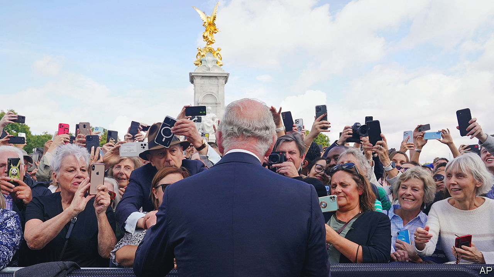

###### The new monarch

# What sort of king will Charles III be? 

##### Early signs indicate that he intends to model his reign on his mother’s 

 

> Sep 15th 2022 

He came to praise his mother—and to bury suspicions. On September 9th King Charles III gave his first public speech as monarch. Explicitly, it honoured the queen—“my darling mama”—for her dedication, service and duty. Implicitly, it answered questions about what kind of king he is going to be and spoke, quietly, to some of the many criticisms levelled at him while he was heir apparent.

The man who is now called king has long seemed uneasy about, perhaps even unsuited to, the job that 73 years ago he was born to do. Charles once described the realisation that he was going to become king as dawning with “the most ghastly, inexorable sense”. Others echoed his doubts: Princess Diana, his first wife, said the role of king would be “suffocating”. The British people seemed to share this cool appraisal of him. A poll carried out in May 2022 put his popularity rating at 54%, far below the late queen’s at 81%.

Little of this is unusual. Transitions from one monarch to the next are, as Tracy Borman, a royal historian, has pointed out, notoriously uneasy moments. Henry VII’s courtiers so feared his death would lead to the downfall of the Tudors that they hid his body in his rooms and brought his corpse meals for two days. When Elizabeth II came to the throne she was derided as a “priggish schoolgirl”, while her coronation was dismissed by John Osborne, an angry young playwright, as a “gold filling in a mouthful of decay”. Will her reign, asked the —not known for doubts about the monarchy—“be a flop?” Both the Tudors and Elizabeth II survived. 

And if Charles did view his new role with dread he is not alone. Few modern monarchs, even those who , have regarded their task with enthusiasm. That is not unreasonable. The role of king or queen is hard, its duration long (death or abdication offer the only possible exits) and its form ill defined. The closest thing to a monarchical handbook that exists is a century and a half old: Walter Bagehot’s “”. It advises monarchs in broad but authoritative strokes: they must be decorative; they must guard their privacy closely; they must know their constitutional place. On the last two points, Charles has repeatedly given cause for anxiety. 

Whereas his mother was scrupulously neutral, Charles has not been. In his “black spider” memos (letters written to politicians in his scrawling script) and in his speeches Charles has spoken out about everything from the “carbuncles” of modern architecture to the culling of badgers. He lobbied Tony Blair over fox-hunting, which Sir Tony’s government banned but Charles wanted to preserve. His absence from a state banquet for China in 2015 was noted, and considered pointed. These things did not look like regal impartiality. They looked, to many, like overstepping. 

And there has been little privacy: during Charles’s long period as heir, daylight was let in not merely on the magic but also on the mess. His miserable schooldays are public knowledge; his disastrous marriage to Diana is known in unsparing detail. His emotions have been similarly ill-concealed—they still are. Mere days into his reign, a camera caught him losing his temper over a “bloody” leaking pen. 

The national mood, for the moment, feels forgiving: a recent YouGov poll showed that those who think he will do a good job has doubled from 32% in May to 63% since his mother’s death. Her reign may have been untarnished, but clearly new kings cannot be as easily minted as their coins can. As Edward VIII wrote: “Heirs apparent cannot be stamped out of sheet metal.” Charles is clearly trying: in his first speech as king he strongly implied that his aim would be to replicate Elizabeth’s style rather than deviate from it. 

That includes matters of religion. Each British monarch bears the title “Defender of the Faith”, meaning of the Anglican variety: the monarch is the Supreme Governor of the Church of England. In 1994 Charles, who has long shown interest in numerous other religions, including Islam and Greek Orthodoxy, remarked that he “personally would rather see it as ‘Defender of Faith’, not the Faith”, since religious exclusivism is something that causes “a deal of a problem.” As if to prove his point, a protracted kerfuffle promptly occurred. Charles’s first speech as monarch was mollifying, noting his “responsibility towards the Church of England” in which “my own faith is so deeply rooted”. 

One area in which he might excel—and win support among younger people—is environmentalism. Charles capitalises the word “Nature”, champions rewilding, was an early advocate of organic farming—even founding a brand of organic food—and is obsessive about waste. Far from indulging in fast fashion, he wears suits until they are patched beneath the pocket. Once, such passions seemed peculiar; today, they seem prescient.

Despite the long run-up, no one really knows what Charles’s reign will mean. For kings, like stocks, past success is no guide to future performance. Edward VIII was at first thought to be thrillingly modern—so modern, it turned out, that he abdicated. The dissolute Edward VII—“Dirty Bertie”, or “fat vulgar Edward” as Henry James called him—was expected to be a failure. Yet today the teatime of the Edwardian era outshines the stodgy Victorian in popular memory. Quite how the Carolean era will be viewed is impossible to say. But so far, the head that wears the crown seems to be wearing it far more easily than many of his subjects expected. ■

