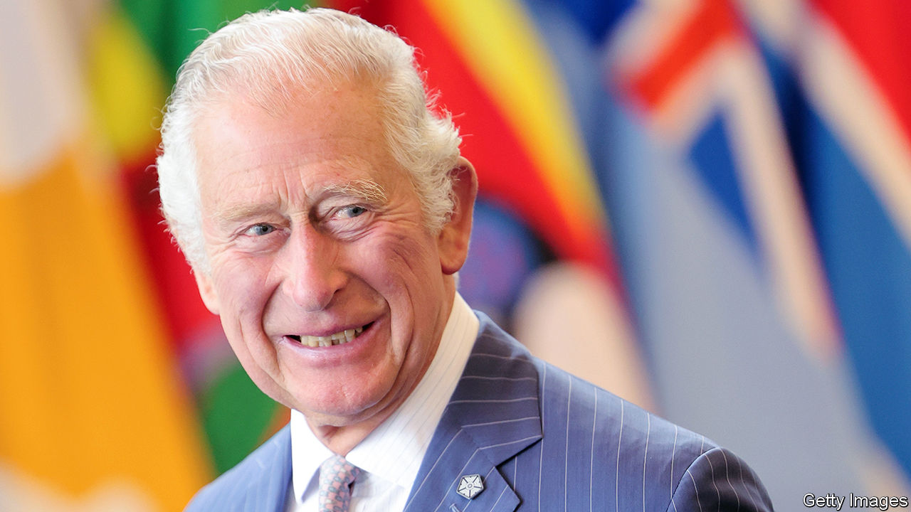

###### Realms and republics

# Will Charles III keep the Commonwealth going? 

##### His mother’s favourite club will miss her 

 

> Sep 15th 2022 

When elizabeth ii inherited the throne in 1952, great swathes of the world map were bedecked in imperial red. Britain still ruled—or had a predominant influence over—some 50 dominions, colonies and protectorates, including at least 15 in Africa, more than a dozen in the Caribbean and a maritime gaggle in the Pacific. 

Seven decades later only the tiniest of places, most of them islands, are still under direct British rule, while a clutch of 14 independent states choose to keep the queen as their ceremonial monarch. At the grander end of the imperial spectrum, at the time of her death she was still head of state of Canada, New Zealand and, more controversially, Australia. Under Charles III, more Commonwealth countriesprobably Jamaica, possibly Australia—are likely to turn republican. Irrespective of whether his image remains on its members’ postage stamps, the new king will strive to hold the club together.

In Malta in 2015 Britain was nervous before a Commonwealth Heads of Governments Meeting (known in diplo-speak as a chogm, pronounced “choggum”), when it seemed uncertain that Charles would succeed his mother as titular head of the show. But a consensus was reached that he would do so as king. His position is not immutable, however. He will have to match his mother’s enthusiasm for the club.

He is well equipped. He must have visited more Commonwealth countries than any other head of state. He lived in Australia as a student. His well-aired interest in religion, including Islam, will go down well in a club that embraces all the world’s main faiths. He has supported many environmental and conservation causes, especially in Africa. His big charity, the Prince’s Trust, has encouraged racial diversity.


Most of Britain’s dependencies broke free in the first few decades of Elizabeth’s reign. Created in 1949, the Commonwealth was promoted as a kind of post-imperial alternative under Britain’s cosy patronage. It dropped the prefix “British” before she took the throne. These days its boosters make much of its demographic and geopolitical reach. It encompasses a third of the world’s population, more than a quarter of the un’s membership, a fifth of the world’s land mass and more than a third of its waters under national jurisdictions. Most of its members speak English and have systems of law and government inherited from Britain. It still attracts new members, even if English isn’t their language: Mozambique joined in 1995, Rwanda in 2009, Gabon and Togo this year. Ireland, Kuwait, Myanmar, Nepal, Palestine and Yemen, which all once had British imperial links, have been dangled as possible candidates.

Still, the Commonwealth struggles to prove its relevance. Guided by a modest secretariat in London, it has a chogm every two years, where King Charles will preside. It has two main official aims: to strengthen democracy among its members and to nurture economic development. But it has no beefy mechanism for enforcing the first and no big pot of cash for ensuring the second. Countries that have flagrantly disrespected democracy—for instance, Fiji, Nigeria and Pakistan under military dictators, or Zimbabwe under Robert Mugabe—have been temporarily suspended, or left before being expelled. But autocracies such as Eswatini (formerly Swaziland) and the sultanate of Brunei somehow manage to retain membership. The democratic record of Rwanda, which hosted this year’s chogm, is shaky.

A social network

The organisation used to play a larger diplomatic role. It nudged Southern Rhodesia into becoming Zimbabwe and shamed South Africa into shedding apartheid. Some Brexiteers try to puff it up as an alternative to the eu. But bulky members like Australia, Canada and India have not leapt at the idea. Given its size, India would increase the Commonwealth’s heft if it were more involved. Recent Indian prime ministers have not always bothered to attend chogms. Nowadays opportunities to network may be the best the club can offer. 

It is a good platform for tackling climate change. At the Maltese chogm of 2015 the leading governments endorsed an ambitious set of proposals that helped pave the way towards the un’s global agreement signed in Paris a few weeks later. Many of the Commonwealth’s smaller members in the Caribbean and Pacific Ocean are vulnerable to the vagaries of climate change, including cyclones and rising waters, while many African ones face drought and desertification. Commonwealth island minnows such as Tuvalu and Nauru cherish their chance to voice their worries on the world platform provided by a chogm. 

Still, Charles will find it hard to match the popularity or grace of his mother. She was deeply respected, even revered, across the Commonwealth. Some say she helped keep it going. For many of the club’s leaders and people, whether or not she remained their formal monarch, she seemed to epitomise the best qualities, of grandeur and fair play, that the British empire claimed to promote. King Charles must make the most of his ceremonial headship. ■


