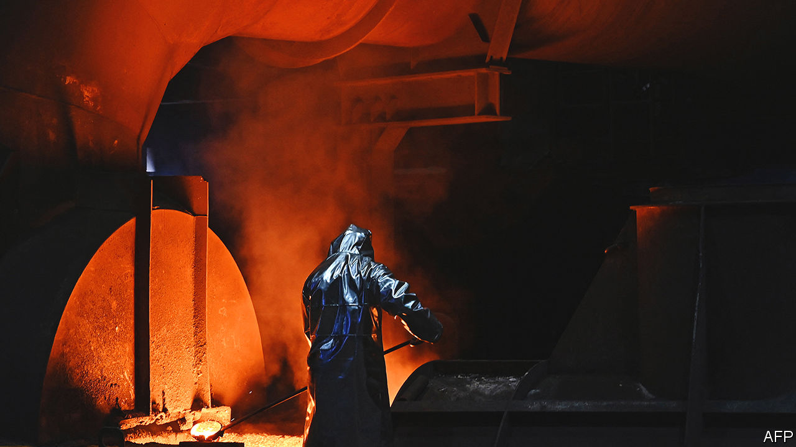
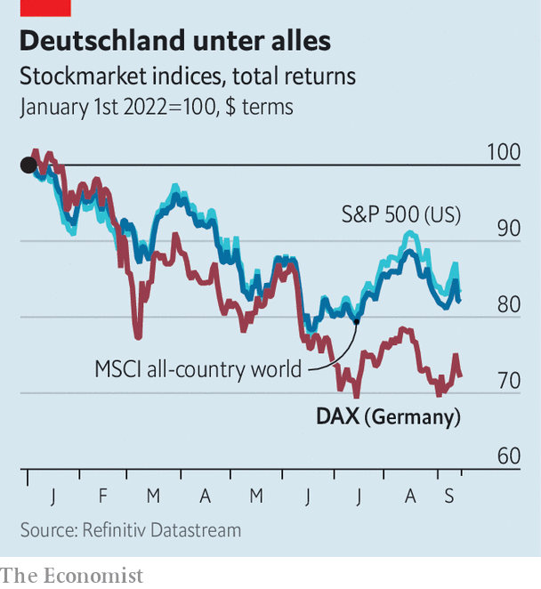

###### Morgenthau’s revenge

# Germany faces a looming threat of deindustrialisation 

##### Crunch time for a business model built on Russian gas and Chinese demand 

 

> Sep 11th 2022 

In a book from 1945 entitled “Germany Is Our Problem”, Henry Morgenthau, America’s treasury secretary, presented a proposal to strip post-war Germany of its industry and turn it into an agricultural economy. Though his radical proposal had some influence on Allied plans for the occupation of Germany after Hitler’s defeat, it was never implemented. 

Almost 80 years later Vladimir Putin might achieve some of what Morgenthau, whose parents were both born in Germany, had in mind. By  on which Germany’s mighty industrial base relies, the Russian president is weakening the world’s fourth-biggest economy and its third-biggest exporter of goods. It doesn’t help that at the same time, Germany’s largest trading partner, China, which bought €100bn ($101bn) of German goods last year, including cars, medical equipment and chemicals, is in the midst of a , too. A national business model built in part on cheap energy from one autocracy and abundant demand from another faces a severe test.

 


The consequences could be dire for : German blue chips have suffered more amid this year’s market turmoil than counterparts elsewhere, dropping by 27% since January in dollar terms, almost twice the fall in Britain’s ftse 100 or America’s s&amp;p 500 index (see chart). “The substance of our industry is under threat,” warned Siegfried Russwurm, boss of the bdi, the association of German industry, last month. The situation was looking “toxic” for many businesses, he said. And through globalised supply chains the poison could spread to the rest of the industrialised world, which relies heavily on German manufacturers.

German industry’s biggest problem is the spiralling cost of energy. The electricity price for next year has already increased 15-fold, and the price of gas ten-fold, says the bdi. In July industry consumed 21% less gas than in the same month last year. That is in part because firms used energy more efficiently. But the fall was mostly due to a “dramatic” reduction in output, says the bdi. Since June the Kiel Institute for the World Economy, a think-tank, has revised down its forecast of gdp growth in 2022 by 0.7 percentage points, to 1.4%. It now expects the economy to contract in 2023 and inflation to rise to 8.7%. 

Smaller companies are struggling more than bigger ones. According to a survey in July by fti Andersch, a consultancy, of 100 medium-sized “pocket multinationals” in the Mittelstand, almost a quarter of firms with fewer than 1,000 employees have cancelled or declined orders or are planning to do so, compared with 11% of those with more than 1,000 staff. In the land of more than 3,000 types of bread, around 10,000 producers of the staple are struggling as never before in post-war Germany. They need electricity and gas to heat ovens and run kneading machines, even as they contend with the higher costs of flour, butter and sugar, as well as with higher wages for bakers. A shop assistant at the 127-year-old Wiedemann chain of bakeries in Berlin reports that the company is desperately short-staffed and trying to save energy by, for instance, keeping ovens in shops cool and baking all the loaves at headquarters.

Another recent survey, by the bdi, of 600 medium-sized companies found that almost one in ten interrupted or reduced output because of high input costs. More than nine in ten said that rocketing prices of energy and raw materials are a big or existential challenge. One in five is thinking about transferring part or all of its production to another country. Two-fifths said investments in greener production methods will have to wait. 

Bigger energy-intensive business such as chemicals or steel face a similar predicament, exacerbated by the need to compete with rivals in other countries where the energy remains cheaper. basf, a chemicals giant which uses natural gas both to generate energy and as an industrial feedstock, has already cut production and may need to slash it further. Thyssenkrupp, a large steelmaker, has lost half its market value since January. 

Big multinational firms often have factories in other countries where energy is cheaper. But many, including basf, with its vast city-sized complex in Ludwigshafen, nevertheless continue to produce a lot at home. Even if costs of raw materials moderate, as some have begun to, and the government comes to the rescue with energy-related support, as it has vowed, cost pressures will not disappear. In particular, companies are bracing for a brutal round of annual wage negotiations with Germany’s powerful unions. Those between ig Metall, Germany’s biggest union, and employers in the giant car industry are about to kick off. “The ig Metall will not accept anything below an 8% increase,” predicts Ferdinand Dudenhöffer of the Centre Automotive Research, a think-tank. 

The higher costs are becoming harder to pass on to consumers. Hakle, a maker of loo roll, has filed for insolvency after being unable to pass onto clients the huge increase of production costs. After several fat years, carmakers’ order books are thinning as inflation burns a hole in car buyers’ wallets. The next two or three years will be very lean, predicts Mr Dudenhöffer. Car companies cannot easily modify production processes. Instead, they will cut costs by slashing spending on administration, and research and development. As with the greening of the Mittelstand, the car industry’s belated efforts to re-engineer itself for an era of electric cars are likely to suffer a setback as a result. Some will probably relocate production to lower-cost countries. 

Holger Schmieding, chief economist of Berenberg, a private bank, predicts that, with energy prices likely to remain high for a while, 2-3% of Germany’s industrial companies that use energy-intensive processes will relocate abroad. A higher share of industrial firms will reduce their production this winter and next. ArcelorMittal, another steel behemoth, has announced plans to close down two mills in northern Germany and put employees on furlough. Stickstoffwerke Piesteritz, Germany’s largest producer of ammonia and urea, two important chemical inputs, shut down its ammonia factories in Saxony-Anhalt. 

In a demonstration of how such moves ripple through supply chains, that shutdown has triggered a shortage of AdBlue, a basf product that is crucial for cleaning the engines of the diesel trucks that help connect Germany to markets abroad. Stefan Kooths of the Kiel institute forewarns that “an economic avalanche is rolling towards Germany.” Before long the reverberations will be felt by German companies’ global customers. ■


