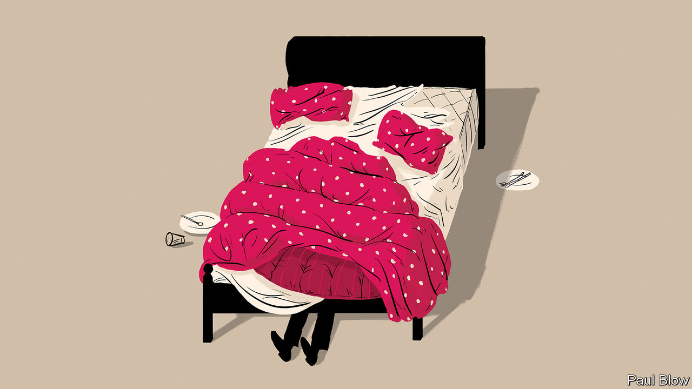

###### Bartleby

# How to get things done—eventually 

##### Dealing with your inner dawdler 

 

> Sep 15th 2022 

“If you want to change the world, start off by making your bed,” Admiral William McRaven told the graduating class of 2014 at the University of Texas, Austin. What the us Navy counts as “making your bed”—square corners, centred pillow, blanket neatly folded at the foot of the rack—is idiosyncratic. Yet the admiral’s broader point is universal: whether you are a sailor, a salesperson or a ceo, “if you make your bed every morning you will have accomplished the first task of the day.” His commencement speech went viral.

Everyone must battle the temptation to temporise every now and again; millions of beds go unmade each morning even on a looser definition than the navy’s. That is also true of people who, like your columnist, a guest Bartleby, more often suffer from the inverse affliction—having trouble putting things off even if they probably ought to be. Still, as someone with a perennial itch for completion, she has some tips for self-professed dawdlers who wish to make their lives more naval.

Start off by not calling yourself a procrastinator. Indeed, if you do, you are probably already the opposite. In “Out of Sheer Rage” (1998), Geoff Dyer elevates dilly-dallying to an art form. The book chronicles how the author was wasting his time instead of writing a study on D.H. Lawrence. “All over the world people are taking notes as a way of postponing, putting off and standing in for,” Mr Dyer writes, including supposedly about himself. If only he could make a start, he laments. Given that he managed not just to start but also complete, publish and market a brilliant book—even if the subject matter was less lofty than intended—the lamentations were in fact cogs of productivity.

The easiest way to get things finished is to get going in the first place. The reason busy people never stop moving is because their constant movement generates further momentum. This is, obviously, easier said than done—especially if you find a task unpleasant. The more objectionable something seems, the more time you spend thinking about just how awful it is. That in turn makes you even less likely to broach it—and so on. Being aware of this vicious circle does not guarantee you will break out of it. But it is, well, a start. 

In practical terms, getting going can mean something as simple as opening an email. Two decades ago, in “Getting Things Done: The Art of Stress-Free Productivity”, an American time-management consultant, David Allen, warned readers that “the in-basket is a processing station, not a storage bin”. The email inbox, whose contents do not pile up on the desk, is even easier to confuse for a garbage can than a tabletop in-tray. Electronic correspondence is the starting point of most work projects, ever more so in the era of hybrid work. So just click it. And if you still find yourself avoiding things on your to-do list that make you anxious, involving others can help. Discussing tasks with colleagues can suppress the tendency to dodge the parts of your job you like the least.

Once you have got moving, consider your waypoints. That may mean breaking a job down into smaller, more readily achievable chunks. A seminal paper from 2005 by researchers at the Massachusetts Institute of Technology examined how conceptual knowledge is processed. The authors found that the brain prefers concrete and discrete tasks to broad and abstract ones. Set your sights on completing a document first, rather than starting out with the goal of crafting a complete strategy. Whatever you do, resist the urge of the overly concrete, like sharpening pencils.

Procrastination lies between logic and emotion, between ambition and achievement. Bridging that gap can be difficult, even when you know full-well that if you do, the dreaded task will no longer lurk at the back of your mind like an unwanted squatter. Quick progress is difficult but rewarding, offering a high that is undiscoverable to those who leave things till the very end. 

Putting something off doesn’t make it go away. That trivial truth is worth repeating. Just ask the central bankers who kept delaying interest-rate rises even as economists warned of rising inflation. Now they must ratchet rates up further and faster, at the risk of provoking a recession. Most workplace decisions are not nearly as consequential but firms can still suffer material losses if employees put off tasks and decisions. So if that email arrives first thing in the morning, read it and reply—even if that means leaving your bed unmade. 


