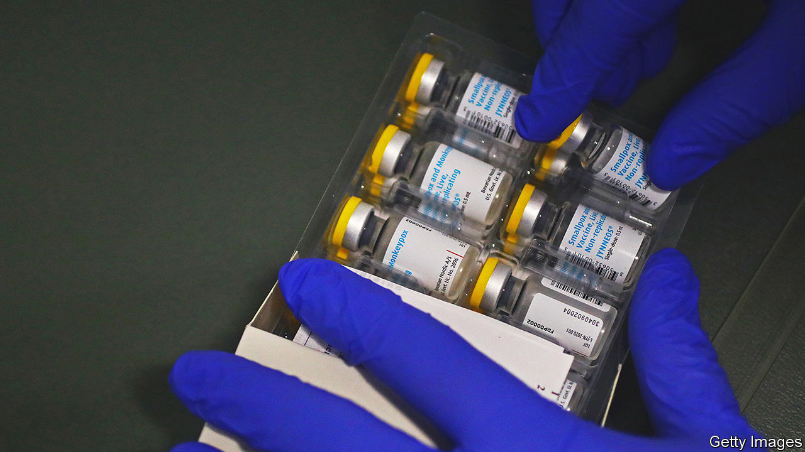

###### Poxy no more

# Makers of monkeypox drugs face a rash of orders 

##### Defeating a worldwide outbreaks falls on two small drugmakers 

 

> Sep 15th 2022 

Monkeypox isn’t covid-19. Since May the viral disease has infected 35,000 people in 92 countries, less than one-tenth as many as covid infects in a day. Though symptoms, including fever, headaches, muscle aches and a pus-filled rash, can be nasty, it seldom causes death. Critically, in contrast to covid, both a vaccine and a treatment predate the current epidemic. Their makers, two smallish drug companies, are struggling to keep up with demand. 

The jab is made by Bavarian Nordic, a Danish firm founded in 1994 to commercialise a clever replacement, developed by a researcher in Bavaria, to the old smallpox vaccine (monkeypox and smallpox are related viruses). Before the latest outbreak, only six countries, including America, had ordered the drug. In the past four months that number has swelled to 70, and counting. “We were definitely not prepared for this,” admits its finance chief, Henrik Juuel. The firm is working around the clock to add capacity and expand its 800-strong workforce. Annual revenue is forecast to more than double this year, to $380m. 

Success has brought in resources to finance its other bets. Bavarian Nordic has just begun a phase-three clinical trial of a vaccine against rsv, a flu-like virus that kills as many elderly and infants as influenza. At a cost of up to $300m, it is a “heavy investment”, says Mr Juuel; the firm expects to lose between $13m and $40m this year as a result. But the potential prize is large. No rsv jab exists and the global market for one could, analysts reckon, be as big as $5bn-10bn a year. 

Across the Atlantic siga Technologies hopes to emulate Bavarian Nordic. The self-styled maker of “human bioarmour” produces tpoxx, an oral capsule used to treat some symptoms of smallpox and some related viruses. From January to July siga shipped $60m-worth of tpoxx, which regulators in Britain and the eu have approved for use against monkeypox (as well as smallpox and cowpox), up from $10m in the same period last year. Orders could swell once America’s Food and Drug Administration follows suit; it accepted tpoxx for smallpox in 2018. 

As monkeypox hit the headlines over the summer, investors piled in. The market value of Bavarian Nordic ballooned from $1.4bn in early May to nearly $4bn in August. siga’s soared four-fold, to almost $2bn. Both have fallen back since, by about two-fifths and a half, respectively, as concerns about the next pandemic receded. But they remain twice as valuable, more or less, as they were in the spring. Not so poxy anymore.


