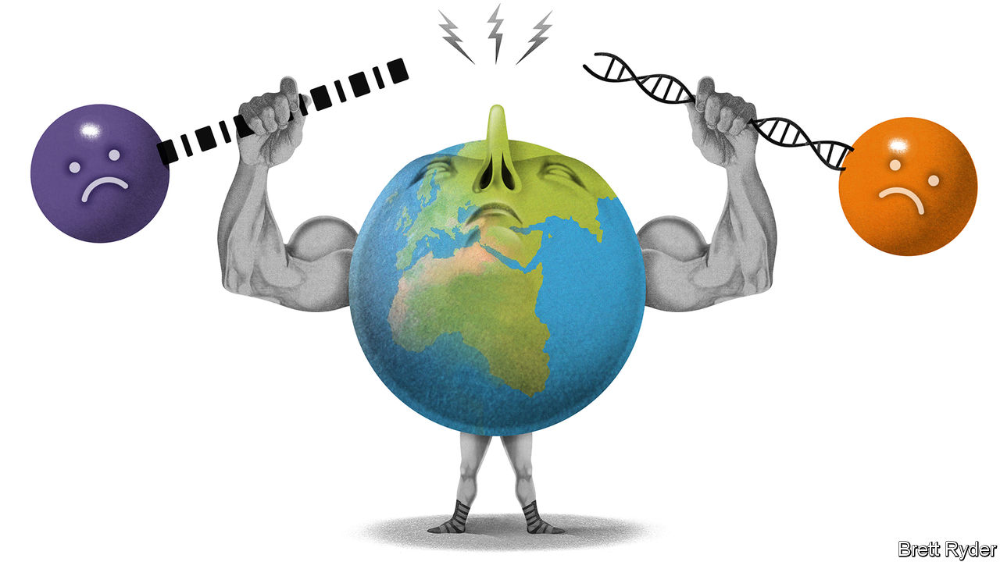

###### Schumpeter

# The rise of the borderless trustbuster 

##### Corporate dealmakers face a formidable foe. It isn’t Lina Khan 

 

> Sep 15th 2022 

It was to be the biggest industrial merger ever. In late 2000 General Electric (ge), the world’s most valuable company at the time, agreed to pay $43bn for Honeywell, a smaller American manufacturer of, among other things, aircraft electronics. Jack Welch, ge’s ceo and America Inc’s capitalist-in-chief, put off his retirement to see it through. The transaction, codenamed “Project Storm”, seemed a done deal. American authorities gave their blessing, finding no threat to competition (ge made jet engines but not avionics). Regulators elsewhere were expected to defer to America in a merger involving two American firms. So it came as a shock when, in 2001, the European Commission killed it. A diversified ge would, the eu’s competition watchdog argued, wield too much power in the market for aircraft parts. America’s trustbusters pooh-poohed the commission’s theory of “conglomerate effects”. The treasury secretary, Paul O’Neill, called the ruling “off the wall”. 

Now another transatlantic antitrust rift has opened up. In March 2021 America’s Federal Trade Commission (ftc) sued to stop the $7bn takeover by Illumina, a gene-sequencing giant, of Grail, maker of a cancer-detection test. The ftc claimed Illumina risked withholding its sequencing technology from Grail’s rivals. On September 1st a judge at the agency’s internal court threw out the lawsuit, in part because Grail’s tests currently have no rivals to speak of. Then, on September 6th, the eu blocked the deal—never mind that Grail has no turnover in the bloc. 

Even if the eu ruling was not, as lobbyists at the us Chamber of Commerce suggest, stirred up by the ftc, this time around the reaction in Washington was not pique but plaudits. President Joe Biden blames overmighty corporations for high prices, low wages and other ills. His crusading ftc chief, Lina Khan, rejects the 40-year-old antitrust philosophy, according to which the goal of antitrust law is to safeguard competition and consumer welfare, in favour of one that seeks to protect competitors, both real and potential, as well as suppliers, workers and other “stakeholders”. 

For corporate dealmakers the chaos and inconsistency are as welcome as a Honeywell-sized slap in the face. The episode also illustrates how much bolder—and borderless—global trustbusters are becoming. The impact on future takeovers could be profound.

Navigating multiple jurisdictions is nothing new in mergers and acquisitions (m&amp;a). When ab InBev, the world’s biggest brewer, bought sabMiller, the second-largest, in 2016, it had to submit merger filings in more than 30 countries. Today’s Welch wannabes face an ever trickier terrain. For one thing, national trustbusters have mushroomed. Filippo Lancieri, now at eth Zurich, a university, and colleagues find that 127 countries had an antitrust regime in 2010, up from 41 in 1979. Many assess not just a deal’s economic efficiency but things like whether it serves “public interest”. And they are staffing up. Britain’s Competition and Market’s Authority (cma) has gone from 650 to 850 officials in five years. China’s main antitrust bureau is tripling its headcount to 150.

Second, those multiplying regulators are flexing their muscles, partly in response to criticisms that their flaccidity had let business get too oligopolistic. Exhibit A is the bigness of big tech, whose sometimes free products and strong network effects (where size begets more size) make the old “consumer-welfare standard” seem, in critics’ eyes, unfit for purpose. Tech giants stand accused of “killer acquisitions”, aimed at smothering potential challengers in the crib, and of buying up firms in markets they one day hope to corner. More regulators now fret that such unorthodox mergers, where two firms have no overlapping business, snuff out innovation—including, as in Grail’s case, in markets that scarcely exist. 

That leads to the third complication. In the past, national merger guidelines made it clear when firms needed to seek approval to wed—typically if their combined sales or market share exceeded a certain threshold. When regulators raised concerns about market power, a firm like ab InBev could put them to rest by offloading a brewery here and there. Now a potential competitor can come from anywhere; so, too, can a regulatory challenge. And if the fears are of conglomerate effects or killer acquisitions, no remedy short of the combined firm’s full retreat from a jurisdiction would be satisfactory. For acquiring firms with a large existing business in a given market, that is a non-starter.

The new antitrust logic is behind a string of recent actions, and not just Grail. In February a lengthy cma probe prompted Nvidia, an American semiconductor firm, to abandon its $40bn takeover of Arm, a Japanese-owned firm that licenses chip blueprints. In July the ftc sued to block the purchase of Within, maker of virtual-reality fitness apps, by Meta, which the ftc says is seeking to illegally “expand [its] virtual-reality empire” that already includes a popular vr headset and a vr app store. Western and Asian regulators are looking into Microsoft’s $69bn acquisition of Activision Blizzard, a video-game developer. 

Dealbreakers

None of this means corporate m&amp;a is dead. Last year saw $3.8trn-worth of deals, a near-record. Most will sail through. Illumina is appealing against the eu decision and may get its way. Even so, Grail-like ordeals raise the costs for everyone. Lawyers report that break-up fees in merger contracts are already rising and “outside dates”, before which parties can walk away scot-free, are stretching from a few months to as many as 18 in the Microsoft-Activision paperwork. The longer a deal takes to conclude, laments an executive at an acquisitive tech firm, the likelier the target’s innovative edge is to be blunted and its other key asset—talent—is to flee. 

Some deals which would once have been no-brainers are thus no longer worth the hassle. To enemies of big business like Ms Khan, that’s the point. If it means innovation forgone, consumer welfare unrealised or shareholder value not created, tough luck. ■


 


