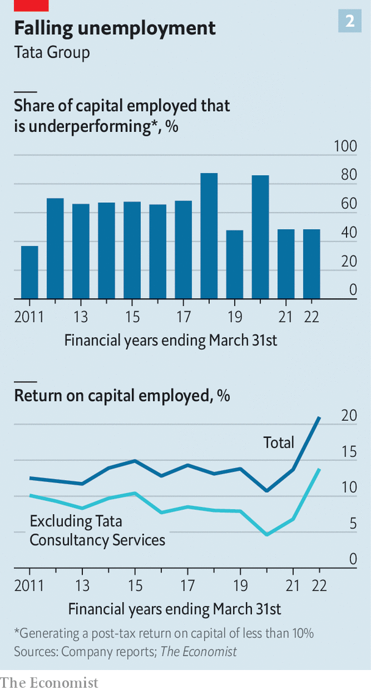

###### The homecoming king

# The world’s biggest bet on India 

##### What Tata’s $90bn pivot to its home market says about the planet’s fifth-biggest economy 

 

> Sep 15th 2022 

If you want to glimpse the frontier of Indian capitalism, take a trip to Tamil Nadu in the south of the country. New factories with solar panels on their roofs lie on a vast 550-acre (220-hectare) site. Inside, it is reported, Tata is making components for the latest iPhones on behalf of Apple—and in the process finally connecting India to the world’s most sophisticated supply chain, which used to be anchored to China.

The project is not a one-off. It is part of a new and staggering $90bn investment surge by India’s biggest business that is repositioning itself towards its home market and away from its 30-year strategy of fanning out globally. Tata’s ambition to create electronics factories and semiconductor fabs in India could transform its economy. “I firmly believe that this is going to be India’s decade,” says Natarajan Chandrasekaran, who runs the holding company, Tata Sons, which oversees the group. 

The change in strategy also reflects the dramatic psychological shift within the business world’s most ardent globalisers, as they adapt to new megatrends. These include the rebasing of strategic manufacturing away from China; the rise of a new energy system; and industrial policy, which in India is being championed by Prime Minister Narendra Modi. 

 


Anyone who follows India, the world’s fastest-growing big economy, may be under the impression that it is run by Mukesh Ambani and Gautam Adani, two swaggering tycoons, whose conglomerates generate headlines and make them Asia’s richest men. Together the “two As” may spend over $100bn in the next five years. Yet Tata is in fact the country’s biggest business measured by market value ($269bn) and operating profits ($16bn last year), spanning everything from steel mills to software. And we estimate that its new plans are larger than any other individual firm’s, encompassing electric vehicles (evs), electronics, battery gigafactories, clean power and chips (see chart 1). If that doesn’t sound ambitious enough, it has also taken on the Everest of corporate turnarounds, buying Air India. 

The firm’s scale, reputation and record make it one of the world’s most important companies. With 800m-900m customers across ten business lines, it employs almost 1m people, more than any listed firm anywhere bar Amazon and Walmart. It is also the ultimate survivor. Of the world’s firms worth over $200bn that have remained independent, it is the oldest, founded in 1868, 18 years before Johnson &amp; Johnson was incorporated. When blue-chip multinationals head to India—not just Apple (reportedly), but everyone from Starbucks to Zara—they seek to team up with Tata, the one firm you can really trust. In a twist, Tata is run by technocrats who report to what may be the world’s least-known and richest charity, not tycoons eyeing the rich list.

To understand where Tata and India are heading in the 2020s and 2030s you have to go back in time. The company has stayed alive by adapting to technological and political change. It made steel for colonial railways, and after independence it coped with India’s socialist detour. When the economy opened up in the early 1990s it helped reinvent white-collar work by selling information-technology outsourcing (it) services. Ratan Tata, the boss between 1991 and 2012, spent the first decade dragging the group into the modern era and the second taking it global through $18bn of cross-border takeovers, including of Jaguar Land Rover, a British carmaker, and Corus, an Anglo-Dutch steelmaker. 

Tata’s belief in the boundless opportunities of borderless commerce was shared by many others at the time. Annual investment by Indian firms abroad soared almost 40-fold between 2000 and the peak in 2008; for all emerging markets it rose by four times. China urged its bosses to “go out there”. Even Cemex, Mexico’s cement giant, became an unlikely deal machine. 

In, out, shake it all about 

Behind the boom lay insecurity as well as optimism. Tata worried India was too corrupt to offer a level playing field. More broadly it and fellow emerging-market firms believed that to tap advanced technologies you had to be in the West. Tellingly, at home in India the fashion then was for “Jugaad Innovation”: basic, frugal engineering that was supposedly a source of advantage. Tata launched the Nano, an ultra-basic car for India that cost $2,000. 

This era of reflexive corporate globalism has come to an end. Geographical sprawl weakened the finances of most multinational acquirers. In Tata’s case, we reckon that about two-thirds of its sales were abroad by 2012. Meanwhile, 70% of its capital employed earned a return of less than 10%, our yardstick for underperformance. Net debt had risen to twice gross operating profit. The strain helped trigger a governance crisis as Mr Tata fell out with his successor, Cyrus Mistry, whose family own 18% of Tata’s holding company (Mr Mistry died in a car crash near Mumbai on September 4th). In early 2017 Tata replaced him with Mr Chandrasekaran, the meritocrat’s choice, who had run the thriving it business that had kept the group afloat. 

The rise of Mr Chandrasekaran to the pinnacle of Asian business illustrates another sharp change: emerging markets’ technological self-confidence. In the past decade India has created perhaps the world’s most advanced payments systems and a venture-capital scene that has helped fund (at least before the recent worldwide tech slump) more than 100 private tech “unicorns” valued at $1bn or more. The it-services firms, including Tata’s, have more than doubled in size and are far more technically sophisticated. And though Tata might not like to admit it, Mr Ambani’s landmark $46bn ten-year investment in Jio, a domestic 5g telecoms business, has shown that you can profitably deploy vast sums of capital in cutting-edge tech in a developing economy. 

More self-confidence in tech has coincided with the last shift, the changing relationship between the role of businesses and the state, championed by Mr Modi’s government. A move in supply chains away from China, new technologies and the energy transition all create opportunities. But who will exploit them? 

The usual suspects are not up to snuff. India’s state-run firms are hopeless. Foreign multinationals have ushered in neither industrialisation nor technological breakthroughs. Capital markets have failed to create young firms with enough equity to take big risky bets. India’s last investment cycle, an infrastructure boom in 2003-11, was debt-fuelled and ended in tears. The government and some bosses now favour giant firms. Those include conglomerates as well as specialist companies like jsw Steel and hdfc, a bank which is concluding a $140bn mega-merger. 

Some firms, such as Adani Group and Mr Ambani’s Reliance, embrace this role and the proximity to the state it brings. Others are making a more calculated bet that the demands of national development and responsible, profitable business really are compatible. Tata is in the second camp. 

As boss, Mr Chandrasekaran is quick and ultra-rational, with a dash of humour, compared with the aristocratic and enigmatic Mr Tata. Emails are dispatched fast. Satraps running subsidiaries are told to deliver performance first and get capital later. Tata’s worst bits are being quietly killed off: Tata Sons has written off $10bn since 2017 as it has exited weak areas like telecoms, and recapitalised fragile divisions. 

 


Some of Tata’s domestic laggards have got their act together. The cyclical steel business is booming, for now, and Tata’s market share in cars has surged, especially for electric vehicles (even though its best-selling Nexon ev costs $17,000 more than the abandoned Nano). The clean-up operation is roughly two-thirds complete and as a result of it, we calculate that Tata’s return on capital has reached 21%, or 14% excluding it services. The share of capital underperforming by our 10% yardstick is down to 48% (see chart 2). Leverage is less than half what it was. By our maths a share in Tata Sons has outperformed India’s stockmarket by 46 percentage points since 2017. A legal battle over the succession ended when India’s Supreme Court ruled in Tata’s favour last year. In February Mr Chandrasekaran was appointed for another five years.

Something striking is also happening. Tata is becoming more Indian for the first time since the 1990s. Sales from the subcontinent reached 38% of the total last year, having grown almost twice as fast as foreign ones in the past decade. The plan for the next five years will accelerate this by deploying an estimated $90bn of capital, mostly in India and mostly in projects that have a technological edge and are compatible with the government’s agenda. Some are plays on growing consumption in India, others on manufacturing for export. Mr Chandrasekaran spies a “global opportunity for global companies to create a supply chain based in India”. 

Chandra’s capex challenge

Tata’s annual capital spending will rise to $18bn, more than twice the average of the past decade, we reckon. That would make it India’s biggest investor. Tata and Reliance together account for 7% of the total for all private firms. If all goes to plan, new, higher-tech businesses could rise from a quarter of Tata’s capital employed to half by 2027. Some 77% of Tata’s new investments will be in India. These are large and potentially transformational shifts—for the firm and the country alike.

That money is going into several bets. One is on the energy transition. Tata’s power subsidiary will invest almost $10bn over the next five years in renewable generation. There is a $5bn project to build gigafactories in India and Europe, to supply Tata’s own cars and those of other manufacturers. The Indian car operation is launching ten ev models (it has just bought Ford’s plant in Gujarat). And Tata will ramp up the manufacturing of solar panels, a business China dominates today. 

Another wager is on tech and electronics. Tata has invested $1bn so far in electronics manufacturing for Indian and global customers, mainly in Tamil Nadu, and there is more to come. It intends to make 5g telecoms gear using the software-heavy Openran standard, and challenge Huawei, China’s hardware-focused champion. It is entering semiconductor testing and packaging (the final, less intricate stage of chip fabrication) and Mr Chandrasekaran is weighing up building what may be the first fully fledged semiconductor “fab” in India, in partnership with a foreign firm. The factory, which could cost $5bn or more to build, would not make chips as advanced as those of Taiwan’s tsmc. But it would be a leap for India and, Mr Chandrasekaran concedes, the biggest challenge for all of Tata Group. There are other contenders, too: on September 13th Vedanta, an Indian-focused firm, and Foxconn, from Taiwan, said they would invest $19.5bn in a semiconductor plant in Gujarat.

The third gamble involves the Indian consumer. The firm has spent $2bn on a digital platform and app called Neu that aspires to be a “superapp” for Tata customers, linking them to its retail, hotel, health-care, transport and financial services, and to products including cars. It has amassed 17m users since its launch in April—a tad disappointing, but the plan is to keep investing, particularly as some startups with competing services are now being starved of cash by a global venture-capital crunch. 

Lastly there is Air India, the perennially troubled flag carrier. Before you wince, consider its selling point: it owns international slots for a huge aviation market, was bought from the state for a meagre $350m, debt-free, and can be merged with Vistara, a domestic airline joint-venture Tata has with Singapore Airlines. The idea is to create a powerful national airline like Emirates or Lufthansa, which India has always lacked. Press reports suggest that Tata may soon buy 300 new aircraft. 

These bets could sour. Tata is doubling down on being a conglomerate, opting for geographic concentration but sectoral diversification. In India, and many emerging economies, conglomerates have advantages: brand presence, clout with regulators, shared access to scarce land. But they bring complexity: Tata’s holding company has over 30 big operating and 286 legal subsidiaries and Mr Chandrasekaran is on the board of seven listed firms. 

Although Tata is huge, it lacks global scale in individual industries. Its $1bn bet on electronics is equivalent to 8% of the capital of Foxconn, the leading contract manufacturer: it must deploy much more cash to truly compete. The $5bn investment in batteries amounts to 40% of the plant of catl, the top Chinese firm. In India Reliance’s two main specialisms, in 5g, and petrochemicals and refining, each has double the capital of Tata’s largest subsidiaries. A lack of focus could make technical breakthroughs harder. The boss of a big chipmaker is sceptical that India can build a globally competitive fab: “It’s too soon.”

Another risk is Tata’s ownership. It has three layers. At the top are self-governing charitable trusts that together own 66% of Tata Sons. They are chaired by Mr Tata, with other venerable directors. They are asset-rich—together the trusts are worth $100bn, more than the Gates Foundation—but income-poor, getting dividends equivalent to under 1% of the group’s operating profits. Below them is Tata Sons, the middle layer, which Mr Chandrasekaran runs and which has stakes in the operating companies, the third layer. 

 


A few things may destabilise this structure. The death of Mr Mistry, and of his father in June, could lead to a reappraisal by his family of their 18% stake in Tata Sons. They have the right to sell the stake to the company, which would force it to scramble to raise $27bn of cash to finance the purchase. Mr Tata himself is 84 and, though still mentally sharp, physically frail. When he retires from the trusts, as is likely, it is unclear who will inherit the de facto leadership of the trust boards. The hope is that a consensus forms, or a strong and respectable candidate emerges who doesn’t meddle in the business. The nightmare scenario is a power struggle, or someone cosy with the government gaining sway.

The final risk is the government. The prime minister’s critics fear that he is presiding over crony capitalism, pointing to exhibit “two As”. Some of this is over the top. India’s business scene is slightly less concentrated than America’s: the four biggest groups have operating profits of 1.1% of gdp, compared with 1.2% in America. Unlike classic rent-seeking firms, India’s giants are reinvesting furiously. 

But even Tata, which considers itself aloof from politics, has paid symbolic homage to Mr Modi’s populist nationalism. In 2019 Mr Tata visited the headquarters of the rss, the Hindu-chauvinist association that backs Mr Modi. In the same year Mr Modi attended the launch of a book by Mr Chandrasekaran. The Tata charities are also working more closely with the state, for example on hospitals. And Tata is participating in India’s $26bn manufacturing-subsidy scheme (though it insists the handouts are too small to swing investment decisions). 

For the time being Mr Modi’s firm hold on power and vision for the economy are tailwinds. But that could change. Unlike the  which made South Korea rich by exposing the country to global competition through export markets, some of India’s big firms are eyeing the domestic market only. They could become too cosy or corrupt. As a handful of giants diversify at home they will increasingly overlap, as they already do in renewable energy. When all that happens, can Tata be sure of equitable treatment? And when some of Tata’s new bets fail, as some surely will, can it be sure it can exit even if that deprives India of a presence in an industry the government regards as “strategic”? 

Some of the reasons for Mr Tata’s wariness of investing in India in the 2000s still hold. Deploying tens of billions of dollars at home is a risky game. If it works, though, Tata and others may finally industrialise and digitise India, turning it into a source of innovation and manufacturing for Indians and the world. To see which way the country goes, follow Tata. ■


