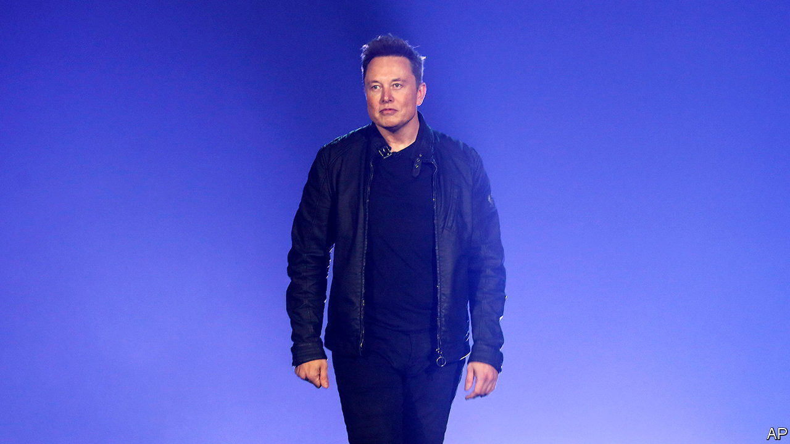

###### Bitter tweet

# Twitter’s shareholders approve Elon Musk’s $44bn offer 

##### No duh 

 

> Sep 15th 2022 

With a fortune of $270bn or thereabouts, Elon Musk is not a man strapped for cash. Thank goodness, for the entrepreneur may soon be compelled to make a sizeable donation to his favourite social-media platform. On September 13th shareholders of Twitter voted to approve the $44bn buy-out offer Mr Musk made in April. The decision was a no-brainer, given that the company’s market value currently languishes below $32bn. In his capacity as Twitter’s largest shareholder, with a 9.6% stake, he would no doubt accept his offer. As the acquirer, he is trying to wriggle out of the deal. Twitter, armed with a bulletproof takeover agreement, is having none of it. A Delaware court will decide the buy-out’s fate in October.

With the trial date nearing, now is about the time when parties usually begin settlement talks, says Brian Quinn, a law professor at Boston College. Mr Musk’s chances of success in the courtroom look slim. His stated reason for pulling out of the deal is that the share of fake users, or bots, greatly exceeds the 5% claimed by the company. That may be true. An academic paper from 2017 estimated the share at between 9% and 15%. Bob Iger, who as boss of Disney had considered buying Twitter, noted in a recent interview his due diligence revealed it to be “substantial”. But identifying bots is an imperfect science. More important, Mr Musk would need to prove that the underestimate counts as a “material adverse effect” on Twitter’s future earnings, a high legal bar. It won’t help his case that he opted out of due diligence.

The mercurial billionaire may yet change his mind once again and opt to go ahead with the purchase. But if he insists on walking away, as seems likelier, forcing him into a marriage neither side particularly desires would not be in Twitter’s long-term interests either. That leaves room for a possible cash settlement. The figure would certainly be higher than the $1bn “reverse termination fee”, which would have applied if Mr Musk was unable to complete the deal for reasons such as inability to secure financing, and lower than his original $44bn bid. It could end up nearer the $12bn difference between that bid and Twitter’s current market value. 

The imbroglio remains an unhelpful distraction from the real problem: Twitter’s perennial underperformance. A failure to adapt its product has eaten away at its share of the digital-ad market. To arrest the decline last year it launched new initiatives such as “Twitter Blue”, a paid version with added features, and “Spaces”, a live-audio service. It has also rebuilt its advertising platform and replaced its often absent founder, Jack Dorsey, with a full-time ceo. (The chairman of ’s parent company is a director of Block, another firm Mr Dorsey co-founded.)

So far to no avail. Last quarter Twitter surprised investors with a loss and a year-on-year decline in revenue. The firm blamed Musky uncertainty. But its woes run deeper. As the online share of all advertising plateaus, the digital-ads business may be becoming more cyclical, just as the offline variety has long been. That exposes digital-ad firms to macroeconomic headwinds, which are picking up as economic growth slows amid stubbornly high inflation. Margins are being crimped by the entry of challengers such as TikTok, as well as Apple and Amazon. On top of that, Twitter is facing increased scrutiny after its former security chief testified before Congress on September 13th that the firm had fallen short of industry standards. Mr Musk may feel that $12bn is a lot to pay for pain relief. If he doesn’t settle and is forced to complete the deal, he may discover that $44bn buys you an awful lot of problems. ■


