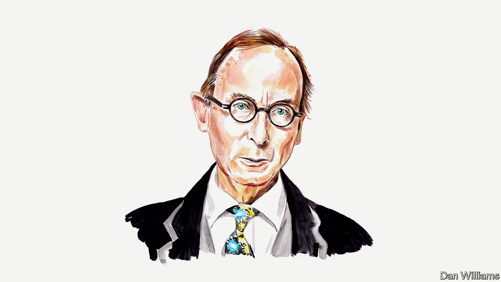

###### The death of the queen

# A.N. Wilson on the art of Queen Elizabeth II’s communication 

##### The biographer considers the ways in which she did her job so well 

 

> Sep 15th 2022 

WAS IT LUCK, that she was personally so well-suited to the role of constitutional monarch? Or did she make herself become the figure who performed this modest office so well? Nearly all other jobs in the world can be defined in the positive terms of what is required. For the constitutional monarch, the job qualifications seem to emphasise the negative: not politically active, but politically astute; not the object of a cult of personality, but nonetheless on frequent display; not obviously a member of any cosy club or interest group.

All her surviving prime ministers speak of how useful they found their weekly meetings with the sovereign. Behind these remarks was, in some cases, a slightly superior surprise that a small woman who had never been to school or university should have had a grasp of world events, and a knowledge of domestic politics, which, over the years, was enriched by decades of memory. Harold Wilson spoke of his embarrassment when she caught him out, having read some cabinet papers which he had neglected.

As far as the public was concerned, she never—or almost never—let it be known what she thought about issues of the day. An exception came during the Scottish referendum campaign in 2014, when she let fall that she hoped people would think very carefully before voting. Hardly an indiscreet remark, but it was obvious that she had meant it when she also said she could not forget being crowned queen of a united kingdom.

In African politics, she was sometimes bolder. Consider 1961. Despite bombs in Accra, Ghana’s capital, shortly before a royal tour of the country, she decided to visit anyway. She even danced with Kwame Nkrumah, the man who led his country to independence: a clever move, since a dance says a lot—only without words.

The most glaring example of a political commitment—and a defiance of the convention of political neutrality—was when she sided with the Commonwealth against Margaret Thatcher’s government over the matter of South Africa. The Commonwealth was in favour of imposing sanctions on the regime until apartheid was lifted and Nelson Mandela released from prison. 

The body language between the two world leaders, when Mandela came to London in 1996 and was received by the queen on a state visit, was eloquent. She was good at body language: witness her visit to Northern Ireland in 2012, when she shook hands with Martin McGuinness. The year before, she bowed her head by the memorial commemorating the Irish who died in the world wars. The silence, and her grief-stricken face when she visited Bergen-Belsen created another such moment.

When you list the positive requirements for the job, the queen was also singularly well-equipped. In a country which still has the “Trooping the Colour” parade, it helps if the head of state can ride a horse. She first undertook this task when her father, King George VI, was still alive. She looked magnificent.

In England, though not in Wales, Scotland or Northern Ireland, the monarch is Supreme Governor of the Church. It helps if the sitting incumbent can not only go through the motions but actually believe in it. The speech she made at Lambeth Palace in 2012 about the place of Anglicanism in national life was masterly, pointing out that it was not merely one faith among many in a diverse society, but a sort of umbrella for other faiths. She was an active supreme governor, urging archbishops of Canterbury, from the time of Robert Runcie onwards, to ordain women. About gay clergy it is said she was more old-fashioned—unenlightened, most modern Christians would say—but, again, this was a discreetly held view, never leaked by her—only by her bishops.

When someone does a job supremely well, as she did hers, it looks easy. Yes, she often looked bored stiff, but who could not, traipsing around opening factories and hospitals and motorways, attending Royal Variety performances, and so forth. Her husband’s remark to her during their first visit to Australia—a long, hot visit when she was pining for the rain-soaked heather of Aberdeenshire: “Cheer up, sausage!” It was something which many must have felt when they saw her face.

She will be a very, very difficult act to follow. She and her daughter knew that if royals tried to woo the press, or make friendships with journalists, they were doomed to failure. She steered absolutely clear of them—unlike the court of Charles which has always tried to “place” his views in public. He was even given the catastrophic advice to admit on television to adultery.

The queen started as a young mystery, and ended as an old mystery. Our new king starts as an old man about whom everyone knows slightly too much. ■


