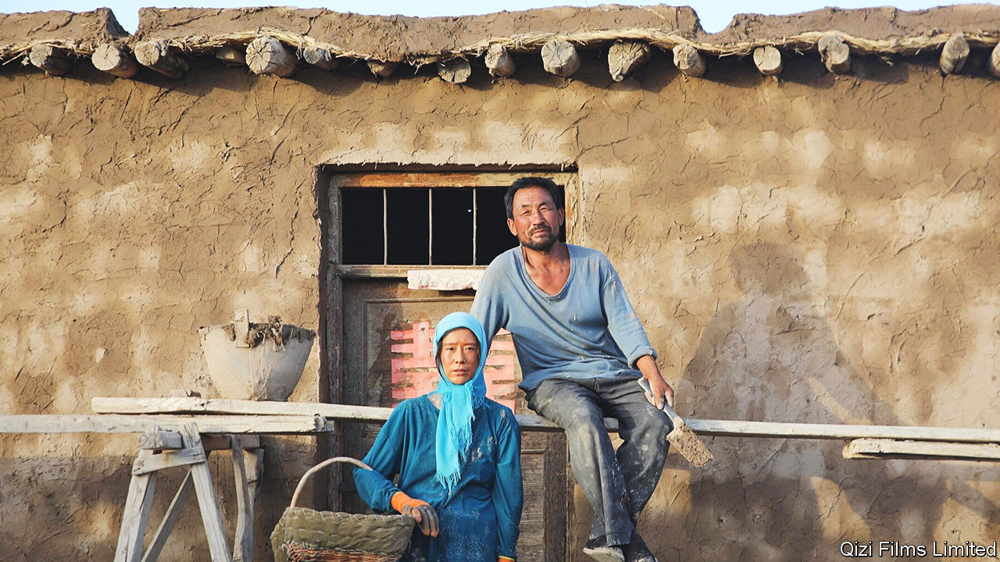

###### Forbidden love story

# A film about rural outcasts made waves in China 

##### Until it was pulled from cinemas 

 

> Sep 15th 2022 

With its modest budget and gritty subject matter, few expected the film “Return to Dust” to become a hit. Chinese cinema, which is heavily censored, tends to be dominated by light-hearted fare and patriotic blockbusters. “Return to Dust” is a complicated love story set in an impoverished bit of countryside. Yet in the first week of September it was one of China’s top-grossing films. Its total box-office earnings have exceeded 110m yuan ($15.8m).

The film is set in the north-west province of Gansu, where the writer and director, Li Ruijun, was raised. The story centres on the arranged marriage between a middle-aged man who has struggled to find a wife and a woman who is disabled, incontinent and unable to have children because of abuse suffered earlier in life. Their affection steadily grows as they face several challenges, the depiction of which seems to have made the Chinese government uncomfortable.

With only hand tools and the help of an old donkey, the couple work their fields and build a mud-brick house. They face constant hardship. Looming in the background is the government, which wants to clear the land for development (a common issue in rural China). A fat cat who stands to gain from the state’s plan bilks the couple out of money.

The scenarios are realistic, as are the portrayals. Mr Li made the cast live on a farm in Gansu for a year. Hai Qing, who plays the wife, is a movie star. But the husband is played by a local untrained actor called Wu Renlin, who is an actual farmer (and Mr Li’s uncle). Critics have been impressed: the film was hailed on the festival circuit. Lei Ming, a Chinese producer of other films, believes “Return to Dust” would not have been allowed to screen in China had it not garnered so much attention abroad.

As it gained popularity at home, though, the government appears to have gotten nervous. “Return to Dust” was suddenly dropped from cinemas in mid-September, despite being licensed to screen for longer. “Everyone knows there are lots of poor people,” says Mr Lei. “But the government doesn’t want Chinese people to see too much of it.” President Xi Jinping would like the arts to project “positive energy”. To that end, before the film was pulled from cinemas, the state added a postscript that straightened out its depressing ending. With the help of the government and fellow villagers, the message read, Mr Wu’s character moved to a better house.

