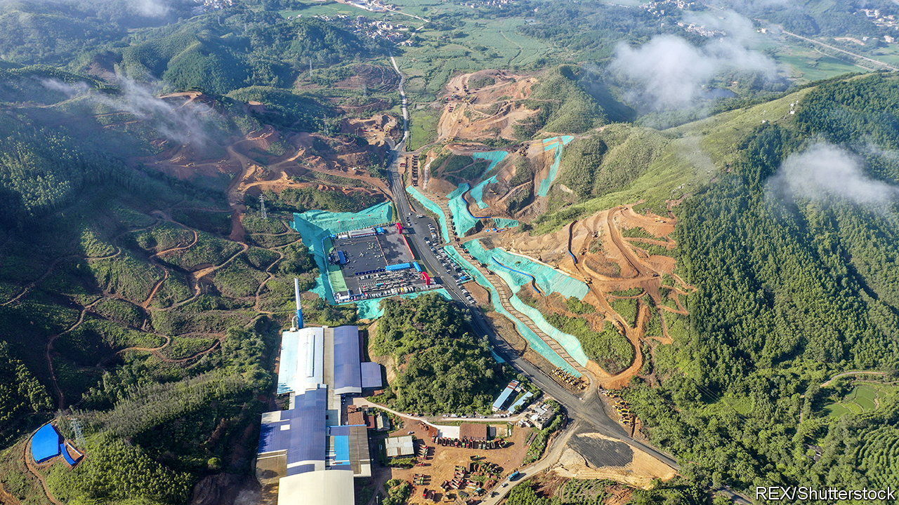
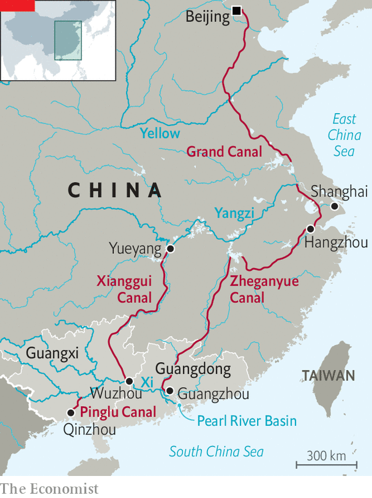

###### Change the channel

# China has plans for grand canals 

##### The building scheme is part of an effort to become a “transportation power” 

 

> Sep 15th 2022 

These are good times for local officials who want to build expensive infrastructure. To revive a flagging economy, battered by draconian pandemic-control measures, the central government is giving them freer rein. The southern province of Guangxi has a project that fits the bill: a canal costing $10.5bn that will link its main river system to the sea. It will involve a spree of demolition, digging, dredging and building over the next four and a half years. Mulled over for more than a century, the project began last month. 

 


The Pinglu Canal may sound piffling compared with the country’s most famous man-made waterway: the Grand Canal, much of which was built 1,400 years ago and which stretches more than 1,700km from the eastern city of Hangzhou to the capital, Beijing. According to the World Bank, part of the ancient channel was the third-busiest of the world’s inland waterways in 2017 by volume of cargo transported—and the only canal in the top six. The Pinglu will be a mere 135km long. Just 6.5km of it will be freshly dug. The rest will use existing river courses (see map). 

But officials are excited. They say it will be the first canal connecting a river to the sea to be built in China since the Communist takeover in 1949, and the first for transport since the Grand Canal itself. They predict big gains for the economy of Guangxi, which is one of China’s poorest provinces. Navigable tributaries of the Xi (or West) river flow through it, but they move eastward towards the much richer province of Guangdong. The new canal will enable goods in Guangxi to be sent from the Xi river system, by waterway, directly south to seaports in the same province instead of in Guangdong, which would shorten the journey by more than 500km. 

The canal will have three chains of locks that will be able to handle vessels of up to 5,000 tonnes. To allow these to pass, several large bridges will be torn down and rebuilt with higher clearance. About 10,000 villagers along the banks will be moved to newly built settlements, says , a magazine. There are officially protected mangroves growing in the area where the canal will meet the sea, but the government insists that the project will do no serious harm to the environment. A 20-metre-wide bridge will be built just to help animals to cross, including civet cats and red-bellied squirrels. 

Just the beginning

The central government sees the Pinglu Canal as the possible start of a much bigger canal-building scheme that could unfold in the coming years as China strives to become a “transportation power” by 2035 (a goal declared three years ago). The idea is to link up China’s main navigable rivers, which flow from west to east, with more north-south canals. 

The Grand Canal connects great rivers in the north, including the Yangzi and Yellow rivers. Two new super-long canals, yet to be formally approved, would connect the Yangzi with southern China’s Pearl river basin, into which the Xi flows. A proposed route for one of them, called the Xianggui Canal, would include a stretch of waterway that was built 2,200 years ago and has not been used for shipping since 1975. In total the Xianggui would be about 1,200km long and provide ready access in the south to the Pinglu Canal. The other new waterway being considered, the Zheganyue Canal, would connect with the Grand Canal and be even longer—about 1,900km. State media estimate the total cost for the two at about $65bn. 

Guangxi’s Communist Party chief, Liu Ning, described the start of work on the Pinglu Canal as a dream come true for his province. It must be for him. He is an engineer who had spent much of his career at the Ministry of Water Resources, working on some of the country’s biggest water-management schemes, before taking up his current post last year. 

In his new job, Mr Liu has stood out among provincial bosses for his fawning references to China’s leader, Xi Jinping. At the canal-building launch, Mr Liu was at it again. Work on the project must be “outstanding”, he said, in order to repay Mr Xi’s “care and love”. A boost to economic growth would please Mr Xi, too. ■

