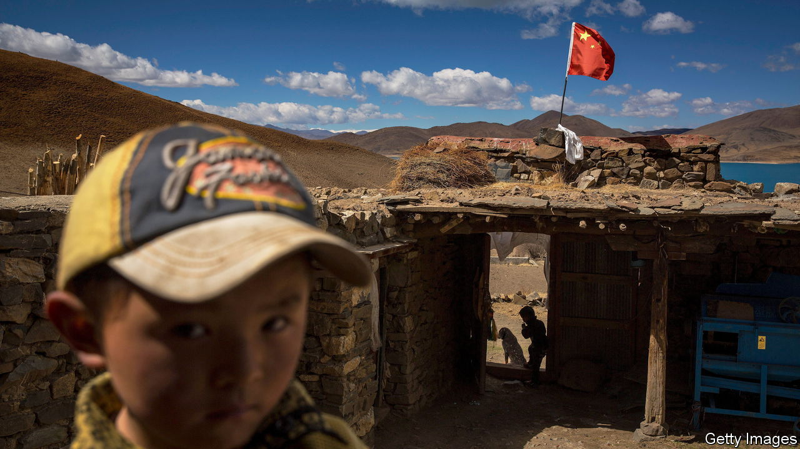

###### They will take blood

# China’s government is mass-collecting DNA from Tibetans 

##### It doesn’t bother to hide its aim: social control 

 

> Sep 13th 2022 

In one image Tibetan monks, clad in burgundy and orange robes, gather around as a police officer pricks a monk’s finger. In another image children at a kindergarten line up to have their blood taken by officers sitting at a rainbow-coloured table. The pictures, posted by the authorities on WeChat, a social-media platform, show an official campaign to collect the dna of Tibetans. It is often as casual as it is invasive. Many of the posts suggest police are pricking fingers while completing other tasks, such as registering id cards or enforcing covid-19 restrictions (much of Tibet has been locked down since August). The effort is painted as part of a broader campaign to strengthen local policing.

The mass collection of genetic material is nothing new to China. Its ministry of public security runs the world’s largest forensic dna database, thought to contain more than 100m profiles. It also maintains a separate database for finding missing children. Those efforts involve gathering samples from criminal suspects or the victims of crimes (as many Western countries do). But in 2017 the government launched a campaign to collect dna from 5% to 10% of all Chinese men, which would allow it to trace a man’s male relatives. Activists decried the move as yet another way for the state to monitor and control people. The authorities often punish perceived troublemakers by threatening their families. 

The campaign in Tibet has raised new alarms because of the government’s history of using genetic material to repress ethnic minorities. Activists draw parallels with the region of Xinjiang, where China has collected dna from Uyghurs and other minority groups, ostensibly as part of a health programme. It has used that material, along with data collected by security cameras and facial-recognition software, to build a totalitarian . In Tibet the police may already have collected dna from between 25% and 33% of the population, says a new report from Citizen Lab, a research group at the University of Toronto.

All this violates China’s criminal-procedure law, which allows dna collection only from criminal suspects or victims for the purpose of investigation. Unlike those in Xinjiang, the authorities in Tibet are not trying to hide their true intentions. “Fighting crime”, “maintaining social stability” and strengthening “population management” are some of the reasons given by authorities for collecting dna. Tibetans don’t have much choice in the matter, though you wouldn’t know it from the posts on WeChat. Police describe how, in one instance, officers “used careful explanation of the purpose and effectiveness of sample collection to make the doubtful participants become enthusiastically co-operative”. Their powers of persuasion never seem to fail. In another post the police say they “sample all who should be sampled”.

dna collection appeals to authorities who have a “fetish for control”, says Yves Moreau of the University of Leuven in Belgium. “When you have different methods of surveillance and control available, you want everything.” That rings true of China under Xi Jinping, parts of which resemble a panopticon. The president’s obsession with security trickles down to local police. In a Tibetan part of Sichuan province they brag about acting as “telescopes and microscopes” and of collecting 158 items of “basic information” from households. 

Other countries have considered creating compulsory national dna databases. But in most cases they have been ruled out on ethical and legal grounds. At the heart of the debate is a question of values, says Mr Moreau. If a society values freedom, then dna collection efforts should be small and targeted, he says. The idea is to ensure safety without “putting everyone on watch”. But if control is the point, there is little reason to hold back. ■

