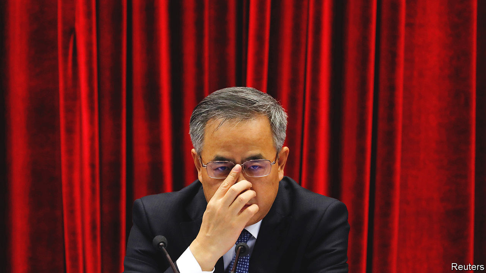

###### Next-generation thinking

# New leaders will soon inhabit China’s top decision-making bodies 

##### Will they change the country? 

 

> Sep 15th 2022 

For an aspiring Communist Party bigwig, Hu Chunhua’s back story seems hard to beat. One of six siblings born into rural poverty, he was the first in his county to attend China’s prestigious Peking University. On graduation in 1983, he joined the party and volunteered to work in Tibet. There he caught the eye of the local party chief, Hu Jintao (no relation), who became China’s top leader in 2002. Soon Hu Chunhua (pictured) was the youngest provincial governor and a member of the party’s Central Committee. Insiders began referring to him as “little Hu” and as one of the favourites to become China’s leader in 2022.

The chances of that happening now are vanishingly slim. Xi Jinping, aged 69, is widely expected to secure a third five-year term as leader at a party congress in October, breaking recent retirement norms. He could hold the top post for another decade—or more. Yet Hu Chunhua, at 59, may still join the new Politburo Standing Committee, the top leadership body, which now has seven members. And he remains a pre-eminent figure in the “sixth generation” of party leaders, which will probably supply most of the 25-member Politburo and the roughly 200-strong Central Committee.

Despite Mr Xi’s continuing dominance, the generational shift matters. These figures will head ministries, provinces and big party offices. It also raises questions. Among them: how will these newcomers influence decision-making, especially on the economy and covid-19? Will other top leaders observe the norm of retiring once they are 68 or over? And will a sixth-generation figure eventually replace Mr Xi or will he pick a successor from the seventh? 

One defining feature of the sixth generation, mostly born after 1960, is that it was the first to come of age amid the growing prosperity, relative stability and warming relations with the West that followed Mao Zedong’s death in 1976. That affected members’ education in particular. Like most of the fifth generation, Mr Xi was withdrawn from school in the 1960s and sent to work in the countryside. After seven years there he reached university, but only as a “worker-peasant-soldier”. Members of the sixth generation, by contrast, entered university after teaching was deradicalised. Most did postgraduate studies, often abroad. Chen Jining, the 58-year-old Beijing mayor and Politburo hopeful, did a phd at Imperial College in London. 

Another sixth-generation characteristic is the predominance of technocrats, mostly engineers and scientists, several of whom have led state-owned enterprises. Seven or eight such figures could join the Politburo, says Cheng Li of the Brookings Institution, a think-tank. A strong sub-group—dubbed “the Cosmos Club”—has a background in aerospace, reflecting Mr Xi’s emphasis on defence and technology. 

Yet some question whether such qualifications matter when Mr Xi prizes loyalty above all. Ministers and provincial leaders have some leeway in how they implement central directives but little space to innovate. “They know Xi’s not that policy-savvy, but there’s nothing they can do,” says Bo Zhiyue, a New Zealand-based expert on Chinese politics. “If you show your true colours, you can be in danger.” 

Up-and-coming technocrats are also matched, if not outnumbered, by those with personal ties to Mr Xi, including some who share his north-western roots and others who worked with him in Zhejiang, Fujian or Shanghai. Zhejiang protégés include Li Qiang and Chen Miner, now the party chiefs of Shanghai and Chongqing. Ding Xuexiang, who heads the party’s General Office, served Mr Xi in Shanghai. All three are already Politburo members—and front-runners for further promotion. 

Who ultimately joins the new Standing Committee will depend, in part, on whether current members aged 68 or over (except Mr Xi) retire. If so, two slots open up. But Mr Xi could force others to step down, making way for more new blood. The body could shrink or expand, as it has before. There may be surprises too: Sun Zhengcai, a Politburo member and potential Xi heir, was sacked just before the last congress in 2017 and later convicted of bribery. 

The new line-up could also reflect the degree to which recent setbacks compel Mr Xi to compromise. One indication will be what happens to 67-year-old Li Keqiang, who is expected to step down as prime minister. Another is Hu Chunhua’s fate. Despite his best efforts (he recently penned a newspaper article that mentioned Mr Xi 52 times), he is not considered an ally. But if Mr Xi sees a need to foster elite unity, Mr Hu could join the Standing Committee—and maybe become prime minister.

No member of the sixth generation is likely to be considered Mr Xi’s heir for the moment. He has avoided anointing a successor ever since he broke with convention by not elevating a next-generation figure to the Standing Committee in 2017. Most favourites to join it now will be too old to replace him if he stays on for another decade. More realistic, perhaps, is that younger figures emerge as potential heirs after joining the Standing Committee in 2027. 

So, for now, Mr Xi’s current and aspiring protégés will continue vying for his favour. That makes them less likely to unite against him, but heightens the risk that infighting and inertia impair good governance. Some draw parallels with Vladimir Putin, who prevented challenges to his rule by promoting loyalists from his past (especially kgb veterans) and having them compete with each other. 

Victor Shih of the University of California, San Diego, also sees similarities with Mao, who elevated weak or compromised figures to preserve his own power. Mr Xi has not quite reached that point. He is promoting competent acolytes with narrow power-bases. But that may change, Mr Shih says: “As he gets older and weaker, he&#39;ll have to adjust towards the Maoist model, because of this fear that someone&#39;s going to launch a coup late in his life.” ■

