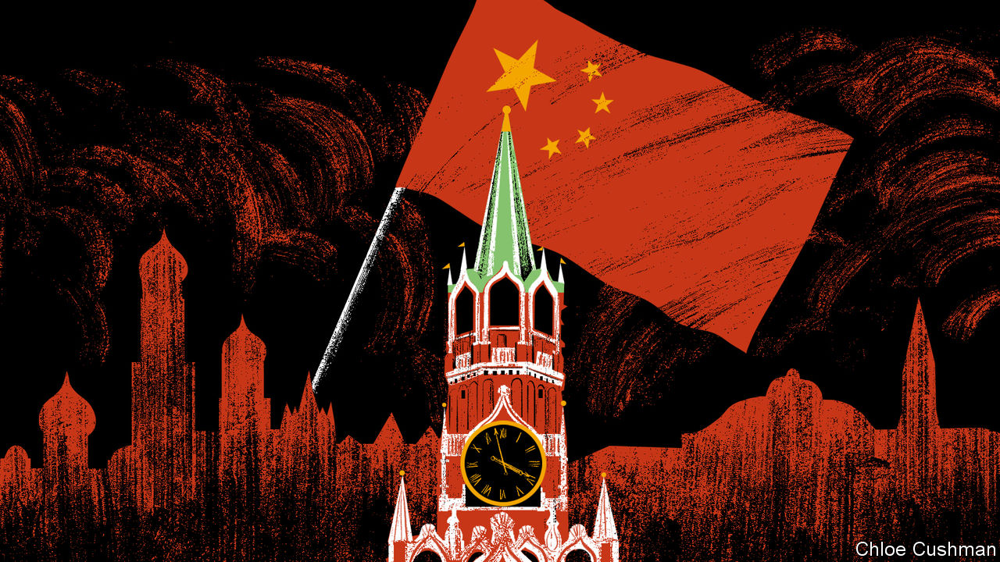

###### Chaguan

# Xi Jinping won’t ditch Vladimir Putin, for now 

##### China’s goal in Ukraine is Western disunity and failure, more than a Russian triumph 

 

> Sep 15th 2022 

Vladimir putin owes Xi Jinping an apology, for he carried a whiff of failure into his meeting with China’s leader in the Uzbek city of Samarkand on September 15th. That taint of humiliation follows bruising Russian setbacks in the war on Ukraine that Mr Putin chose to wage.

Mr Putin’s offence is compounded by poor timing. Back in February, on the opening day of the Beijing Winter Olympics, Mr Putin and Mr Xi declared a “no limits” friendship between their two countries. Days later the Russian leader invaded Ukraine. This latest Xi-Putin meeting, on the margins of a summit of the Shanghai Co-operation Organisation, a grouping of Eurasian powers, came a month before the highest-stakes gathering of Mr Xi’s career. A Communist Party congress opening on October 16th is expected to bestow on him power and ideological authority of a sort last wielded by Mao Zedong. Mr Xi goes into that congress facing headwinds from a slowing economy and a public growing exhausted by his draconian “zero-covid” policies. Now, on his first trip outside China since the pandemic, Mr Xi found himself sharing the world stage with a leader whom he has called his “best friend”, but who stands exposed as brutal, reckless and incompetent.

For all that, it would be premature to imagine that Russian losses in the plains and river valleys of Donetsk are enough to make Mr Xi rethink his decision in February to publicly align his vision of global security with Mr Putin’s. That world-view is based on a shared hostility to American-led alliances in Asia and Europe; scorn for Western multi-party democracy; and calls for a security order that heeds the “legitimate security interests” of sovereign states (Chinese and Russian code for deferring to big countries).

Mr Putin has time to redeem himself in China’s eyes. For Chinese interests to be advanced, Russia does not need to achieve all its war aims, let alone to control this or that Ukrainian oblast. China’s cold-eyed priority is for the American-led West to end up divided and weakened. China views this as a long game. It still hopes to see Europeans hold “America’s war” responsible for soaring energy prices causing pain to citizens and businesses across their continent, especially after a long, hard winter.

Throughout the past week of Russian retreats, China has maintained impressive message discipline. Each night, the main evening news programme on China Central Television, “Xinwen Lianbo”, has followed the same pattern. Over images of rockets being fired and shells zipping skyward, it tersely reports assertions by Russia’s defence ministry that it has struck targets in Ukraine, followed by Ukrainian claims to have fought back. The Biden administration is often accused of troublemaking, for instance by sending new weapons to fatten the profits of American arms manufacturers. Then comes the meat of each report: a lengthy account of how unhappy Europeans are reeling from sky-high fuel prices and gas bills, and how they blame them on American-led sanctions. This is delivered over such captions as “International view: America is only out for itself, and Europe is headed for failure.”

Propaganda chiefs might call their low-drama war-reporting proof of China’s neutrality in the fight between Russia and Ukraine. But that claim of neutrality has never been convincing. Chinese officials have spent months repeating Russian talking-points about America provoking the war by expanding nato up to Russia’s borders. Chinese diplomats and state media have promoted and relayed Russian disinformation accusing American armed forces of funding and controlling biological-weapons laboratories in Ukraine. China has, however, largely ignored Mr Putin’s wildest justifications for his invasion, notably his history-twisting ramblings about Ukraine being an eternal homeland of the Russian people, before it was carved off as an artificial state in a “historic, strategic” blunder by Lenin and other Bolshevik leaders.

China’s preferred account of the war was signalled by Li Zhanshu, the third-ranking official in the Communist Party and head of China’s pliant legislature, the National People’s Congress, during a visit to Russia this month. Mr Li said that Russia was “not crushed by the severe sanctions of the United States and the West, but rather in a short period achieved stability and showed resilience.” Without quite defending Mr Putin’s invasion, Mr Li told Russian parliamentarians that their country had been backed into a corner by nato expansion and had its national security threatened, adding: “Russia took actions that were necessary and China understands it.” In Moscow, Mr Li paid a respectful visit to Lenin’s former residence—perhaps because in Mr Xi’s China, questioning the wisdom of communist immortals is not encouraged.

Russia is useful, America is the obsession

Self-interest explains Chinese policy. China denounces American defence alliances and sanctions because it fears the same levers being used to contain China in Asia, or to punish an attack on Taiwan. Chinese leaders believe they will gain from a Russian draw or victory in Ukraine, concludes a senior Western official. “Either Russia is weakened and so China is stronger in their bilateral partnership, or Russia can claim victory and that’s a defeat for the West.” Either way suits China, he says. Taking advantage of Russia’s semi-isolation, China is buying its oil and gas at low prices, and will soon pay for more of it with its non-convertible currency, the yuan. Ever-cautious about its interests, China has avoided overt challenges to Western sanctions. “Our Chinese friends are tough bargainers,” Mr Putin noted, days before meeting Mr Xi.

To China, Mr Putin’s current woes are unwelcome but manageable. Abject defeat for Russia in Ukraine would be another matter. For one thing, it might trigger regime-threatening chaos in Moscow. For another, if liberal democracies stay united and prove willing to endure pain to defend the rules-based order, that would undercut China’s favourite charge that the West is in decadent decline. Mr Xi wants a fighter for a friend, not a loser. ■

