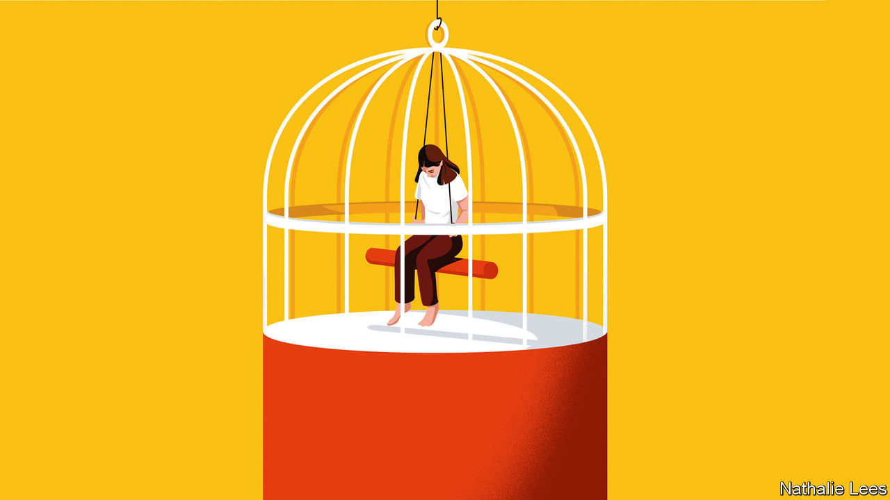

###### The pill machine

# Dispatches from the struggle to treat mental illness 

##### In “Strangers to Ourselves”, Rachel Aviv explores “unsettled minds” 

 

> Sep 15th 2022 

By Rachel Aviv.

What if the diagnosis of a mental illness does not help a patient? What if it traps them into a system—therapeutic or pharmaceutical—which, paradoxically, makes them worse? Rachel Aviv, a writer for th, poses these questions at the start of “Strangers to Ourselves”, a collection of essays loosely strung together by the theme of “unsettled minds”.

“Strangers to Ourselves” is book-ended by Ms Aviv’s own psychological struggles. She begins by recalling her hospitalisation for anorexia when she was six. At that age the diagnosis was too big for her to comprehend, just as the name of the illness was hard to spell: “I had some thing that was a siknis its cald anexorea.” On the ward, she learnt to imitate the tics and mannerisms of the older girls. Shocked at how she and her condition were typecast, her parents rejected the doctors’ advice that she should be put into a further psychiatric hospital—which may have saved her from a life defined by the disorder.

Near the end of her book, Ms Aviv writes about how, as a journalist in New York, she was put on an antidepressant. “My first six months on Lexapro were probably the best half-year of my life.” Her anxieties about her work lifted; she got engaged and, later, became pregnant. But when she tried to give up the drug, she found that she slumped into depression. She has now been on it for more than a decade.

Between these personal experiences, Ms Aviv profiles five people who have wrestled with psychological problems and written about their experiences in unpublished memoirs, diaries and fragments. Through these case studies, she questions the efficacy of different kinds of treatments and the parameters of clinical thinking, particularly in America, where a pill-based approach tends to dominate. One in eight Americans takes antidepressants; among white women, that rises to one in five. But the plights of black and poor people are often ignored. More than two-thirds of women incarcerated in prisons have a history of mental illness.

The most striking of these profiles is of Naomi Gaines. In 2003, when she was a 24-year-old mother of four, she jumped off a bridge into the Mississippi river with her young twin boys, one of whom drowned. Her problems, as a poor black woman, started young. She grew up in a sprawling public-housing complex in Chicago that was partly controlled by gangs. Her mother had an abusive boyfriend and the pair took drugs. Mental illness was never discussed, her mother tells Ms Aviv. “In our family, if you feel a little down you just take a nap. That’s the solution: take a nap.”

Ms Gaines moved in and out of hospital before her leap from the bridge. But the litany of diagnostic labels she was given was alienating, and she did not take her medication. “Where is the sensitive side of psychiatry?” she asked. After the jump she was committed to a secure institution as “mentally ill and dangerous” and started to take an antipsychotic. She was charged with second-degree murder and sent to prison. Things began to change: she read voraciously and became the prison’s library clerk. She was assigned a therapist. But in 2010 she was taken off the antipsychotic “due to cost”, and was soon put in solitary confinement for 60 days. She was released 16 years after her crime.

Ms Aviv writes sensitively about the limits of diagnosis in a case like this one. “Psychiatric insight can save a life,” she acknowledges. Yet a narrow medical outlook “may also blind doctors and family members to certain beliefs—a relationship to God, a new understanding of society and one’s place in it—that are essential to a person’s identity and self-worth.” She scrutinises the racial biases seemingly inherent in the American health-care system: according to one study, 40% of second-year medical students think black Americans are less liable to feel pain. She sees the limits of antidepressants, even if some drugs can reshape lives for the better.

The subtlety of Ms Aviv’s book is also its flaw. Her five profiles feel disparate and disconnected. A chapter set in India is the weakest; the author is best when she is on home ground. A case study that was originally a  profile—of a woman called Laura who was prescribed pill after pill—has the strongest sense of purpose. Ms Aviv’s withering assessment of the over-prescribing “biochemical” model of health care is powerful, as is her horror at the treatment Ms Gaines received at the hands of doctors and prison guards. More moments of clarity like these would have made for a better book. ■

