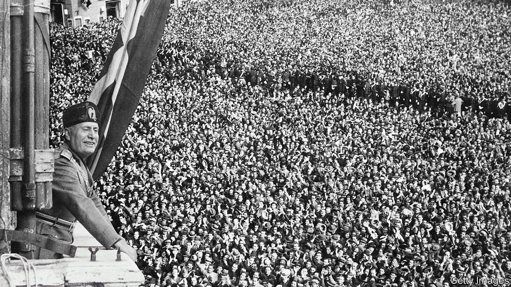

###### Mussolini’s shadow

# Italians’ memories of Fascism are dangerously inaccurate 

##### Paul Corner explains the distortion in “Mussolini in Myth and Memory” 

 

> Sep 15th 2022 

By Paul Corner. 

Seldom is the publication of a book more topical. On September 25th Italy will hold a general election at which around a quarter of the vote is expected to go to a party, the Brothers of Italy, that traces its origins to neo-fascism, flaunts the symbol of neo-fascism in its logo and has a leader, Giorgia Meloni, who as a teenager belonged to the defunct, neo-fascist Italian Social Movement (msi). She is odds-on favourite to be Italy’s next prime minister.

One reason this is happening lies in Italians’ indulgent perception of the Fascist regime that governed their country from 1922 to 1943. As Paul Corner of the University of Siena sets out to prove in this enlightening study, that perception is starkly at odds with the historical record.

Silvio Berlusconi spoke for many of his compatriots when in 2003 he told Boris Johnson and another interviewer that the Fascist dictator, Benito Mussolini, was “benign” and “killed nobody”. That is hard to square with the 3,000 victims of his blackshirt militia in the period before he seized power, let alone the hundreds of thousands who died following Italy’s savage invasion of Ethiopia in 1935.

Fascism created a nation that was partly supportive of it, and superficially enthusiastic, but also cowed by the enduring memory of the blackshirts’ reign of terror, and by a system of social control as rigorous as that later installed in communist East Germany. Almost every aspect of an individual’s well-being was dependent on party approval: “suitability for a job, for a licence, for a work permit, or for a pension would be decided at the discretion of the Fascist official”. Monitoring those suspected of dissent were a network of informers and two secret police forces. Yet, as Mr Corner notes, while “Gestapo” and “kgb” have become widely recognised and reviled terms, barely anyone recalls the ovra or the PolPol.

Neither are they reflected in the view commonly held in Italy that Mussolini “did many good things”, but made just “one mistake” by allying with Hitler. Mussolini did indeed do some good things (as any long-serving leader is likely to). His governments reorganised and extended Italy’s rudimentary welfare system. They built roads and houses. But Mr Corner makes the case that democratic governments of the period did similar things, only rather better. In the 1930s France built twice as many houses as Italy did.

Meanwhile other Fascist achievements, like the much-vaunted draining of the marshes south of Rome, represented the continuation of schemes initiated earlier. As for the alliance with Hitler, far from being a momentary lapse, it was entirely consistent with the congruence between Italian Fascism and Nazism.

So why should such a distorted view have become widespread—and not just in Italy? Scattered through Mr Corner’s book are various explanations. One is that the Fascist era is still seen through the lens of the regime’s superb propaganda machine, literally so in the case of the newsreel clips produced by the state-run Istituto Luce. Another explanation is what Mr Corner terms the “lesser evil argument”, whereby the horrors of Italian Fascism are belittled by comparison with those inflicted by Hitler and Stalin.

But he proposes a further explanation that is as contentious as it is intriguing, rooted in the conviction of many Italians that they are intrinsically  (“good people”). In the 1970s the post-war myth that they had been merely victims of Fascism began to yield to another simplistic orthodoxy: that there had been mass consensus in favour of it. But, says Mr Corner, that turnaround produced a paradoxical effect. An argument took hold that “if Italians are ‘good people’, and if there was a mass consensus for the regime, then, logically, Fascism could not have been so bad.” That is an interpretation unlikely to be challenged if Ms Meloni and her Brothers do indeed come to power. ■

