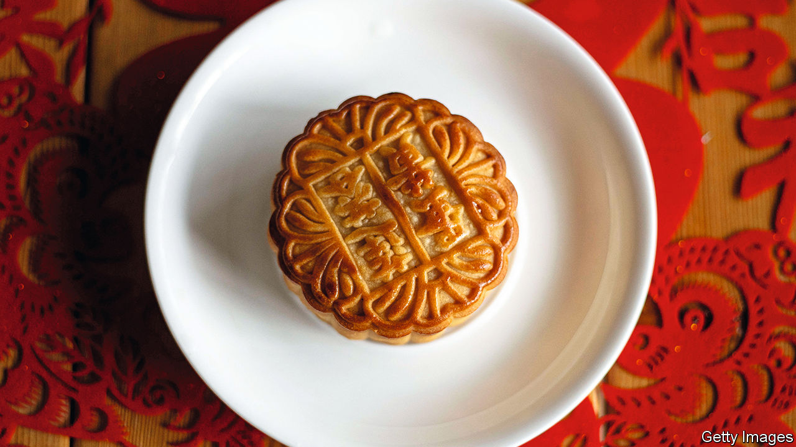

###### World in a dish

# Mooncakes, an ancient tradition, are constant yet variable 

##### Like other holiday treats, they are also a lot of work 

 

> Sep 15th 2022 

At the southern end of Manhattan the grid system comes undone, and the streets converge like electric cables at the bottom of a junk drawer. Chinese immigrants have flocked to the neighbourhood for well over a century. Trend-obsessed eaters shun this Chinatown for the one in Flushing, or glitzier spots in the East Village. But nowhere in New York offers such a wealth of old-school Cantonese delicacies: crackling roast pork, carefully seasoned seafood and, at this time of year, soft, golden mooncakes.

Mooncakes are a stuffed pastry eaten for the Mid-Autumn Festival, a harvest holiday celebrated in much of East Asia, second in importance only to the Lunar New Year. This year it fell on September 10th. Gary Chan, a Chinese-American baker who owns Bibble and Sip in midtown Manhattan, compares it to Thanksgiving: a family reunion with food as its anchor.

As with the cakes and pies that conclude a Thanksgiving or Christmas dinner, mooncakes are celebratory. And rich: they have lard-enriched wheaten crusts and fillings traditionally made from bean paste, mixed nuts, lotus seeds, fatty pork and other unusual sweet foods. Miranda Brown of the University of Michigan notes that in the past they would have been a particular treat in rice-centric southern China. Before baking they are pressed into a mould to imprint designs and characters, further distinguishing them from ordinary fare. When most families did not have ovens, they would have had to buy them from a specialist—another splurge.

They are still mostly bought rather than made. These days cooking them at home is easier, but it is still an undertaking. A recipe from Andrea Nguyen, a Vietnamese-American cook, is four pages long, takes 22 steps, requires a special mould to shape the cakes, and includes salted egg yolks, sausage, fruit-cake mix, sorghum and rose-petal liquor, and canned chicken. Mooncakes have a fudge-like density and lightness and, as in many East Asian desserts, the fillings tend to be delightfully subtle rather than sickly sweet. 

Or, they do now. The tradition of eating mooncakes for the Mid-Autumn Festival dates back to the Tang dynasty, well over 1,000 years ago; but the cakes themselves have varied in form and filling. When many ethnic Chinese left Vietnam following the Communist takeover, Ms Brown explains, they brought their style of mooncakes with them. These “snow-skin” cakes are served cold, with a soft crust made from steamed rice flour, and have grown popular around the world.

Mr Chan makes highly Instagrammable mooncakes with a mochi and organic sweet-potato filling and inventive moulds (this month’s include lions, persimmons, peanuts and lucky cats). He feels pressure each year to do something novel and delicious; that, combined with the manpower involved, leaves him a little frazzled by early September. The upshot will be familiar to anyone who has cooked a Thanksgiving or Christmas dinner. “Every year,” he says, “we go, ‘We’re not doing this again.’ And then every year we come right back to it.” ■

