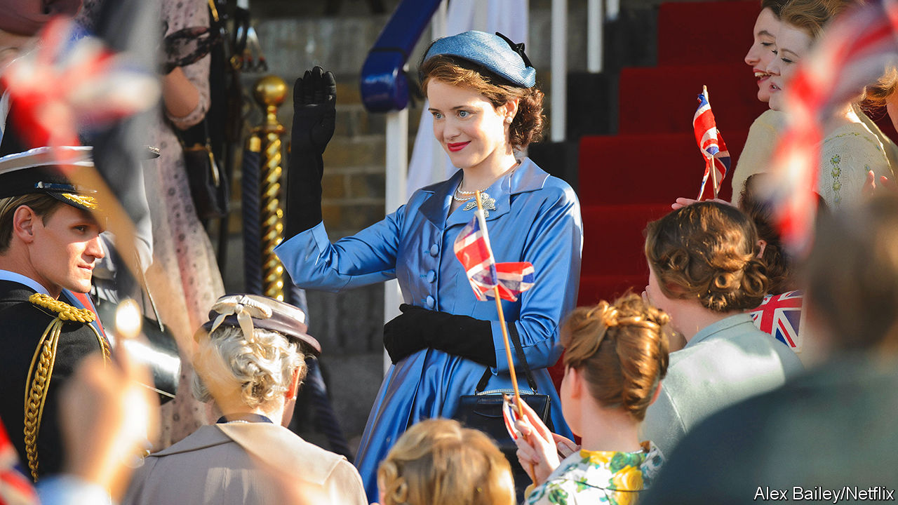

###### The queen on screen

# “The Crown” will help shape the memory of Queen Elizabeth II 

##### It is a flattering portrait—mostly 

 

> Sep 15th 2022 

The helmet of hair, the waving hand, the clipped intonation, the corgis: on screen, a few universally recognised tropes instantly evoke Queen Elizabeth II. But for much of her 70-year reign, depictions of her in the arts did not delve far below the familiar surface. Most were superficial or comical; few tried to throw open the doors of the House of Windsor and nose around inside. When, in 1977, the Sex Pistols declared that “our figurehead/Is not what she seems”, the guitars and thrashing drums sounded like a rebellion against her inscrutability. In 2001 Lucian Freud painted her with tellingly pursed lips. 

Then Peter Morgan, a screenwriter and playwright, spied a story in the bond between monarch and prime minister. He explored that relationship in “The Queen”, a film of 2006 that chronicled the aftermath of Princess Diana’s death in 1997, when Tony Blair was in Downing Street. The weekly meetings between queen and prime ministers provided the structure for “The Audience”, his play of 2013. Then came “The Crown”, a drama about Elizabeth’s reign broadcast on Netflix since 2016.

More than any other screen interpretation, “The Crown” has sought to understand the queen as a person as well as a figurehead. Rigorous as Mr Morgan’s research is, he has said that “joining the dots” of history is the dramatist’s prerogative. The show imagines the Windsor family’s gatherings, chit-chat and reactions to the headlines. It portrays shooting parties at Balmoral and pageants at Buckingham Palace.

Saints and sinners

The result is a smash hit, which has influenced perceptions of the queen around the world—and may do so in posterity. Shakespeare’s plays defined the reputations of Richard III and other English kings. Albeit to a lesser extent, “The Crown” will help shape the memory of Elizabeth II. 

Its recurring theme is the queen’s unwavering sense of duty. In the first season, Elizabeth is taught about the “dignified” and “efficient” branches of government as outlined in Walter Bagehot’s “The English Constitution”. She belongs to the dignified, symbolic branch, and stands apart from the bit that does the actual governing. After her accession to the throne in 1952, the show suggests, that doctrine is her guiding principle. Played initially by Claire Foy (pictured), she prevents her sister, Princess Margaret, from marrying her divorced lover on grounds of impropriety, and casts out her wayward, Nazi-sympathising uncle, Edward VIII. She counsels constancy and stoicism above hastiness and passion.

Grasping her role as a national symbol, the monarch grows accustomed to self-effacement. When Prince Charles (Josh O’Connor) wants to exhibit his personality in public, the queen (now played by Olivia Colman) forbids it: “People will always want us to smile or agree or frown or speak, and the minute that we do, we will have declared a position, a point of view—and that is the one thing as the royal family we are not entitled to do.” Her husband, Prince Philip (played by Matt Smith, then Tobias Menzies), describes her as one in a line of “dull, dutiful, reliable, heroic” Windsors, in stark contrast to the “dazzling, the brilliant, the individualistic and the dangerous” members of the family. In a changing world, the queen of “The Crown” strives to be immutable.

All that makes her a tricky protagonist. The queen, Mr Morgan has said, is “not naturally a person you’d want to put at the centre of any drama, because she’s this remarkably undramatic woman”. He has likened her to a Russian doll, her feelings and impulses concealed deep within. Still, “The Crown” imbues her with the dry wit she is often said to have exuded in private. When new stamps are issued with her likeness, she quips that they mark her transition into an “old bat”. Some of her exchanges with Philip fizz with sexual chemistry.

And, in this telling, she keeps a close eye on the government and does not suffer fools. In the wake of the Suez crisis of 1956, she upbraids Anthony Eden (Jeremy Northam) for lying to Parliament. When Margaret Thatcher (Gillian Anderson) is at loggerheads with her party, Elizabeth reminds her that “power is nothing without authority”. By imagining such private reproaches, the show implies that the queen did much more for the country than cutting ribbons and opening hospitals. 

So far, so flattering. But “The Crown” is not pure hagiography. It suggests that the famed stoicism was both a strength and a flaw. In 1966 the fictional queen struggles to find the right words after the Aberfan disaster, which killed almost 150 people, and resorts to faking tears. Her judgment of royal interests is not always astute. One episode explores her meddling in the early relationship between Charles and Camilla. Watching it now, as the real-life versions assume the roles of king and queen consort, you get the feeling that a lot of heartache might have been avoided had Elizabeth behaved differently.

Yet admiration for the queen was not affected by this rendering. According to surveys by Ipsos, since the show first aired her approval rating in Britain has remained sky-high, at 86%. The same is not true of King Charles. Viewers criticised him on social media after scenes of his stormy marriage to Diana. Between 2016 and 2022 his approval rating slipped from 71% to 65%. Support for the monarchy itself dipped too. Since the queen’s death, “The Crown” has shot up Netflix’s viewing charts again. A new season, with Imelda Staunton on the throne, is due in November.

Discretion and diplomacy were the real queen’s watchwords. She regretted allowing behind-the-scenes access for “Royal Family”, a documentary shown in 1969. Likewise, early in “The Crown”, her character fears that televising her coronation would compromise the “higher ideal” of monarchy. On the contrary, argues Philip, such insights will let the public “feel that they share in it, understand it”. Accurately or otherwise, millions of viewers of “The Crown” may now think they do. ■

