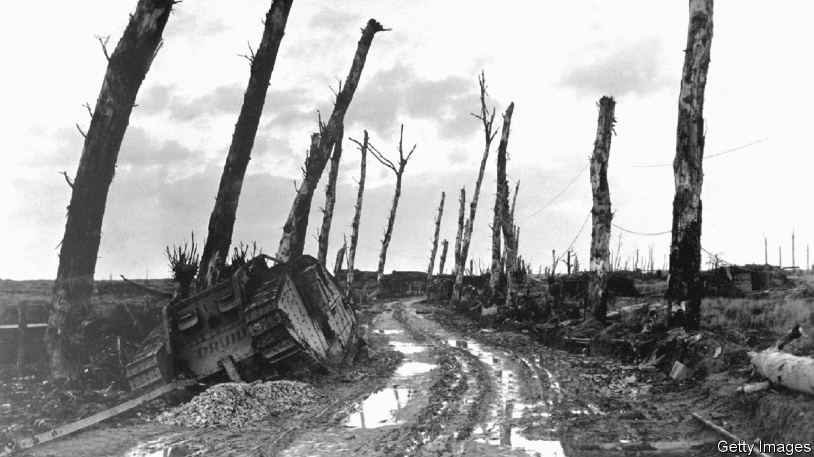

###### Back Story

# “The Waste Land” is a case study of great art by flawed artists 

##### On its centenary, the challenge is to reconcile T.S. Eliot’s masterpiece with his prejudice 

 

> Sep 15th 2022 

Babies like “The Waste Land”. Try it on one if you’re sceptical. They appreciate the assonance, the rhythms and the intermittent rhymes. They cock an ear at the hair that “Glowed into words”, the “rattle of the bones” and the mystical sign-off: “Shantih shantih shantih”. True, they may not get all the allusions. But then hardly any adults do either.

The thicket of references is one reason readers have often struggled with the long poem since it was first published 100 years ago, in October 1922. Chaucer, the Bible, Dante, Wagner, Buddhist and Hindu texts, Shakespeare and St Augustine, Ovid and Arthurian folklore—T.S. Eliot put them all in. Despite insisting on the “impersonality” of art, he drew on his grief for his father, the disintegration of his psyche, his wife’s and their marriage, and his day job at Lloyds Bank, where he dealt with German debts from before the first world war. Europe’s post-war upheavals shudder through the lines.

What is that sound high in the air

Murmur of maternal lamentation

For some, the upshot of all these influences is merely, in a phrase from the poem, “A heap of broken images”. In 1923  queried whether it had been “written as a hoax”. For others, “The Waste Land” is, like “Ulysses” (published in the same year), a landmark of Modernist literature. How readers respond to it is a matter of prejudice—their own, but also, now more than ever, the poet’s.

“The Waste Land” is a work of fragments: of people (those bones and that hair), stories and memories, which Eliot once called “the faded poor souvenirs of passionate moments”. There are snippets of writing and conversations in many languages and registers, highfalutin to demotic. As Matthew Hollis relays in his forthcoming book, “The Waste Land: A Biography of a Poem”, some lines echo the chatter of two brassy actresses who lived below the Eliots during the war. It doesn’t make sense; at least, not in a linear, rational, conventional way. 

But that is part of the point. Elsewhere Eliot warned readers of verse not to seek “a kind of ‘meaning’ which is not there and is not meant to be there”. He talked of a “logic of the imagination” that joins up disparate images, and an “auditory imagination” that operates “far below the conscious levels of thought”. These are how he evokes his themes of death, grief and resurrection, doubt and faith and urban anomie, the presence of the past, sex, disgust and (above all) loneliness and a yearning for connection, for the key that unlocks the prison of the solitary mind. 

My friend, blood shaking my heart

The awful daring of a moment’s surrender

Which an age of prudence can never retract

By this, and this only, we have existed

The real meaning of “The Waste Land” is how it makes you feel. This way of responding to art tends to come naturally for music or paintings. When the medium is words, some readers find it harder to trust in their emotions. Perhaps that reflects a failure in the words; perhaps it is a limitation in the readers.

So much for their prejudice. As for the poet’s: he was not as hatefully bigoted as his friend Ezra Pound, a bad man but an inspiring editor whose gruff corrections sharpened the drafts of “The Waste Land” into the piercing marvel it still is. But Eliot’s prejudices—in particular, his anti-Semitism—were grim.

In the past, the poet’s fans, and Eliot himself, tried to explain away the slurs that scar his writing. “The rats are underneath the piles”, runs one poem. “The jew [sic] is underneath the lot.” He was  prejudice, he was a man of his time, don’t be a philistine; and so on. Letters newly cited by Robert Crawford in “Eliot After ‘The Waste Land’” put an end to the casuistry. “Why is there something diabolic about so many Jews?” Eliot asked in 1934. He was a diehard anti-Semite, even amid the Nazi horror. 

So, at its centenary, “The Waste Land” is a case study in thinking about great art by reprehensible artists. Anti-Semitism does not feature in the published poem; but that does not mean readers should blithely ignore the poet’s failings. Nor, though, are those a clinching reason to forswear reading it altogether. 

The challenge is to acknowledge, and reconcile, the masterpiece and the monstrous views. Generously, perhaps, you could see both as symptoms of a mind, and a world, convulsed by change and modernity (for which, in Eliot’s vile caricatures, Jews are sometimes a kind of avatar). Or you can accept that people, like poems, can be made up of jagged fragments that form a complex whole. 


 (Aug 31st)


