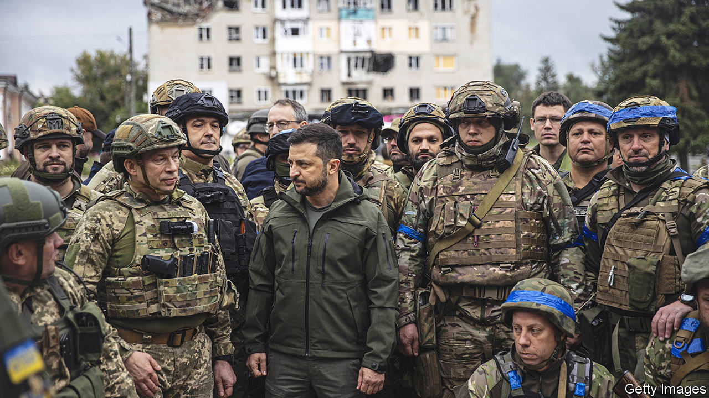
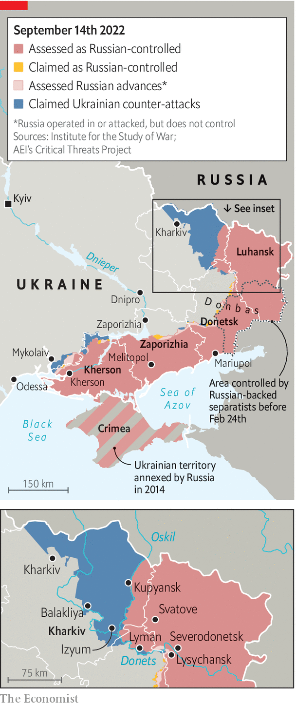

###### Chasing the bear away

# A stunning counter-offensive by Ukraine’s armed forces 

##### Russian troops flee in disarray 

 

> Sep 15th 2022 

Russian military vehicles litter the road to Izyum, in Ukraine’s north-eastern Kharkiv province. They serve as signposts to the Ukrainian counter-offensive which began on September 5th and liberated virtually the whole province in a matter of days. As you get nearer to the town, which sits atop a strategic hill, the heavy armour turns into a river of metal. There are tanks, artillery pieces and the remains of a tos-1a heavy flamethrower with its rocket pod sheared off. More than a dozen vehicles stand abandoned in one garage alone. Remarkably, much of this graveyard of Russian might seems to have filled up without any fighting. The invaders appeared to have panicked, abandoned their kit to the advancing enemy and fled.

Ukrainian troops arrived on the outskirts of the town on September 8th, three days after the start of a lightning operation that overwhelmed Russia’s north-eastern flank. Denys Yaroslavskiy, a special-forces officer who took part in the first wave, said the offensive grew in “domino” fashion. Within 24 hours Ukraine’s army had encircled Balakliya, a town close to the front line. Two days later, it seized Kupyansk, a critical rail hub connected to Moscow. At dawn on September 10th Ukrainian units entered the centre of Izyum itself. 

 


The Kharkiv offensive is the most consequential military action of the war since Russia abandoned northern Ukraine in late March. It has liberated over 6,000 square kilometres of territory, said Volodymyr Zelensky, Ukraine’s president, who visited the new front lines at Izyum on September 14th. In six days of fighting Ukraine’s army captured two brigades’ worth of Russian military equipment, according to Oleksiy Arestovych, an advisor to Mr Zelensky. That includes valuable kit such as counter-battery radar and t-80 tanks. “After the usa,” quipped Mr Arestovych, “Russia is the main provider of vehicles for the Ukrainian army.” Significantly, the loss of Izyum probably now makes it impossible for Vladimir Putin to meet his stated aim of conquering the entire Donbas region to the south. 

Yet the most important consequence of the offensive is what it says about the future. It shows that Ukraine is capable of fast, complex and daring attacks; that Russia can be dislodged; and that Ukraine can therefore win. The speed of the advance hinged on a superbly executed plan and new Western weaponry that has denied Russia air supremacy. Ukraine’s army was “inventive and experimental”, says one Western official, with decision-making pushed down to low levels.

At times it was improvised. Some Ukrainian units were given instructions to head to Izyum in whatever way they could. “We didn’t sleep for three days,” said Mr Yaroslavskiy. “We fed on adrenaline, excitement and anticipation. None of us expected it to move so fast.”

The front was thinly manned because Russia had earlier sent its best units to the southern Kherson region, where Ukraine is conducting another offensive, leaving poorly trained militia and national guard units to hold the line. The operation in Kherson is not a feint—it involves more troops than the one in Kharkiv did—but Ukraine successfully deceived Russia into believing that it was the sole object of Ukraine’s attention. Ukraine disguised its preparations by thinning out some weapons, such as himars rocket launchers, from the attack force in Kharkiv, with a relatively small number of tanks punching through in the first wave.

But Russia’s armed forces also proved brittle and leaden. Its command system appears to be in crisis. “For some decisions, they are still reverting all the way back to Moscow and back to the front line,” says the Western official, “which speaks to a lack of agility.” Russia’s removal of mobile-network coverage in Kharkiv and a scarcity of secure radios (on both sides) meant that the defenders were caught by surprise when Ukrainian soldiers swarmed through the forest.

Serhiy, a company commander in Ukraine’s 25th brigade, said the tactic meant sleepy Russian troops found themselves cut off from their comrades. “At one point, we turned around to see a Russian [armoured personnel carrier] driver chugging along without a care in the world,” Serhiy said. “He surrendered at the next checkpoint when he realised what had happened.” Another soldier, who uses the  of Tiger, said his unit was still finding enemy soldiers far behind the current front lines. They were surrendering on sight, he claimed.

The communications black hole extended to civilian life. Izyum’s local population—cut off from the internet, gas and electricity for most of the last six months—did not expect its starring role in the war. Many realised something was up around September 6th, when the Russians introduced a week-long curfew, enforced with a shoot-on-sight order. Nikolai, a pensioner, says he took heart when he heard the grind of heavy armour retreating across the Donets river early in the morning of September 10th. Many regular Russian army units abandoned their colleagues from proxy militia forces, leaving them to hide or surrender. The disappearance did not come quick enough, Nikolai said. “They bombed us with everything they had: helicopters, planes. Bastards.”

Not universal love

But many of his neighbours had, on the contrary, rooted for Russia, and some even shopped pro-Ukrainians to the occupying authorities. On September 14th an angry crowd at the artillery-pocked central square reflected the divisions as Mr Zelensky in person raised Ukraine’s blue and yellow flag. A large part of the crowd blamed him for the war. He should have offered Mr Putin concessions, said one. Svetlana Stepanova, 55, insisted that she would not be “forced” to say “Glory to Ukraine!”—the Ukraine for which she once had affection was no more, she lamented.

Though the offensive has showcased Ukraine’s strengths and exposed Russia’s systemic weakness, such a blitzkrieg will not be easy to repeat elsewhere. In the south, Ukraine has trapped around 20,000 Russian soldiers on the west bank of the Dnieper river, cutting off their resupply with rocket attacks on bridges. But Ukrainian troops, exposed on Kherson’s flatlands, are thought to be taking heavy casualties against a Russian force that is larger, more experienced and better dug-in than the one in Kharkiv.

For now, Ukraine’s army is determinedly pressing home its unexpected advantage. As  went to press, fighting continued on the outskirts of Kupyansk and in Lyman, in Donetsk province to the south, with Ukraine controlling a section of the road in between. If both of those battles tilt Ukrainian, thousands of Russian troops based on the eastern side of the Oskil reservoir could face encirclement. The town of Svatove to the east in Luhansk, atop the roads to Belgorod in Russia, is a key battleground.

It would also open the prospect of Ukraine retaking part of the Luhansk region, including the towns of Severodonetsk and Lysychansk. But the forward lines remain fuzzy and could be reversed if Ukraine pushes too deep and fast. Few of the soldiers who walked into Izyum believed Russia would accept the humiliation of losing towns it captured only after three gruelling months of fighting. But Nikolai says that he has stopped worrying about Russia returning. A walk around town and its makeshift scrap yards convinced him of that. “How do they intend to come back?” he asked. “On what exactly?” ■


