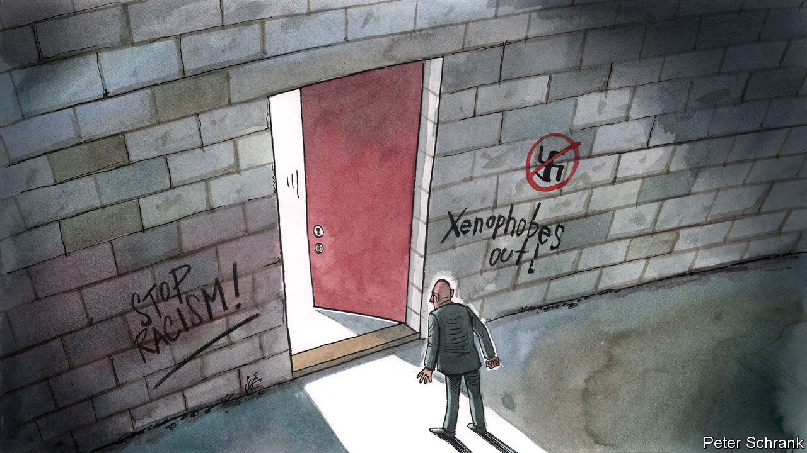

###### Charlemagne

# Demonising nationalist parties has not stemmed their rise in Europe 

##### Success in Sweden and soon in Italy shows their continued electoral appeal 

 

> Sep 15th 2022 

Imagine if abba, undisputed masters of the kitsch euro-pop musical genre, was sent year after year to represent Sweden in the Eurovision Song Contest, a kitsch euro-pop extravaganza. Bored pundits would soon start betting on which of the other contestants was best placed to come second. Elections in Sweden have a similar flavour, with the Social Democrats in the role of the spandex-clad crooners. On September 11th the centre-left party came top in its 32nd consecutive parliamentary election, securing just under a third of the vote. The last time it was defeated, by a mere 0.1% margin, the first world war was in its opening throes. Not even the most brazen election-riggers in Moscow or Pyongyang have racked up such a winning streak.

If the name of the party with most votes came as no surprise, that of the runner-up did: the Sweden Democrats (sd), an outfit with roots in the neo-Nazi movement. Having campaigned to “make Sweden great again” (subtext: with fewer immigrants), it snagged second place from the centre-right Moderates. It was the first time in a dozen elections over four decades that a party had gatecrashed the established political order in Sweden. Even more notable was that, as the biggest vote-winner of the right, which eked out a narrow victory over the combined forces of the left, the sd would normally be poised to lead a government. This would propel its youngish leader, Jimmie Akesson, to the prime ministership—a remarkable outcome for a party that got its first members of parliament elected just over a decade ago.

And yet an Akesson government is not on the cards. Indeed it is uncertain whether the sd will get any ministerial posts. In Europe, two party-political systems exist in parallel. Any party within a spectrum that goes from full-blown Trotskyism to family-values conservatism gets to politick freely, crafting alliances with friends and foes as they vie for power. In contrast, parties that flirt too enthusiastically with xenophobia, such as the sd, Marine Le Pen’s National Rally in France, various Dutch populists and Vox in Spain—are considered beyond the political pale. In most countries some sort of , a barrier used to isolate the infectious, has separated the civic mainstream from the untouchable. At its most uncompromising even debating with those beyond the  was considered a betrayal of political norms. Bringing them into ministerial office, as Austria first did in 2000, was enough to trigger diplomatic reprisals by its eu neighbours.

Such ostracism has failed. Treating nationalists as pariahs has not prevented their rise. On the contrary: elections in Europe now are often a case of loudly pitting the mainstream against the supposedly unpalatable and hoping that not too many voters pick the “wrong” side. Simply hoping the nasties go away has not, in fact, made them go away. 

In all likelihood the them-versus-us strategy will take yet another big knock later this month when Italians vote. Giorgia Meloni of the Brothers of Italy, a party with neo-fascist roots and plenty of bile aimed at foreigners, looks set to come top. Unlike Mr Akesson, she has the allies needed to become prime minister. If that happens it will be the first time in decades a western eu country has had a government head with an avowed nationalist bent (in the east, Poland and Hungary come close).

The erosion of the  may do some good. The ban has often hobbled the fight against intolerance, not bolstered it. At its worst, it has given nationalist parties a free pass. Many have been allowed to, in effect, join ruling coalitions—including the crafting of government programmes—without getting ministerial posts, as may be about to happen in Sweden. Such confidence-and-supply deals suit mainstream parties, who get to dole out more top jobs among themselves. But it gives populists on the outside the power to shape policies with none of the accountability. 

Bringing xenophobes into government is not a sure-fire way of draining the abscess. But it can work. Some have floundered in office when they joined ruling coalitions: in Austria and the Netherlands, nationalist groups in power collapsed under the weight of their ineptitude. In Norway the populist Progress Party mellowed after first getting ministerial briefs a decade ago. (By contrast, ekre, a nationalist outfit in Estonia, joined the government for two years before being booted out in 2021 and remains popular.) Staying out of office also carries its own risk for nationalists: in Denmark the bigoted People’s Party refused to enter government in 2015 after coming second in parliamentary elections, only to find mainstream parties stealing its migrant-bashing rhetoric and policies. It is now a spent force.

Outsiders looking out

Denouncing racists and xenophobes is a worthy cause. But treating them as untouchables has deepened their electoral mystique. Mainstream parties have too often shied away from speaking honestly about immigration and crime, sounding other-worldly to voters who have noticed changes on the ground. When “normal” politicians belatedly try to address such issues—during Sweden’s campaign, a spate of gangland shootings linked to migrant gangs made it inevitable—they look like tourists in political territory they vacated long ago. Even mentioning immigration is considered a sop to Those Who Must Not Be Named. 

The more ferocious the alliance against the xenophobes is, the more a swathe of voters may come to see them as the only alternative to a political cartel they think out of touch. Campaigning vocally against populist ideas to siphon votes away from the nasties is laudable. Denying them influence once the results are in is not. In a democracy, a political party receiving broad electoral support with nothing to show for it should be a source of civic embarrassment, not pride. Voters have been treating nationalist parties as “normal” for a long time. If politicians do not do the same, they can expect to be punished. ■


