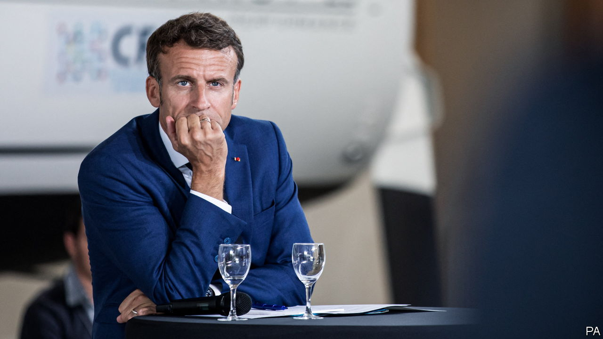

###### A budget battle looms

# France’s president, Emmanuel Macron, gets back to work 

##### Despite an energy crisis and a lost majority, he hopes to revive reforms 

 

> Sep 15th 2022 

B y september 2017, just months after he was elected for the first time, Emmanuel Macron had already passed controversial decrees designed to loosen up the French labour market. These helped the economy create jobs and bring down unemployment to its lowest level for 14 years, embodying the president’s early reformist zeal. Today, five months after Mr Macron’s re-election, that breezy can-do spirit has faded. The president’s demeanour is often sombre, his mode crisis-management. The question now is whether Mr Macron can revive his reformist vigour and complete unfinished business from his first term. 

The president’s darker note is scarcely surprising. He was re-elected in April amid war in Europe. The inflationary consequences of Russia’s bloody invasion of Ukraine, and the subsequent sanctions, are being felt in France as elsewhere. This summer Mr Macron told the French to prepare for a harsh winter, calling it the “price of our freedom”.

Yet his hands are also tied in new ways. In his first term Mr Macron enjoyed a robust parliamentary majority. When policymaking stalled, it was usually due to protests on the street, not the opposition benches. Today, after big losses at elections in June, Mr Macron’s party and its centrist allies are 40 seats short of an absolute majority. He is having to make do with a minority government. 

So far this has complicated, rather than blocked, law-making. In August parliament passed a cost-of-living package worth a hefty €64bn ($64bn) in two separate bills, despite the hostility of the biggest opposition bloc and rowdy late-night debates. Most members of Jean-Luc Mélenchon’s left-wing alliance, nupes, voted against both bills, arguing that the measures were inadequate. They passed thanks to support from the centre-right Republicans. “A culture of compromise is being built. That’s what the French asked for,” said Elisabeth Borne, the prime minister. 

Up to a point. By re-electing Mr Macron, but depriving him of a majority, French voters seemed to be asking for a different governing style: more consensus-seeking, and less top-down. Ministers have been forced to consult and cajole. The national gaze has shifted to parliamentary debates. The business of forging compromise and seeking support in the chamber has put a fresh spring in many a deputy’s step. “It’s actually very positive for French democracy,” argues Benjamin Haddad, one of Mr Macron’s new deputies.

Yet in reality France’s minority government has not been fully tested. To vote for public spending in order to subsidise energy bills is one thing. To lend the government support for controversial reforms that voters dislike will be quite another. The real test in the coming months will be over three items: the 2023 budget, due to be presented to cabinet on September 26th; a reform of unemployment benefits; and a promised pension reform. 

Already the Republicans have said that they will not vote for the budget. The party elects a new leader in December, and no candidate wants to be seen as a Macron lackey. nupes has made its  opposition to anything Mr Macron comes up with. Marine Le Pen, whose nationalist party voted for one of the cost-of-living bills, says she may well not back the budget either. The government has not ruled out resorting to an emergency constitutional provision, known as 49-3, in effect threatening a fresh election unless it gets its way.

The toughest test of all, though, will be pension reform. Having shelved a previous proposal due to the pandemic, Mr Macron campaigned this year on a pledge to raise the legal pension age from 62 years to 64 or 65, before going quiet on the subject again. The unions, and nupes, reject the idea out of hand. Mr Macron’s notion of retirement at 64, tweeted François Ruffin, a nupes deputy, is not about saving the system but “financing handouts for his rich friends”. 

Those who have seen the president recently say that Mr Macron is still determined to press ahead, despite recognising that this reform will “please nobody”. He wants to base consultations on fresh dire warnings about the financing hole in the current system after 2027, and to put a new system in place by next summer. A self-described optimist, Mr Macron knows it will be tough. But he claims to be ready to take difficult decisions if need be, arguing that if you think you need unanimity to get things moving “you never do anything.”

By and large, the president has so far concentrated on spending money to protect the French. The inflation rate in France is currently the lowest in the euro zone. Gas prices have been frozen, electricity price rises capped at 4% and petrol subsidised at the pump. Having ruled out raising taxes, Mr Macron has chosen to finance this with borrowing. The government’s budget deficit is forecast to remain at 5% in 2023, the same as this year.

Yet, as one friend says, “risk-taking is in his dna.” Mr Macron may not relish the idea of provoking a protracted fight over pension reform, let alone doing so without a majority. But he probably would not forgive himself if he did not try. ■

