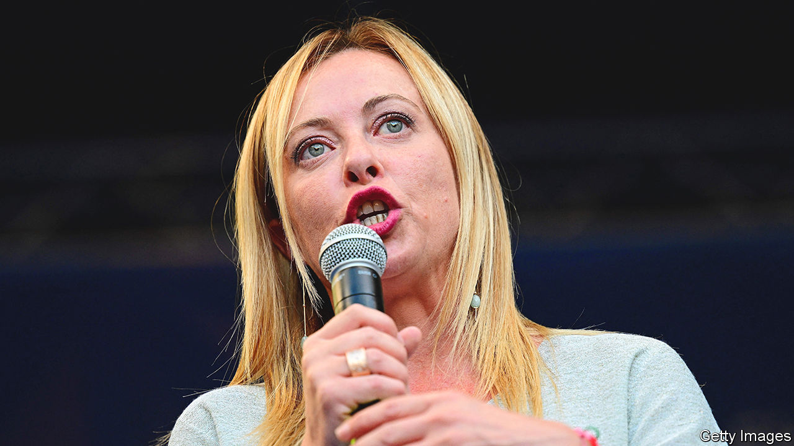
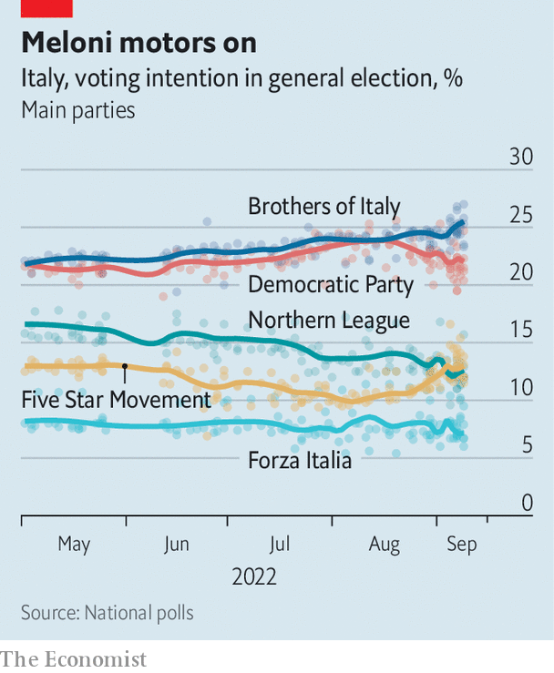

###### Strife on the right

# Italy’s probable next government contains many tensions 

##### Uneasy allies could split over Vladimir Putin and fiscal prudence 

 

> Sep 15th 2022 

Giorgia meloni bounds onto a platform in the shadow of a medieval tower at the end of a gruelling day of campaigning. It has already taken her to two cities, but this one is special. Mestre, the mainland part of Venice, is in the Veneto. And the Veneto is the region that spawned the Northern League. The League is yoked to Ms Meloni’s party, the Brothers of Italy (fdi), in an alliance that is expected to win Italy’s election on September 25th. Under its leader, Matteo Salvini, the League no longer flirts with separatism. But regional autonomy remains hugely popular in the Veneto. Ms Meloni, a Roman, leads a stridently nationalist movement with its roots in neo-fascism. If there is anywhere she should be unwelcome, it is here.

Yet the long piazza ahead of her is packed. A party of fdi loyalists hold aloft an immense banner, 25 metres long, in the national colours of green, white and red. A disproportionate number of the men in the crowd—more than a quarter in a section counted by —are wearing black shirts, which Italians still associate with those worn by fascist militiamen.

The tone of Ms Meloni’s speech, however, is sober. “I’m not here to tell you everything is all right,” she says, before outlining her plans for the economy. The Veneto is a region of mostly small enterprises that developed later than other parts of the north. Its inhabitants pride themselves on their industriousness. The Brothers, she says, would reduce employers’ welfare contributions, adjust corporation tax to encourage them to employ more workers and change the education system to make it more compatible with what the labour market needs. They would also stop foreign companies buying Italian ones—“utter folly”, Ms Meloni calls it. 

 


That gets applause. The warmest response, though, is for her advocacy of a clampdown on illegal immigration, which she links to drug-peddling and prostitution. The Brothers’ leader has a knack for expressing radical views in a way that makes them sound judicious. It is among the reasons her party has surged in the polls—from 7% three years ago to almost 25% in the last soundings, before a polling blackout took effect on September 10th. The fdi’s success has been almost wholly at the expense of the League. Its support has plunged over the same period from 33% to 12%. In the very heartland of the League, the imbalance between the two parties is even greater. 

All this makes an already tense relationship between Ms Meloni and Mr Salvini even more delicate. They have sunk their differences to fight the election in a three-way alliance with Silvio Berlusconi’s party, Forza Italia. And they have endorsed an understanding that whichever party gained most votes should lead the next government (though the appointment of the prime minister is a prerogative of the president, Sergio Mattarella).

Since then, however, Ms Meloni and Mr Salvini have split on both the most important campaign issues. Ms Meloni has given unconditional backing to the Western alliance supporting Ukraine. Her ally, a long-standing admirer of Vladimir Putin, has wobbled, presenting himself as a peacemaker, announcing and then cancelling a trip to Moscow, and questioning the value of sanctions against Russia. While Mr Salvini is pressing for a €30bn package of measures to ease the cost of living, even if it means extra debt, the Brothers’ leader is arguing for fiscal prudence. On September 11th Mr Salvini met Mr Berlusconi, reportedly without informing Ms Meloni, amid speculation that the two embattled party chiefs might be plotting to stop their ally from becoming prime minister.

None of this bodes well for the stability of Italy’s next government. If the election result mirrors the polls, the right will acquire a big parliamentary majority, comparable to that won by a similar alliance headed by Mr Berlusconi in 2001. It kept him in power for the next five years. But, unlike Ms Meloni, the media tycoon could count on vast financial resources and media clout. And—it is always worth remembering—the average Italian government over the past 30 years has lasted for less than 20 months. ■

