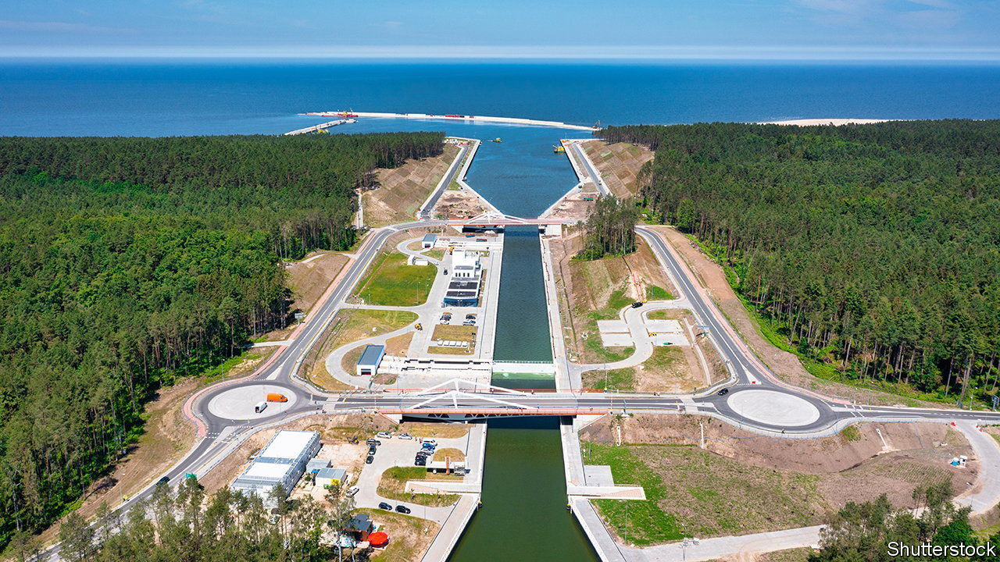
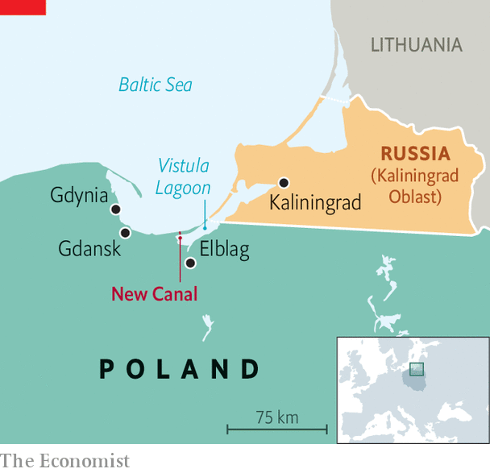

###### How to waste 2bn zlotys

# Poland opens a propaganda-heavy canal 

##### A concrete channel to avoid Russian-controlled waters 

 

> Sep 15th 2022 

Where the cool Baltic waves once lapped a remote forested sandbank, the Vistula Spit, Poland’s government has created a megaproject to outwit Russia. “This is the last place in Poland which was constantly subject to interference,” said Marek Grobarczyk, the deputy infrastructure minister. With pomp and pageantry, this weekend the government will unveil a canal linking the Vistula Lagoon, a shallow 90km-long reservoir in north-eastern Poland, to the Baltic Sea. The 1.3km artificial waterway will allow ships to bypass a Russian-controlled strait, which has on occasion been shut off.

The government has shrugged off environmental and economic misgivings over its investment of more than two billion zlotys ($420m) by depicting the canal as a matter of national security. The rest of a new, deeper, waterway to the port of Elblag, 20km to the south, has not been finished. But officials have rushed forward the canal’s opening to September 17th, the anniversary of the Soviet invasion of Poland in 1939. “On this symbolic day, we will break Russia’s domination in the region,” boasted Mr Grobarczyk, who is overseeing the project. 

 


But the canal’s strategic importance is exaggerated. Military experts argue that naval vessels would have no business navigating the shallow lagoon in such proximity to Kaliningrad, a heavily armed Russian exclave on its eastern edge. “They would become sitting ducks,” says Czeslaw Juzwik, of the Institute for Security and International Development in Warsaw. And the amount of civilian traffic using the port is feeble.

The Polish government accuses the canal’s detractors of being Russian propagandists. The war in Ukraine has increased the project’s symbolism, but also dished its already weak economic rationale. In past years the port of Elblag has mostly handled trade across the lagoon to Kaliningrad. But sanctions introduced in the summer have for now halted the traffic of peat and wood pallets with Russia. Even after the war ends, the chances of the canal making back even a fraction of its cost seem remote. 

But the government has dug its heels in. The project is the brain-child of the chairman of the ruling Law and Justice party, Jaroslaw Kaczynski, who originally set its construction in motion by burying a shovel in the Baltic sand days before local elections in 2018. As soaring inflation erodes his party’s support ahead of next year’s national elections, he is reaching again for the same page in his successful political playbook. 

