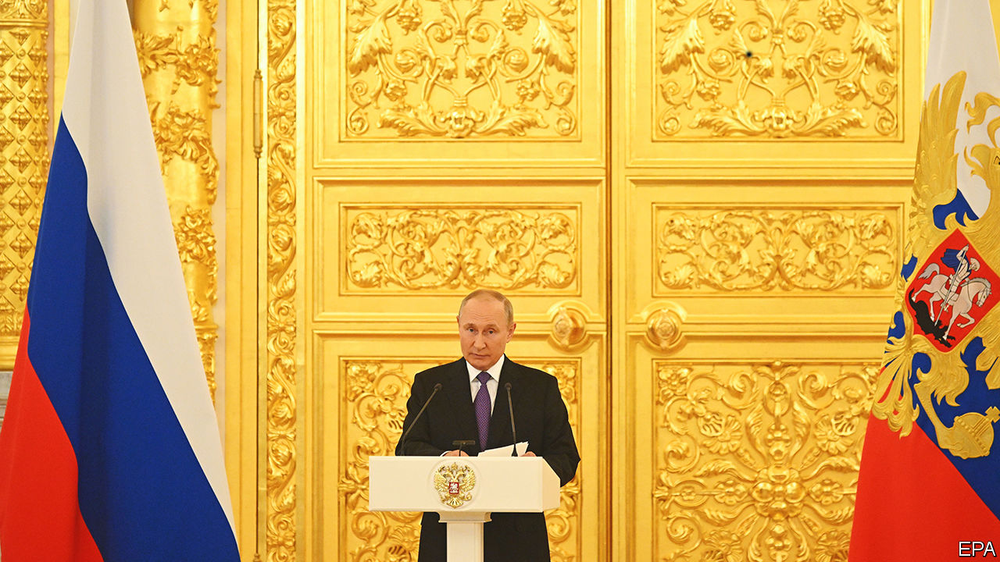

###### Setting sun

# Russian discontent with the war, and Vladimir Putin, is growing 

##### A big reverse in Ukraine makes him look incompetent 

 

> Sep 15th 2022 

As russia’s troops were abandoning their positions and armour in Kharkiv, in Ukraine, Russia’s capital was celebrating the “Day of the City”. Vladimir Putin, the dictator who started the war, boasted of a new attraction—a giant Ferris wheel called the Sun of Moscow at vdnkh, a vast theme park built in the 1930s to exhibit the achievements of the Soviet empire that Mr Putin is now fighting to restore.

“It is unique. There is nothing like that in Europe…It is very important for people to have a chance to relax with their family and friends,” Mr Putin said on September 10th. It was meant to be an advertisement for Mr Putin’s successes. But within minutes, the 140-metre-high wheel got stuck, and the next day it closed altogether. Visitors were offered a refund.

The symbolism was not lost on those who flooded social media with sarcastic or angry comments. “Why? What are all these carousels, attractions and pavilions with clowns? [Our] people are dying for us there [in Ukraine]. Are you sure that at such moments we need events whose goal is to distract, relax and entertain?” Boris Korchevnikov, a pro-war television presenter, wrote on Telegram, a social-media app.

“The army has NO thermal-imaging cameras, NO body armour, NO reconnaissance equipment, NO secure communications, NO first-aid kits. You’re holding a billion-rouble feast. What is wrong with you?” another social-media post read.

It was not just the Sun of Moscow that was malfunctioning. Having failed in his plan to take Kyiv in three days, and having failed to dissuade the West from supporting Ukraine, Mr Putin suffered another reversal. He had planned sham referendums to give a figleaf of legitimacy to the annexation of Russian-occupied territories in Ukraine on September 11th. These have now been postponed indefinitely. Russian forces do not know if they will be around long enough to intimidate voters. 

Mr Putin’s power depends on Russians believing that he is strong and ever-victorious. His propagandists do all they can to promote that notion. However, the rout of Russian forces in north-east Ukraine caught them off-guard. At first state television was silent. Then its channels coyly acknowledged Russia’s retreat, described by the army as “an operation to organise the transfer of troops”. The bad news was padded out with patriotic guff. All criticism was deflected away from Mr Putin.

Dmitry Kiselev, Russia’s propagandist-in-chief, talked about “the most difficult week at the front”. Licensed pundits let off steam, criticising bad planning by the armed forces. Some even questioned the wisdom of attacking civilian infrastructure in Ukraine, though one prominent hawk, Margarita Simonyan of Russia Today, urged more of it, including possible attacks on nuclear power plants. None of this is evidence of a new-found freedom of expression. Russian tv bosses know it is more effective to manipulate the news rather than pretend that nothing has happened. “Denying the news would only further undermine people’s trust in the official lies,” says Kirill Rogov, an analyst.

The anger of the nationalists poses little threat to the Kremlin. It may even help to drown out anti-war voices, such as the dozens of young, brave local politicians from Moscow and St Petersburg who published an open letter calling on Mr Putin to resign and even accusing him of treason. They now face prosecution. But growing calls for military mobilisation create a different problem. Mr Putin’s “special military operation” relies on fear and apathy rather than active support. Russians accept it so long as it stays on television and does not affect their daily lives too much. 

A draft would change that. It could mobilise people against the war. The Kremlin was unnerved this week when Gennady Zyuganov, the leader of the Communist Party, the second-largest in parliament, called the special operation a war that required full mobilisation. “There is a war going on, and we have no right to lose it. We need a complete mobilisation of the country,” he said. Almost immediately his party was forced to explain that what he really meant was “mobilisation of resources rather than people”. 

Russia’s retreat could also erode the morale of Russian mercenaries. They signed up to make money, not to die for Mr Putin in a Ukrainian ditch. Most important, Russia’s top military brass, already afraid to make their own decisions, could now face blame for their failure. Few of them expected they would be fighting a well-equipped and highly motivated army backed by Western powers.

That backing will surely grow. A proposal co-written by Anders Fogh Rasmussen, a former boss of nato, and presented to Ukraine on September 13th, guarantees the further provision of weapons, training and intelligence. It is modelled on America’s guarantees to Israel. It seems designed to plant a thought that would not have occurred to many people at the start of the war: that Russia could lose. For Mr Putin, this is a scary prospect. He cannot afford to be seen as a loser. ■


