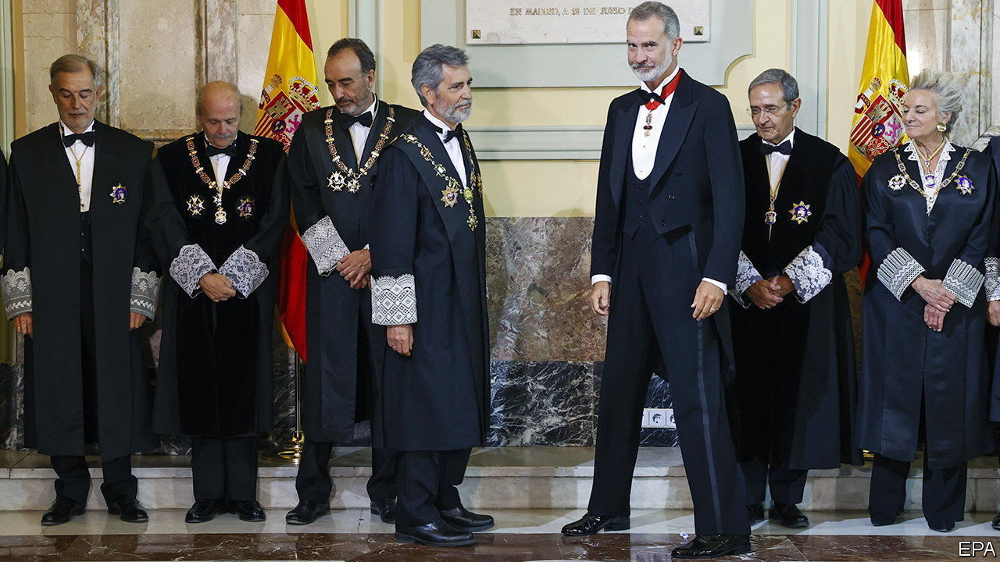

###### Injudicious

# Spanish politicians are arguing over judges 

##### It erodes confidence in the system 

 

> Sep 15th 2022 

Politicians tussling for control over courts, stand-offs over judicial nominations and rumblings of a constitutional crisis. These are things many associate with America, or in the eu with difficult members like Poland or Hungary. But the same problems have also dogged Spain, which is suffering a years-long stand-off over its most senior judges.

The General Council of the Judiciary (cgpj) is the governing body of Spain’s judges and courts. It not only plays a supervisory role but nominates some judges to the Constitutional Court and the Supreme Court. Its membership (12 judges and eight other experts) is meant to be renewed every five years. But the current group has been serving with an expired mandate since 2018, because Spain’s two biggest parties cannot agree. Things came to a head on September 13th, when the cgpj missed a deadline to nominate two judges to the Constitutional Court. The cgpj has refused, saying it will not do so until its own mandate is renewed. 

In 1985 the Socialist government, grumbling that many judges still had their roots in Francisco Franco’s dictatorship (1939-1975), passed a law requiring all 20 cgpj members to be appointed by parliament. But this set the stage for partisan horse-trading over the institution, with its political colouring changing as governing majorities do. 

In 2018, when the conservative People’s Party (pp) had lost power, it suddenly discovered the principle that “judges should be chosen by judges”, not politicians. The pp refused to renew the cgpj’s mandate, which has obliged the members then in office to carry on until today. The pp is right that the eu urges members to let judicial experts select judges. But the timing looked self-serving. The parties have argued ever since, occasionally hinting that a deal might be done. But this month Carlos Lesmes, the body’s president, forced the pace, refusing (with conservative colleagues) to nominate the two needed judges to the Constitutional Court, and even threatening to resign. 

Critics suspect that Mr Lesmes, of the conservative camp, merely wants to keep the Constitutional Court from moving to left-leaning control. (The cgpj would nominate one member each from left and right, but once its appointments are made the Socialist government would then be able to nominate two more judges, who could both be from the left.) Articles about the conflict print graphics with members of the cgpj, the Constitutional Court and the Supreme Court coded as blue or red, as though they were members of parliament—the kind of politicisation the eu rightly warns member states against.

The Constitutional Court is due to consider important cases on euthanasia, abortion and education. It is no wonder that politicians want it to lean their way. “Letting judges pick judges” sounds like a reasonable antidote to partisanship. Defenders of the Socialists’ position, though, say that the profession has long had a conservative bias. Elisa de la Nuez, director of the Fundación Hay Derecho (a rule-of-law organisation) says that though this was a valid argument in the 1980s, it holds less water today: judges do tend to be well educated and middle-class, but are no more conservative than that. 

Trust in the courts is low. Of the eu’s 27 countries, Spain ranks a dismal 22nd in public perception of judicial independence. The European Commission, the eu’s executive arm, has issued increasingly urgent warnings to Spain’s squabbling politicians. But the latter have failed to do anything about them for a long time. The dispute could even end up in European courts—an embarrassment that Spain would surely do well to avoid. ■

