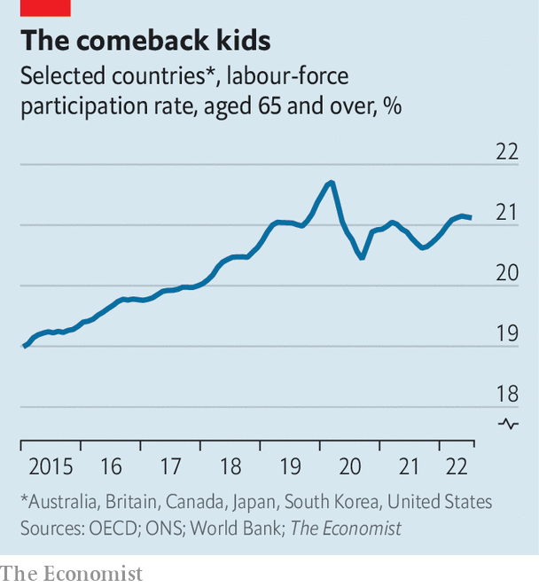

###### The Brady bunch

# Against expectations, covid-19 retirees are returning to work 

##### Pensioners across the rich world are following Tom Brady’s example 

 

> Sep 15th 2022 

On september 11th Tom Brady marked his “unretirement” from America’s National Football League, guiding the Tampa Bay Buccaneers to a decisive win over the Dallas Cowboys in their first game of the season. Mr Brady, probably the greatest quarterback in history, had earlier this year announced that he was retiring, only to change his mind a few weeks later. The 45-year-old athlete is, it seems, not the only one who cannot bring himself to give up the grind. Across the rich world, old folk are flocking back to work.

 


It is quite a turnaround. When the covid-19 pandemic struck in 2020, many people already close to retirement brought the date forward. Using data from a variety of sources, we estimate that the rich world’s labour-force participation rate for people aged 65 and over crashed that spring (see chart). This represented a relatively larger decline than for people of working age. Like everybody else, some oldies were fired as demand dried up. In addition, though, they also faced higher risks of becoming seriously ill or dying if they caught covid, meaning many no longer wanted to work. 

Economists had assumed, based on historical experience, that pandemic retirees would never come back. Employers often unfairly turn their noses up at older job applicants; for their part, older folk can find the idea of learning the ropes at a new place daunting. Indeed, two years on many appear to have followed the example of Rob Gronkowski, Mr Brady’s former partner in crime, hanging up their cleats for good. 

But a surprising number have followed the path of Mr Brady. There are probably more over-65s in the rich world’s labour force today than there were in 2019. Old-age participation is lower than it would have been without the pandemic. But we estimate that the number of pandemic-induced retirees has fallen by 20-40% from its peak. In Britain and South Korea old-age activity is higher today than it was in 2019. 

Other data back up the idea of a wave of unretirements. Statistics from Europe suggest that, as early as the end of 2020, an unusually large share of people aged 55 to 74 were moving from economic inactivity to employment. According to our analysis of official microdata, in the second quarter of this year, some 75,000 Britons in paid work said that they had been retired the year before, much higher than the pre-pandemic norm. It is a similar story in America. Nick Bunker of Indeed, a jobs site, finds that the share of retired workers returning to the workplace each month is higher than it was before the pandemic.

In some cases retirees have little choice but to return. Market turmoil has reduced the value of pension pots (in America the total value of retirement assets fell by 4.5% in the first quarter). Some retirees have run down “excess” savings that they had accumulated during the covid lockdowns. And inflation, now approximately 10% year on year across the rich world, is cutting the purchasing power of fixed payments that those in their dotage are receiving. 

Yet there are pull factors, too. The threat of the virus has dissipated, meaning more people are comfortable with being in public spaces. Thanks to red-hot demand for workers, employers have had little choice but to set aside their prejudice, and some erstwhile retirees are able to earn pretty well, even if only working part-time. Others, though, may simply have realised, in Mr Brady’s words, that their “place is still on the field and not in the stands”. ■


