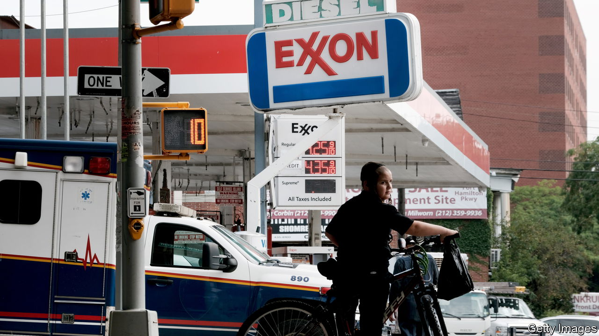
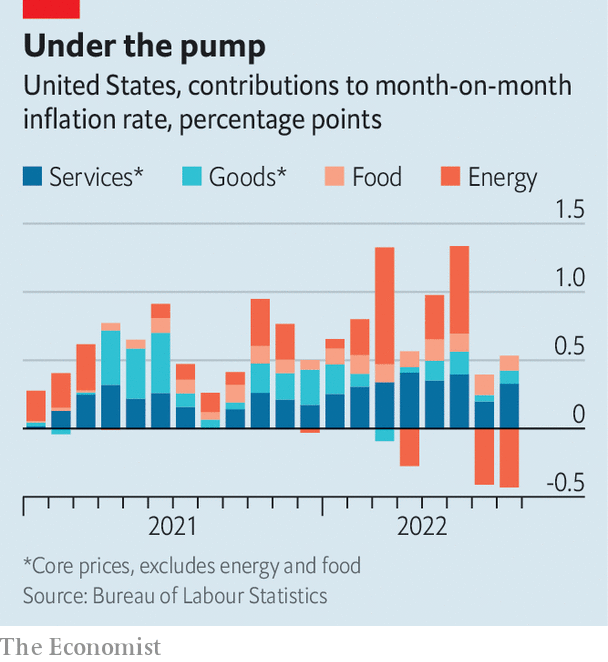

###### Core of the matter

# America still has an inflation problem 

##### Markets reel from the latest figures 

 

> Sep 13th 2022 


It had been hoped that America’s latest inflation report would bring good news. Headline annual inflation has been falling from the  in June, and economists expected August would bring a second month of modest increases—by recent standards—in core prices, which exclude food and energy. Those hopes were dashed. The release on September 13th showed another drop in the headline annual rate, to 8.3%. But core prices rose 0.6%, twice the 0.3% forecast. The news hit markets: the s&amp;p 500 index dropped by 4.4% as investors worried that the Federal Reserve would have to raise rates harder and faster to cool the economy.

 


Investors are focused on core inflation because of big swings in energy prices. The price of crude oil is down a quarter from its peak in early June. In a breakdown of the August price data, energy lowered the month-on-month inflation rate by nearly half a percentage point. Other components—, goods and services such as rent—pushed up prices (see chart).

Were August’s rate of core inflation sustained for a full year, it would mean a 7.4% annual rate, which is well above the Federal Reserve’s target of 2%. Investors believe the Fed will opt for its third consecutive three-quarter-point interest-rate increase when it meets later this month, making for the most aggressive pace of tightening in four decades. It may go further and raise rates by a full percentage point.

One critical factor in the persistence of high inflation is . With roughly two jobs available per unemployed person, workers have strong bargaining power, which leads to hefty wage gains. A tracker from the Fed’s Atlanta branch shows that in August wages rose at an annualised pace of nearly 7%. The grim conclusion for many economists is that America may require a marked increase in unemployment in order to temper wage pressures and, ultimately, inflation.

The median projection of the Fed’s rate-setting committee is that the unemployment rate will only need to tick up slightly to 4.1% in 2024, from the current level of 3.7%. But a recent paper by Laurence Ball of Johns Hopkins University and Daniel Leigh and Prachi Mishra of the imf argues that a 4.1% level of unemployment would be consistent with core inflation of between 2.7% and 8.8% in 2024. In other words, only in the rosiest scenarios does it seem America can escape the inflationary mire without lots of job losses.

Nevertheless, the divergence between core and headline inflation poses an intriguing question. As far as consumers are concerned, there is no such distinction. All prices matter, and indeed prices at the petrol pump do more to capture the attention of Americans than prices anywhere else. Surveys of consumers show that their expectations for future inflation have come down sharply since June, undoubtedly thanks to the decline in oil prices.

As Mr Ball and his co-authors argue, a failure to account for the pass-through from energy prices into core inflation was one reason why economists were wrong-footed by inflationary pressure over the past year. The hope now is that the plunge in energy prices can continue, and that the pass-through into weaker core inflation will again wrong-foot many economists. For now, however, America’s inflation problem shows little sign of going away. ■


