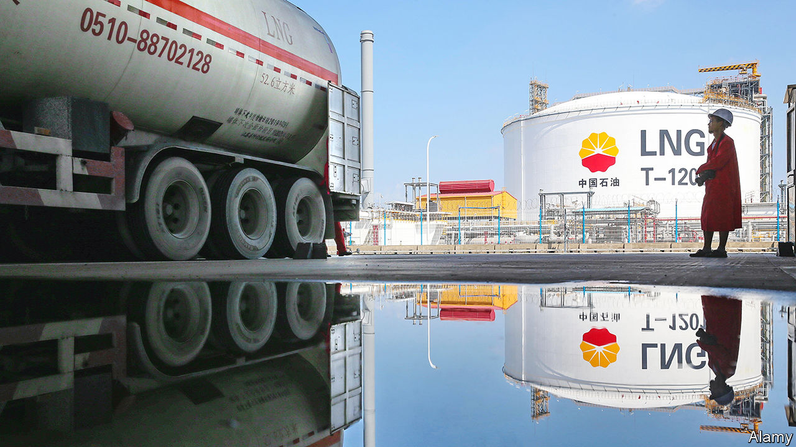
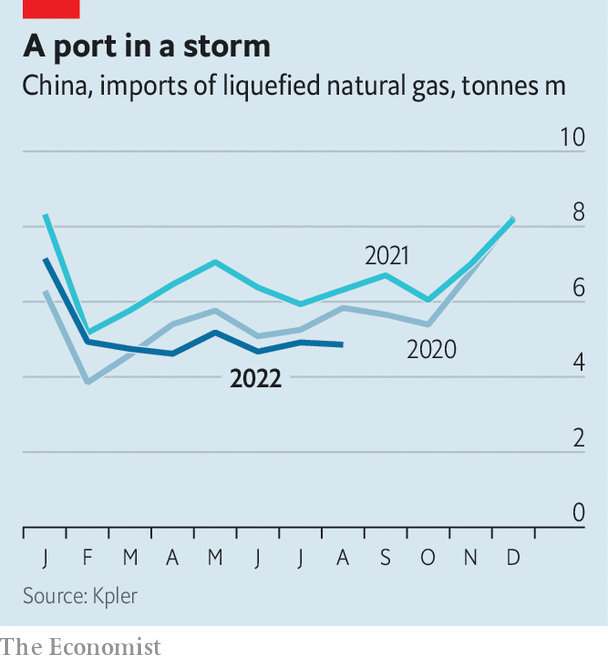

###### Commodities

# China’s plunging energy imports confound expectations 

##### A revival would cause problems—and not just for Europe 

 

> Sep 15th 2022 

In the aftermath of the global financial crisis in 2007-09, China’s stimulus efforts, which pumped around 4trn yuan ($575bn) into the economy, left observers gushing with praise. Robert Zoellick, then head of the World Bank, expressed his delight at the fiscal expansion. The imf credited the world’s second-largest economy with leading the global recovery.

This year, during a new period of economic turmoil, China is again helping to bring supply and demand back together—albeit in a very different way. With the price of fuels surging, the collapse in Chinese purchases of natural gas and other forms of energy has been an unexpected boon to countries around the world. 

Arrivals of seaborne liquefied natural gas (lng) have declined most markedly. China remains the largest lng importer in the world but, between January and August, imports dropped by a fifth compared with the same period last year. That shortfall, at roughly 14bn cubic metres, is roughly equivalent to the entire annual lng imports of Britain. 

Industry experts had expected imports to grow throughout the year, if not as rapidly as they had in previous ones. But China’s endless covid-19 lockdowns have caused a sharp drop in household spending and a meltdown in the residential property market has held back the construction industry. Meanwhile, volumes imported through the Power of Siberia pipeline, which pumps cheap Russian gas into China, have increased by an estimated 60% (this accounts for less than half the fall in seaborne imports). 

 


It is not just imports of lng—which is typically used for heating, industrial power and electricity generation—that have slumped. Lockdowns also mean considerably less travelling. Between January and July highway traffic fell by more than a third compared with the same period last year, reducing demand for petrol. Chinese crude-oil imports in August were 9% lower than last year, and the International Energy Agency, a think-tank, forecasts the first annual drop in oil demand since 1990. Coal imports were also down, by 15%. 

What happens next is crucial. The behaviour of an importer as big as China moves prices, especially in a market under severe stress. An end to the country’s “zero-covid” policies looks unlikely any time soon. But Chinese energy demand is muted even relative to last year when the approach was already in force, meaning demand may yet rise a little. The weather also makes a difference. If it is “exceptionally cold”, China could return to the spot market, notes Laura Page of Kpler, a data firm, pulling much-needed lng supplies away from Europe.

China’s neighbours would also struggle in the face of a further squeeze. Price-sensitive buyers of lng in developing economies in Asia are already being forced out of the market. According to the Institute for Energy Economics and Financial Analysis, a research firm, $97bn-worth of infrastructure for lng imports in Bangladesh, Pakistan, the Philippines and Vietnam risks being underused or mothballed if prices remain unaffordably high. 

For good reason, the Chinese policies that have crushed energy imports this year will not gain the plaudits that the country’s stimulus did during the global financial crisis. But European buyers of globally traded gas, already desperately scrambling for the imports needed to make it through the winter, will miss them if they go. ■


