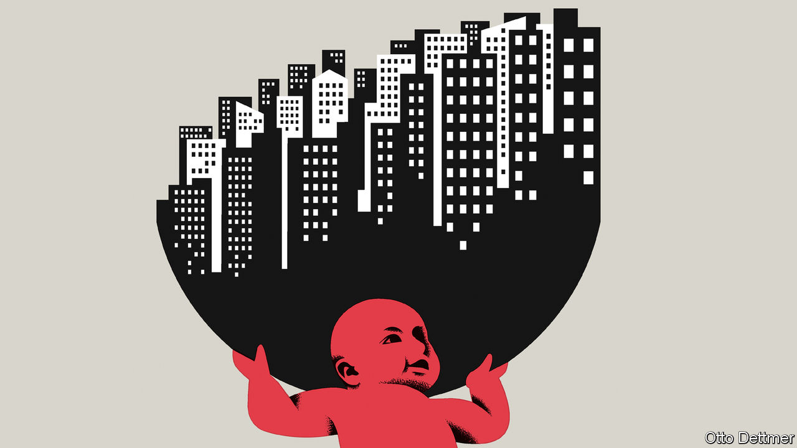

###### Free exchange

# Richer societies mean fewer babies. Right? 

##### A guide to the new economics of fertility 

 

> Sep 15th 2022 

In a speech to the Vatican in January, Pope Francis made an observation fit for an economist. He argued that declining fertility rates might lead to a “demographic winter”. In every European country the total fertility rate, the expected number of children a woman will have in her lifetime, has now fallen below 2.1, the level needed to maintain a stable population without immigration. The same is true in many developing countries, including China and (as of this year) India. This, the pope warned, would weigh on the world’s economic health.

Economists have long considered such a slowdown inevitable. In the best-known model of fertility, popularised by Gary Becker, a Nobel-prizewinning economist, and others in the 1960s, there is a central role for the trade-off between the “quantity and quality” of children. As countries grow richer and the returns to education rise, it is expected that families will invest more in a smaller number of children. And as women’s working options expand, the opportunity cost of their time will grow, making the trade-off between family and career more difficult. 

Fitting this theory, many places have already gone through a “demographic transition”, in which poor, high-fertility countries become rich, low-fertility ones. In some, the transition has been so dramatic that their populations have started to decline. The number of people in Japan has fallen by about 3m since peaking at 128m in 2008. Many demographers suspect China’s population is also falling, no matter what the country’s official figures claim. 

Yet an emerging body of research suggests that fertility may go through another shift at a later stage of development. A recent review of the literature by Matthias Doepke of Northwestern University and co-authors makes the case that, in rich countries, fertility may rise, or at least fall at a slower rate, if norms, policies and the market for child care make it easier for a woman to have children and a career. In countries with, say, supportive family policy or fathers who take on a greater share of child-care duties, one would expect working women to have more children than in the past.

One way to see if this is true is to compare fertility rates across countries with differing incomes and female labour-force participation. In 1980 countries in the oecd with higher female participation rates had lower rates of fertility. By 2000 that relationship had flipped: countries with higher rates of female labour-force participation had higher rates of fertility. Since then, the picture has muddied slightly. By 2019 the new relationship had weakened a little, and it looks less sturdy when considering gdp per person rather than labour-force participation

But when looked at within countries, the new pattern of fertility becomes clearer. A paper published in 2018 by Michael Bar of San Francisco State University and co-authors shows that in America the relationship between education and fertility, which used to be a downward-sloping trend, has turned into something of a reversed-tick mark. Women with advanced degrees have slightly more children than college graduates. A similar pattern holds when looking at income. The authors argue that the growing availability of child care has reduced the difficulty of the trade-off between family and work.

Governments are also trying to change the picture. Last year South Korea’s fertility rate dropped to 0.81, a record low. In 2019, family-leave policy changed to allow parents with young children to take an additional year of reduced hours on top of an already generous year off work. The share of South Korean parents who take leave has doubled in the past decade, from 12% to 24%. Meanwhile, Hungary has exempted mothers of four or more children from income taxes for life—a more controversial approach, especially since Viktor Orban, the country’s prime minister, has justified it as a way to boost the population without allowing immigration to rise. A report published by the un last year found that the share of countries with pro-natalist policies had grown from 20% in 2005 to 28% in 2019.

Not all interventions are equally effective. Work by Janna Bergsvik of Statistics Norway, an official research outfit, and colleagues, finds that, although some measures (including subsidised child care) make a difference, others (including parental leave) accomplish far less. Mr Doepke says the biggest boost to fertility occurs when interventions match the way that societies operate. The provision of child care will make little difference if social norms push women to stay at home to look after children. But in Denmark, where fathers take on more child-care responsibilities than in other rich countries, the provision of state-subsidised care for children made a big difference. The country’s fertility rate rose from 1.38 in 1983 to 1.72 in 2021. 

Flush of youth

There is a lot riding on the new fertility switch lasting. The share of the population in the oecd aged 65 and over is expected to have passed 50% by 2050, about 20 points higher than today. As rich countries grow old, there will be greater demand for carers, which will make it more expensive to hire child care. Without a productivity revolution, perhaps featuring robot nannies, child care will remain a privilege of the rich in places without state-funded provision. It is also unclear if norms that make the family-career trade-off easier will continue to spread. 

Yet the worse the problem becomes, the harder governments will work to combat it. And as they experiment, evidence will build about which responses are the most effective. The covid-19 pandemic may also end up helping. It delayed many families’ decisions about whether to have children, but in time it may turn out to have had a more positive impact. The rise of working-from-home should make working with children easier. In his speech the pope lamented those people who chose to look after pets instead of children. Maybe that trade-off will lessen, too. ■


