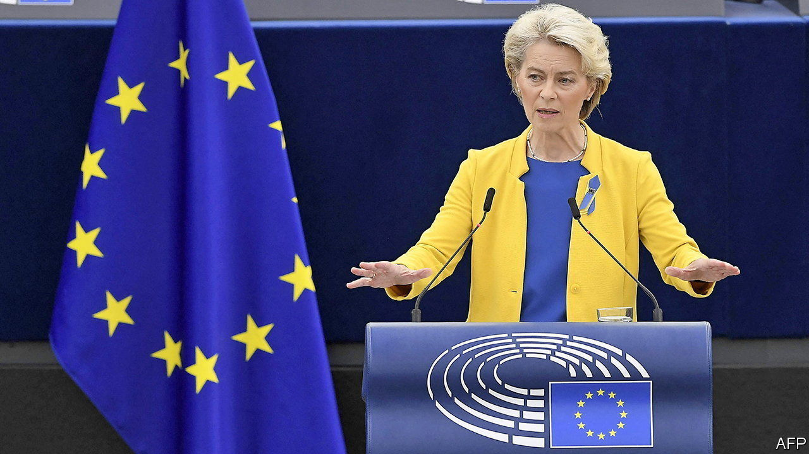
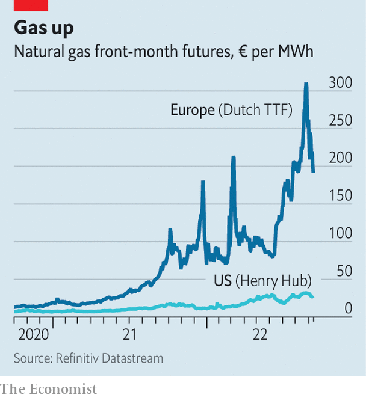

###### The libor of energy?

# The European Commission searches for a gas-price villain 

##### And settles on a once obscure market 

 

> Sep 15th 2022 

The main target of Ursula von der Leyen’s state-of-the-union address on September 14th was energy companies. It is wrong, the president of the European Commission said, for them to make such profits “from war and on the back of consumers”. Windfall taxes raising €140bn ($140bn) would follow, she announced. Yet the speech also included a telling sideswipe at a once obscure part of commodity markets: the Dutch Transfer Title Facility (ttf), a gas-trading network. 

Russia’s invasion of Ukraine has thrust the ttf into the limelight. The network sets Europe’s benchmark price for natural gas—so it is now a measure for the continent’s economic health. With such attention comes criticism. “Our gas market has changed dramatically: from pipeline gas to increasing amounts of liquid natural gas,” Ms von der Leyen said. The ttf has not adapted, she added, and so the commission would start work on a new lng index.

The ttf was born of European politics. In the 2000s the eu pushed for deregulation of Europe’s gas market, moving it from bilateral contracts to trading on exchanges. The Netherlands was first out of the blocks to establish a euro-denominated trading hub, says Mike Fulwood of the Oxford Institute for Energy Studies (and the father of an journalist). This free-market zeal combined with state investment in storage and pipelines to make the Netherlands Europe’s natural-gas hub.

The problems facing Europe are not caused by the ttf. As Europe’s hub, it gathers participants from across the bloc. Consequently it is a liquid market, allowing power firms and utilities to manage risk. In 2020 there was 60 times as much volume traded as demand for the fuel in the Netherlands. The only market in Europe that comes close is Britain’s National Balancing Point, which in 2020 handled 11 times as much volume as underlying demand. 

 


Even so, ttf prices have been volatile. The cost of a megawatt hour (mwh) of front-month gas rose from €80 in June to €340 in August, after Russia cut the flow to Germany and then shut it down. More recently prices have fallen to €218, after Germany hit its winter-storage target early. These are extreme changes, but reflect highly unusual circumstances.

Lofty prices increase the cost of failed trades, leaving the clearinghouse, which is responsible for settling deals, on the hook. So as prices rose, it demanded more “margin”, to be seized if traders cannot make good on the deal. A cycle of such margin calls and nervy traders stepping back may have helped drive up prices over the summer. Governments across Europe have been forced to step in to provide guarantees. A Finnish minister warned the situation had “all the ingredients for the energy sector’s version of Lehman Brothers”.

The commission’s criticism of the ttf may have some justification. The close correlation between it and some other European trading hubs broke down this year, notes Ben Wetherall of icis, a research firm. Congestion in the Netherlands means European lng prices are in fact slightly lower than those on the ttf. Using the ttf as a benchmark could lead firms in Spain, which has a quarter of the continent’s lng terminals, to overpay. On September 14th the cost of a mwh of gas on the Iberian Gas Market for delivery in October was €171 compared with €218 on the ttf. 

But these differences should be short-lived, suggesting a new index is probably not needed. High prices have spurred investment in lng infrastructure elsewhere. Meanwhile, researchers at Goldman Sachs, a bank, argue that Europe’s energy prices are likely to have halved by spring 2023, owing to lower demand. If they are right, the Dutch gas market’s moment in the spotlight may not last all that long. ■


