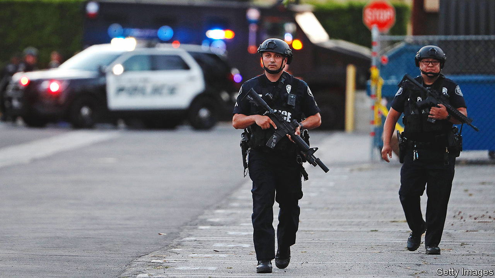

###### Getting away with murder

# America should reform its police forces, not defund them 

##### Cops need to be trusted if they are to curb a surge of killings 

 

> Sep 15th 2022 

What a difference a couple of years makes. In spring 2020 the murder of George Floyd, an unarmed black man, by a police officer in Minneapolis brought millions of people out of covid-19 lockdowns all over the world and onto the streets. After a wave of furious protests, and riots, some politicians on the American left adopted the protesters’ slogan: that the way to ensure that black lives mattered was to “defund the police”. The Democratic mayors of New York and San Francisco, among others, promised to cut police budgets.

Today, few people think that is a good idea. As our special report in this issue explains, murders have surged in America. In 2020 the number of people killed was 28% higher than it was in 2019—the single biggest increase recorded in more than a century. In 2021 many cities saw further rises. Almost nowhere has been spared, including suburbs and rural areas. 

By rich-world standards, America is a staggeringly violent country. The murder rate is six times higher than it is in Britain, France or Germany and 20 times higher than in Japan. In 2020, one in 700 black men aged 18 to 24 was murdered. Violence is now not only cutting short the lives of over 24,000 people a year. It is also devastating entire communities, as businesses and middle-class people leave crime-ridden neighbourhoods. Plausible estimates put the social cost of murder at over $400bn per year, around 2% of America’s gdp. 

Republicans campaigning for the midterm elections have tarred Democrats as tough on cops and soft on crime. No serious Democratic politician now promises to defund the police. Last month President Joe Biden proposed to direct $37bn to tackle crime, partly through the hiring of 100,000 more police officers. Though some activists, such as the American Civil Liberties Union, which criticised Mr Biden’s plan, pretend otherwise, this is a problem that cannot be solved without investment in policing.

The rise in violence since 2020 has many causes. Gun sales have soared; the pandemic shut many social services. But the fact that violence has not risen as much in any other comparable country suggests that the American public’s loss of faith in their police that summer played a part. People in high-crime areas became more reluctant to call or co-operate with the cops. Many officers, sensing a loss of political support, pulled back from such places, or stayed in their cars.

 The share of murders that result in an arrest or identification of a dead suspect has dropped from about 70% in the 1980s to 54% in 2020. If criminals get away with murder, others will resort to “street justice”. As Robert Peel, founder of London’s police, argued, good policing requires “the willing co-operation of the public”. 

The protesters who raged that hot summer were right to demand change. But that should mean reform, not retrenchment. Mr Biden’s programme to hire more cops is a necessary start. Though it spends vastly more on prisons, America devotes roughly 20% less as a share of its gdp on policing than the European Union average. 

However, more money will produce lasting improvement only if it is coupled with sustained reform aimed at rebuilding trust in the police. In the 1990s New York and Los Angeles both proved that policy change can reduce violence dramatically. Police chiefs should devote more of their officers to investigating and prosecuting serious violence. Training should focus more clearly on teaching police officers that they are public servants, not warriors. Mayors and prosecutors should not back down from firing and indeed locking up those who use unjustifiable violence. And cops who do not want to get on board should find another profession. ■

