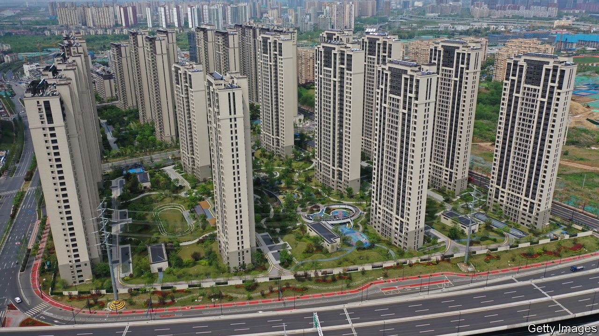

###### House on fire

# China’s property crisis hasn’t gone away: it is getting worse 

##### Officials may have little choice but to bail out the industry 

 

> Sep 15th 2022 

Weeks ahead of the Chinese Communist Party’s 20th congress, at which Xi Jinping, the country’s president, is expected to secure a third term as party leader, an already big problem is becoming even more alarming. More than two-thirds of urban households’ wealth is tied up in property and the industry underpins a fifth of gdp. The housing market is slumping into a deepening hole, dragging the economy down and even causing small outbreaks of social unrest. 

 shows how bad the crisis has become. The frenetic pace of house building used to be emblematic of China’s rise. Now confidence in the model has collapsed. Buyers are dropping out, borrowers are on mortgage strikes and developers face a liquidity squeeze. In July the value of new home sales fell by 29% compared with a year earlier. Country Garden, China’s biggest developer, has reported that its profits have collapsed and says the market “has slid rapidly into deep depression”. 

Two years ago, in an attempt to tame the property monster, the government imposed limits on borrowing by developers, known as the “three red lines”. The reforms carried the imprimatur of Mr Xi, who insisted that “Housing is for living in, not for speculation.” The original idea was that tougher rules would lead property firms to be more restrained and deter speculative buyers, allowing house building to slow to a sensible pace. 

Things started to go wrong last year with the default of Evergrande, a giant developer. A year later Mr Xi’s strategy lies in tatters as activity has faltered. The crisis is now a political, as well as economic, problem. In parts of the country, distress is turning into defiance. Mortgage-holders have banded together, threatening to stop repaying their loans if work does not resume on long-overdue homes.

Part of the problem is Mr Xi’s fixation with zero covid. In trying to suppress outbreaks with lockdowns—Chengdu, with a population of 21m, is the latest mega-city to be put through the wringer—the state has stomped on confidence. 

Another part is that the government’s original plan did not resolve the conflicts between growth and financial prudence, and between citizens’ needs and the incentives of crony officials and developers. The three red lines have deprived property firms of the cash they need to finish building flats that they had sold in advance. Delays in finishing past projects have in turn made it harder to sell new ones to disgusted buyers. Weak sales have worsened the cash crunch. And the absence of a coherent bankruptcy process has left firms like Evergrande in limbo. 

The central government has been trying quick fixes. It has cut interest rates and allowed local governments to ease restrictions on who can buy property and how. It has also encouraged local bail-outs of unfinished construction projects. But local authorities lack the resources to ease the distress, not least because property downturns hurt their revenues from land sales. 

China’s property market needs to be redesigned. Local governments need other sources of revenue to lessen their dependence on selling land. The receipt of money in advance for unbuilt properties must be better policed, to prevent fraud and collapses. As the population peaks and migration to the cities slows, the property industry needs to shrink. Attention should turn to getting the most out of China’s existing housing stock.

In the short run, however, officials have little choice but to undertake a bigger bail-out. The government wants state-directed lenders like China Development Bank to lend to local-government entities, which can in turn help developers that post collateral. The three red lines may be smudged, if not erased. Ambitious restructuring will be put off. The property crisis is a calamity in its own right. It is also another example, along with zero covid and a purge of tech firms, of Mr Xi botching the big calls over the world’s second-largest economy. ■

