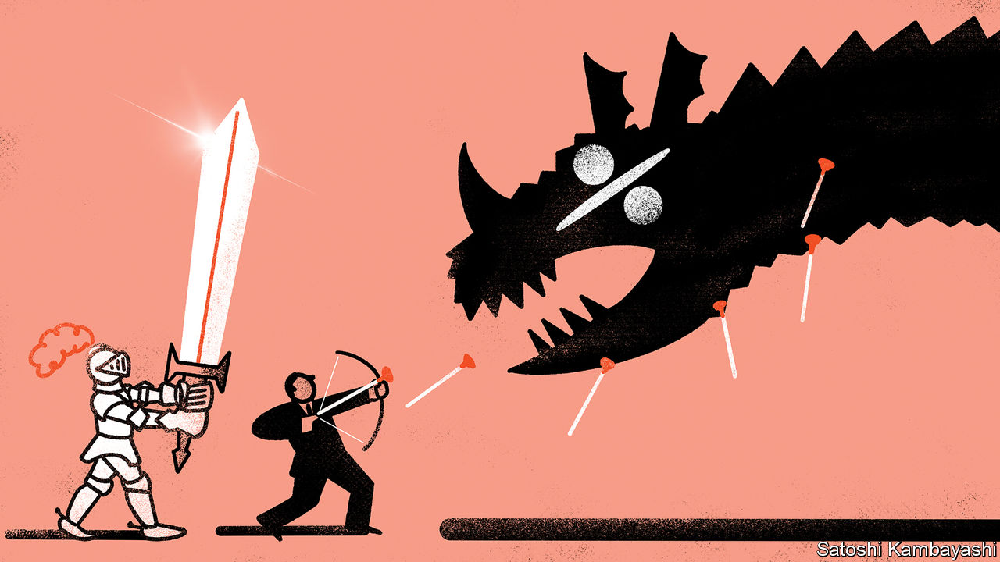
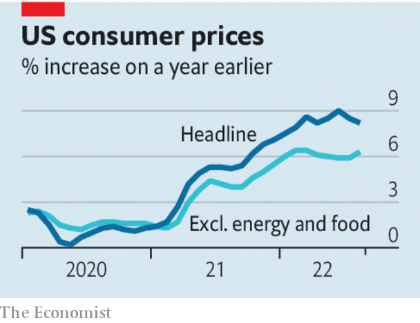

###### The perils of wishful thinking

# To fix America’s inflation problem, the Federal Reserve must go big 

##### The odds that a painful recession can be averted look woefully long 

 

> Sep 14th 2022 

Over the summer a wild hope took hold among investors. Inflation seemed to be falling gently even as America’s economy stayed in rude health. Perhaps the worst bout of inflation since the 1980s would be easily quelled, without interest rates rising much further or much economic pain. Now the dream has been dashed. Figures published on September 13th show that the  in August was fast and furious. Stockmarkets fell by the most since the early months of the pandemic; the price of junk bonds dropped; and short-term Treasury yields spiked. America still has an inflation problem. To fix it, the Federal Reserve must go big.

The good news is that America has been spared the worst of the  that is wreaking havoc in Europe. As Vladimir Putin has turned off the taps, inflation in some places has crossed into the double digits. America does not rely on Russian energy. Its inflation rate peaked at 9.1% in June and fell to 8.3% in August as oil prices eased. Prices of petrol at the pump have fallen for 13 consecutive weeks. That in turn has helped bring down consumers’ expectations of inflation.

Strip out volatile food and energy prices, though, and underlying “core” inflation is still roaring. Prices rose at an annualised rate of 7.4% in August, exceeding economists’ forecasts and well above the Fed’s target for overall inflation of 2%. It is tempting to sift through the components of the inflation basket in an endeavour to find signs of cooling. At one point inflation was driven by stratospheric prices for second-hand cars and gummed-up supply chains, as locked-down Americans splurged on goods. These pressures have since eased. The increases today reflect a surge in the prices of some services, such as , which could eventually slow down, too. 

 


Yet when underlying inflation has been this high for this long the simplest explanation is the most obvious, no matter what happens to individual components: the economy is still overheating. The effects of generous fiscal stimulus, which stoked demand during the pandemic, linger today. According to Goldman Sachs, a bank, households in aggregate are still sitting on more than $2trn in excess savings accumulated during lockdowns, equivalent to 10% of annual gdp. 

A tight labour market is buoying demand still further. At 3.7% the jobless rate remains remarkably low; there are still around two vacancies for every unemployed person. The severe shortage of workers has led to heady wage growth, which in turn has sustained consumer spending. By one gauge, median earnings in America are rising by 7% at an annualised rate, a pace not seen in at least the past two decades. Whereas inflation in Europe should plunge as the energy shock fades, American inflation, rooted as it is in home-grown demand, is far stickier.

The Fed’s job is to set interest rates so that inflation reaches its target. With the economy still overheating, its work is far from done. Although the central bank has raised interest rates faster than in past tightening cycles, it has been so far behind the curve that every reminder of inflation’s stickiness is jolting markets—the opposite of what good monetary policy is supposed to achieve. 

Rather than continuing the cycle of tardiness and surprises the Fed should act in bigger increments, by bringing forward to this year the interest-rate rises it had planned for 2023. The odds that a painful recession can be averted, meanwhile, look . Only in the rosiest of worlds will a mild rise in unemployment suffice to slow down price rises substantially. The worst of the fight to tame inflation is yet to come. ■

