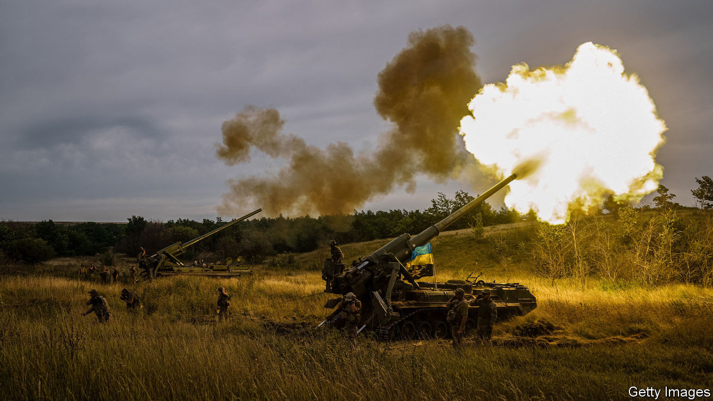

###### Getting the job done

# Vladimir Putin’s war is failing. The West should help it fail faster 

##### Ukraine’s friends should reinforce its success by sending more and better weapons 

 

> Sep 15th 2022 

One of the many excuses Vladimir Putin has given for invading the country next door is that Ukraine and Russia are “one nation”, which should be united under his benign rule. “Do you still think that?” asked Ukraine’s president, as his troops swept thousands of Russian invaders from Kharkiv province this week. Volodymyr Zelensky’s triumphant sarcasm was justified. The , which began on September 5th, marks the most dramatic Russian reversal since Mr Putin abandoned his effort to seize Kyiv, the Ukrainian capital, at the end of March. 

Its significance is not just the liberation of 6,000 square kilometres of territory in a few days—more than Russia had gained in the previous five months. Nor is it Ukraine’s seizure of the tanks, guns and boxes of ammunition that the Russian soldiers left behind as they fled in disorder. Ukraine has also recaptured two transport hubs, Izyum and Kupyansk, which Russia needs if it is to complete its conquest of the Donbas region and integrate it into Russia. Mr Putin’s plans to stage phoney “referendums” on annexing occupied parts of southern and eastern Ukraine are now on hold, as Ukraine counter-attacks in both areas. Predictions in war are always risky, but the tide seems to have turned. Russia’s occupation is everywhere held in check, and Ukraine is gradually—and sometimes suddenly—rolling it back. 

Ukraine’s battlefield advances rest on two pillars; materiel and men. In hardware it has an ever-increasing edge. America and other friendly states have sent it rockets with enough range and accuracy to shift the terms of engagement. Ukraine can see and reliably hit enemy ammunition dumps, command centres and logistics nodes far behind the front lines; Russia cannot. Russia’s supposed air superiority has been suppressed by mobile air defences. And whereas Russia is running down its stocks of weapons, Ukraine’s are growing both more plentiful and more powerful, as superior nato equipment replaces its old Warsaw Pact kit. 

Ukraine’s manpower advantage is growing, too. Mr Putin’s original invasion force of 200,000 was never big enough to occupy Ukraine. (He imagined, apparently, that the Ukrainian opposition would obligingly collapse.) Russia’s losses have been terrible; by one estimate 70,000-80,000 of its soldiers have been killed or wounded. Despite raiding jails and offering huge bonuses, Mr Putin is struggling to replace them. 

Ukraine, by contrast, has its entire adult male population to call on. Their morale is sky-high and, thanks partly to nato, they are well-equipped and increasingly well-trained. They will only gain in confidence as Russia falters. They are fighting for their homes and fellow citizens. Russia’s troops are fighting for a basket of lies: that Ukraine is run by “Nazis”, that it poses a threat to Russia, that its people want to be “liberated” by Russia. Mr Putin could in theory order a general mobilisation and force many more young Russians into battle; but he knows this would be wildly unpopular, which is why he has not yet done it. Even if he did, it would take many months to recruit, train, equip and deploy the reluctant and terrified reinforcements.

Victory for Ukraine is not yet certain, but a path is discernible. Evicting Russia entirely from Ukraine will be hard. It will mean pushing it out of territory where it is far better dug in and organised than in Kharkiv. A general collapse of the Russian forces cannot be ruled out, but is improbable. 

The West should, therefore, reinforce success. Ukraine has shown that it can use Western weapons to regain territory; the West should send better ones, such as longer-range atacms munitions for the himars launchers that have proved so effective, which it previously hesitated to supply. To avoid escalation, advanced nato weapons should not be fired into Russia; Ukraine will surely comply rather than alienate its arms supplier. It will also need a reliable flow of ammunition for future offensives and armoured vehicles to move forces fast. The West should also consider what Ukraine might need next year—and vastly expand the scale of training for Ukrainian troops abroad. 

Momentum in war can be self-sustaining. If Ukrainians in occupied towns believe that the invaders are there to stay, some may eventually acquiesce or even collaborate. If they think the Russians will be booted out in a few months, they have the opposite incentive: resisters will expect to be on the winning side; collaborators, to be locked up. So the more stolen land Russia loses, the harder it will find it to hold on to the rest. 

All the more reason for Europe to resist Mr Putin’s energy blackmail. Since he cut off Russian gas supplies, European governments have vowed to dig deep to prevent their citizens from freezing this winter, even as they scour the world for alternative energy supplies. You can quibble about the policy details, but the main thing is to maintain solidarity despite the pain.

Meanwhile, Mr Putin is suffering the first cracks in his carefully cultivated aura of invincibility. He has smothered most dissent, yet disquiet is being aired. Hawkish voices are criticising the conduct of the war. Ramzan Kadyrov, a fearsome Chechen warlord whose men have fought and terrorised Ukrainians, has called the situation on the ground “astounding”. A nationalist on Russian television suggested tactfully that Mr Putin had been badly advised. A few brave local politicians in Moscow and St Petersburg have even called for the man in the Kremlin to resign. 

An old man’s delusions 

Russia’s economy has weathered the sanctions better than expected, but it is slowly stagnating and the energy prices that benefited Russia have fallen. The West should try to drive a wedge between the regime and the Russian people. Western leaders should stress that their quarrel is with Mr Putin, not his subjects. Western countries should welcome Russian defectors, especially the most educated. Russians who serve the regime, by contrast, should be denied visas. With luck, Russia’s elite will eventually tire of isolation, as its security forces tire of being thrust into an unwinnable war by a tyrant with delusions of historical grandeur. Russia can end this conflict any time it chooses. But peace will not be on the terms Mr Putin originally envisaged. ■


