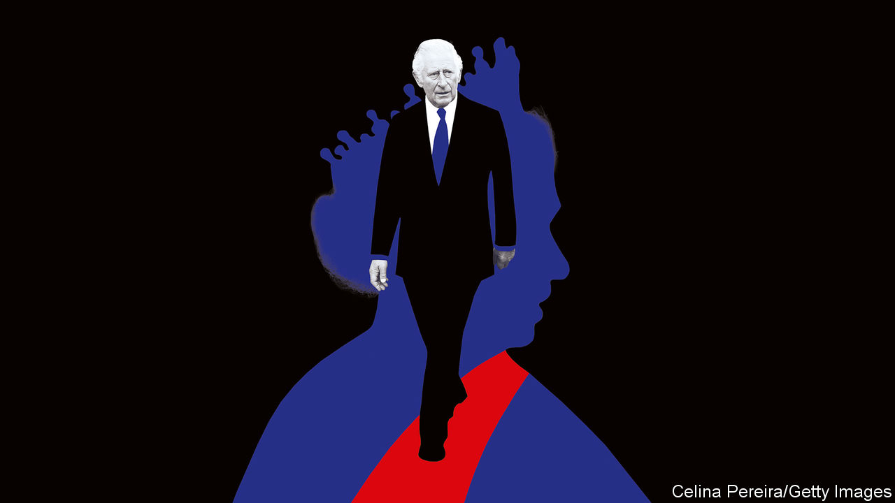

###### Britain’s constitution

# Why the monarchy matters 

##### The monarchy is an anachronism, yet it thrived under Elizabeth II. That holds lessons for her successor and for democracies elsewhere 

 

> Sep 15th 2022 

On september 19th, as Queen Elizabeth II is laid to rest, London will briefly become the centre of the world. In a distant echo of Britain’s imperial standing of a century ago, heads of state from dozens of countries, including President Joe Biden, will witness funeral rites and flummery in Westminster Abbey, while perhaps a billion or more of their citizens watch at home. That is a function of Elizabeth’s longevity. Her 70 years on the throne began in the twilight of that now-vanished era and were packed with state visits and receptions. But it is also a measure of her success. As King Charles III begins his reign amid strife in Britain, populism in the West and a challenge to democratic systems led by China and Russia, this success bears examination.

On the face of it, the British monarchy runs against the spirit of the times. Deference is dead, but royalty is built on a pantomime of archaic honorifics and frock-coated footmen. In an age of meritocracy, monarchy is rooted in the unjustifiable privilege of birth. Populism means that elites are out, but the most conspicuous elite of all remains. Identity politics means that narratives are in, but the queen kept her feelings under her collection of unfashionable hats. By rights, support for the crown should have crumbled under Elizabeth, as has sometimes imagined it might. Instead, the monarchy thrived.

One reason is that it was a platform for her individual . Chief of those was a self-denying vision of public service. Elizabeth worked out how the monarchy could help weave unity and a sense of national purpose in all parts of an ever-more-disparate nation. Just as assiduously as she held weekly audiences with the prime minister in her palaces, she also sought to show that ordinary Britons matter too, by criss-crossing the country, cutting ribbons, listening, waving and asking: “Have you come far?”

Abroad, she had a sure touch. On a state visit in 1961 she danced with Kwame Nkrumah, Ghana’s first president and a former political prisoner, signalling to Ghanaians that they were sovereign and to Britons back home that times had changed. When in 2011 she became the first monarch to visit Ireland in its 90 years since bloody independence, and 32 years after the ira assassination of her husband’s uncle, she became an unlikely symbol of harmony. Her diplomacy did not atone for Britain’s imperial wrongs—how could it?—but it was a step forward.

Nobody knows how Charles will match up. At 73, he has always lived in the shadow of others: the dazzling Diana, his first wife; and his dutiful mother. In the past the “Prince of Wails” said too much, too much of it self-pitying. But some of his early themes, notably the environment, no longer seem like the obsessions of a crank. And this week he signalled that he understands that he must henceforth muffle his opinions.

Yet the new king does not have to be a statesman to succeed. And that is the second reason Britain’s constitutional monarchy has thrived. His powers will be as circumscribed as a starched collar on loan from the nation. The more assertively he exercises them, the less potent they will be.

Writing in the 1860s, Walter Bagehot, ’s greatest editor, noted that under Britain’s constitutional monarchy “A republic has insinuated itself beneath the folds of a monarchy.” The executive and legislative powers of government belonged to the cabinet and Parliament. The crown was the “dignified” part of the state, devoted to ceremony and myth-making. In an elitist age, Bagehot saw this as a disguise, a device to keep the masses happy while the select few got on with the job.

Today, when the franchise is universal, nobody in Britain believes Bagehot’s fiction, any more than they do in Australia, Canada or any other country where Charles will be a distant head of state. We have argued in the past that Britain should, therefore, vote on whether to become a republic. However, Bagehot’s insight still has force. Grubby politicians come and go, they cut deals and win elections by dividing their countries. The king helps keep politics and nation separate and woe betide him if he confuses the two. Contrast that with America, Brazil and Turkey, poisoned by the fusion of head of state and head of government in Donald Trump, Jair Bolsonaro and Recep Tayyip Erdogan.

You do not need a monarchy to pull off the separation, obviously. Countries like Ireland rub along with a ceremonial president instead. He or she comes from the people and has, in theory, earned the honour. A dud or a rogue can be kicked out or prosecuted. To a degree, history lays down the choice—it would be comic to invent a monarchy from scratch.

However, constitutional monarchy has one advantage over figurehead presidencies that is the final reason behind Elizabeth’s surprising success: its mix of continuity and tradition, which even today is tinged with mystical vestiges of the healing royal touch. All political systems need to manage change and resolve conflicting interests peacefully and constructively. Systems that stagnate end up erupting; systems that race away leave large parts of society left behind and they erupt, too.

Under Elizabeth, Britain changed unrecognisably. Not only has it undergone social and technological change, like other Western democracies, but it was also eclipsed as a great power. More than once, most recently over Brexit, politics choked. During all this upheaval, the continuity that monarchy displays has been a moderating influence. George Orwell, no establishment stooge, called it an “escape-valve for dangerous emotions”, drawing patriotism away from politics, where love of country can rot into bigotry. Decaying empires are dangerous. Britain’s decline has been a lot less traumatic than it might have been.

Crown empirical

Elizabeth’s sleight of hand was to renew the monarchy quietly all the while, and Charles’s hardest task will be to renew it further. The prospect is daunting. The legacy of empire festers and could imperil the Commonwealth. Fights over Scottish independence loom. Brexit exposed holes in Britain’s piecemeal constitution; even the status of Britons’ fundamental rights is in doubt. Charles does not have the power to resolve these issues alone, but he has a part to play in resolving them peacefully. He is fortunate that Elizabeth showed him the way. ■


