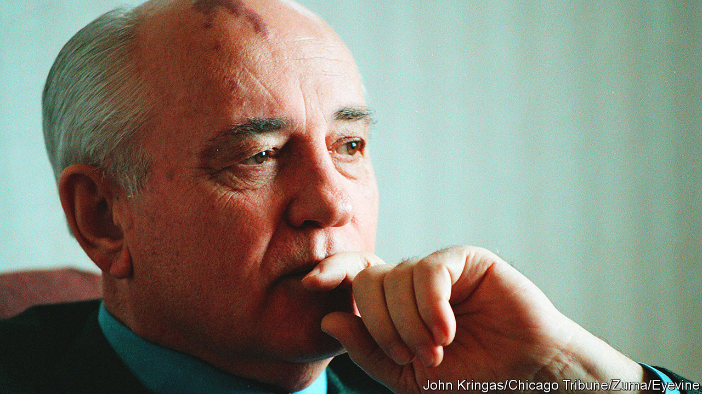

###### On big tech in the EU, the Soviet Union, museums, farming, planning

# Letters to the editor 

##### A selection of correspondence 

 

> Sep 15th 2022 


Digital enforcement

(September 3rd) hit the nail on the head by highlighting how the European Union may lead the world in making rules for big tech, but that these rules are pointless unless it enforces them. Unfortunately, as things currently stand, the eu seems unlikely to devote enough of its budget to fund such enforcement, or to allocate sufficient staff or expertise to do so. Meanwhile, big tech companies are spending fortunes on employing extra lawyers and experts to delay and circumvent effective enforcement of the new rules. Unless the eu faces up urgently to the enforcement challenge, millions of European consumers will continue to be denied the benefits of choice and innovation online. And the eu’s reputation of leading the world in big tech regulation will be in tatters.

ursula pachl

Deputy director-general

European Consumer Organisation


 


The fall of an empire

The bald assertion in your leader on the death of Mikhail Gorbachev that “Boris Yeltsin empowered the kleptocrats” ignored the glee with which Western ideologues swept into the crumbling Soviet Union to impart the blessings of capitalism (“”, September 3rd). They did this without bothering about the more challenging nuisance of institution-building. Healing the scars of history requires the co-operation of losers as well as winners. 

g.h. lewis


 


Share the artefacts

A lot of debates about objects of cultural heritage hinge on the perception of permanent and eternal nation-states with defined territories and identities, such as the debate raging about Britain returning the Rosetta Stone to Egypt (“”, September 3rd). But what we think of today as “Greek” or “Egyptian” or even “British” are the contingent outcomes of centuries of interactions. Is the Hagia Sophia in Istanbul representative of the legacy of the Greek people, the eastern Romans or Byzantines, Greece, Christianity, Constantinople, the Turkish people, the Ottoman Empire, Turkey, Istanbul, or Islam? How fair would it be to strip any one of those layers entirely away?

I think it would be better to ask what gives value to a work of art. There are probably several answers; aesthetic appeal, historical reflections and national or cultural identity among them. How can those valuations be best appreciated and conveyed? The large point of museums is to do exactly that instead of narrowing the assessment of a piece into one dimension.

Perhaps museums in London, Athens, Cairo and elsewhere could work together and display originals and copies of contentious pieces on a timetable throughout the year. That way, works could be seen and understood through their various layers by the many communities who cherish them. Moreover, such an arrangement would underscore the shared heritage of a given object and the importance of global collaboration in celebrating human civilisation.

nareg seferian


 


Farming for today

Agroecological practices have a great potential to make agriculture more sustainable and resilient against climate change (“”, September 3rd). However, far too often agroecology has become synonymous with a movement that rejects any form of modern agricultural technology and that judges agricultural practices on the basis of their naturalness, rather than on their sustainability. You suggested that “industrial” fertilisers break down soil structure. But there is no evidence at all for this when they are applied wisely, and together with a sufficient supply of organic fertilisers such as compost and manure. Feeding 9.7bn people in a sustainable way by 2050 will require smart combinations on farms of agroecological practices and technology.

olivier honnay

Professor of agronomic and conservation ecology

Katholieke Universiteit Leuven


 


Planning for the future

I disagreed with the thrust of your criticism of Britain’s planning system (“”, September 3rd). The system seeks to strike a balance between competing interests, most glaringly between private and public and local and national, and it does this well. The picture you painted is one that has delivered nothing but stagnation. This is far from the case. London’s skyline has been radically transformed and towns and cities regenerated, admittedly sometimes with mixed results. At the same time, it has preserved much of our historic heritage and protected our green spaces and biodiversity. 

Planning needs a degree of consensus to work effectively. This has been in short supply of late and not helped by the muddled thinking of the government. The Oxford to Cambridge arc, once trumpeted as globally significant, was shelved in favour of “levelling-up”, whatever that means. Strategic regional planning and the Infrastructure Planning Commission were dropped in favour of “localism”, with predictable results. Aiming for net-zero carbon emissions while at the same time banning new onshore wind development is quite frankly daft. And goodness knows what the current plans are for Heathrow airport. 

There is certainly scope for planning reform but politicians of all stripes need to be clear-eyed that reform in itself cannot dodge the issues. Planning decisions of any scale involve trade-offs and hard choices. 

david evans


Viewed through every possible measure, Britain’s planning system is indeed dysfunctional. We are not achieving the right quality or quantity of homes and our infrastructure is typically ageing and underinvested. We need to change the conversation, by which I mean starting from the point of recognising the issues we all need to address within our communities and getting people within each and every community to be a genuine part of identifying the solutions for their patch. 

Governments and voters don’t like top-down planning and community-led planning alone can’t deal with the bigger issues. Right now no one trusts anyone else when it comes to planning; development has become a dirty word. We need to establish a capability where local councils have the skills, support and will to involve people and the development industry in planning in a meaningful way and in a way they understand. 

Call it co-creation if you like, but the point is collective ownership, collective responsibility and collective action. 

robin shepherd

Planning director

Barton Willmore


The economic purpose of the British planning system is to restrict the supply of new housing. All other planning constraints are collateral damage to this goal. For most Britons, their home is their primary asset. The result is intense political pressure to drive up house prices. The state does this by manufacturing structural shortages; divesting from social housing and restricting new planning permissions. As long as private-home ownership dominates British tenure it will not be possible to solve the housing crisis or reform the planning system. 

jack self

Architect


 


So Britain’s woes are all the fault of nimbys (Not in My Back Yard)? Well I am a gommby (paid Good Money for My Back Yard). What do I do when I encounter a grospy (Getting Rich On Spoiling People’s Yards) with a grab (the Goal of Raising Awful Buildings)? There’s no hint of a crilby (Compensation for Real and Intangible Loss on Back Yards). So of course I am angry.

geoffrey planer


Your despair of British planning delays brings to mind an exchange at a planning convention. A French practitioner had been invited and was asked why projects in France completed more quickly. Her reply was, “In France, when we decide to drain a swamp we do not consult the frogs.”

rod tipple


