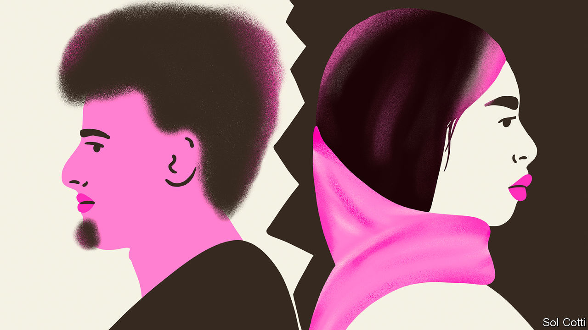

###### I don’t

# Arabs are divorcing more often 

##### And women are more likely than before to initiate a split 

 

> Sep 15th 2022 

A generation ago, Arab divorcees tended to be objects of scorn. “No virginity, no dowry,” sniffed Adel Imam, Egypt’s leading actor, in “Halfout”, a film in the 1980s. Today they are often heroines, confronting bastions of patriarchy in courtroom, mosque and marital bed. A big hit across the Arab world last Ramadan, the Muslim month of fasting (and feasting on television), was “Fatin Amal Harbi”, an Egyptian soap opera about a mother escaping from her abusive ex-husband. “Pop culture had more impact than decades of fighting for our rights,” says a female Palestinian campaigner.

Once frowned upon, divorce is increasingly common. Whereas rates have fallen in the West (partly because more couples never marry in the first place), they continue to climb in the Middle East. Egypt’s have more than doubled since the process was made easier for women in 2000. In Jordan, Lebanon, Qatar and the United Arab Emirates more than a third of marriages end in divorce. In Kuwait almost half do, a higher rate than America’s. 

The pattern of divorce is changing, too. Once it was almost exclusively a male prerogative. In Morocco nearly as many women as men initiate a split. “We’ve moved from being traditional conservative societies to transitional ones,” says Said Sadek, an Egyptian sociologist.

Sheikhs may once have quietly rotated their favourites within harems. But polygyny—the practice permitted by the Koran whereby a man may have up to four wives simultaneously, provided each is “justly” treated—is increasingly restricted. In many Muslim countries it is banned. 

What is novel, even among royalty, is that divorced wives are hitting back, even in public. Witness the recent acrimonious divorce (albeit in a British court) that has cost the emir of Dubai $550m to shed Princess Haya, a sister of the king of Jordan.

Most Arab rulers have gone with the social flow, curbing the old custom whereby a husband could get rid of a wife merely by declaring , the Arabic for divorce, three times over. After it became easier for Egyptian women to file for divorce, Algeria, Jordan and Morocco followed suit.

As social influence has shifted from extended families to nuclear ones, with couples marrying more often for love, bossy relatives are much less able to perpetuate unhappy unions. “Marriage has gone from being a collective decision to an individual choice,” says Soumaya Naamane Guessous, a Moroccan sociologist. Religious figures and family patriarchs are less dominant. Female participation in the workforce has given millions of women financial independence. And divorce in the Middle East tends to be much cheaper than in the West. “It cost me just 10,000 riyals ($2,650),” says a 38-year-old Saudi water engineer in the northern city of Tabuk after his third divorce.

Some Islamists denounce the rise of divorce as a wickedness of globalisation. “A most dangerous trend,” laments a puritanical Saudi cleric after the kingdom’s figures showed that last year there were almost as many divorces as marriages. 

But Islam has always been pragmatic about marriage. Most of the Prophet Muhammad’s wives were widows or divorcees. Tradition has it that he was divorced from one of them, Bint al-Jawn, on their actual wedding day. A Kuwaiti bride reportedly filed for divorce a mere three minutes after registering the marriage, since her husband failed to offer a helping hand when she tripped up. ■

