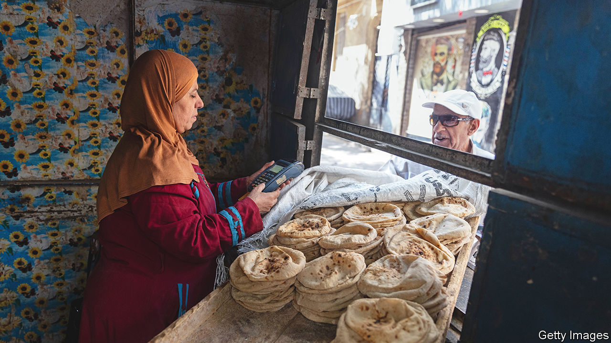

###### A tale of two scarcities

# From tea to cars, Egypt and Tunisia struggle to pay for imports 

##### Both countries are burdened with huge debts and are in talks with the IMF 

 

> Sep 15th 2022 

The signs that limit customers to one bag of flour or two litres of milk are sometimes unnecessary, because there is nothing to buy. Supermarket shelves in Tunisia have been stripped bare in recent weeks. Cooking oil, coffee, sugar and butter are all hard to find, especially outside the capital. Some supermarkets even ration bottled water. Shoppers at malls in Cairo had a similar experience all summer: stocks of consumer goods, from clothing to furniture, are running low.

Shortages have been an unhappy reality for consumers around the world since 2020. Tampons have been scarce in America; France has run low on mustard. In the Middle East, though, empty shelves are not merely the result of supply-chain kinks. They are also signs of indebted, cash-strapped governments struggling to pay for basic imports.

Most of the goods running low in Tunisia are heavily subsidised. A 250g bag of coffee from a local roaster costs as little as $1, and a litre of vegetable oil less than $2. These products are essential in a country where 19% of people live on less than the equivalent of $5.50 a day, according to the World Bank. (The government has not released national statistics since 2015.) 

Kais Saied, the president, knows whom to blame: hoarders. He insists Tunisia’s problem is not a lack of food but rather greedy “speculators” who refuse to sell it at the low official prices. Police carry out periodic raids on warehouses full of staples. In March Mr Saied, who has ruled by decree since he suspended parliament last year, issued a vaguely worded law which banned spreading “false information” that might scare consumers or push up prices.

His explanation is facile. Some goods are not available at all, even on the black market. Tunisia has $8bn in foreign reserves (four months of imports) and $35bn of debt, mostly to foreign creditors. That does not leave much to pay for imports. Shipments are stuck at ports because distributors are unable to pay for them.

The government’s price-fixing exacerbates the problem. Dairy farmers, for example, must sell their milk for 25% less than it costs to produce, and the government is not making up the difference. (The cost of animal feed has soared since the invasion of Ukraine.) Naturally, the farmers grumble. Many have left the business or thinned their herds. 

Egypt’s problems are different. Prices have soared since the start of the year, with annual food inflation hitting 23% last month. But the corner shop still has cooking oil and coffee. Shortages are instead hitting businesses that sell imported goods to wealthier customers. 

Since January foreign reserves have fallen from $41bn to $33bn (four and a half months of imports). The government is keen to husband its stash of hard currency. In April it banned hundreds of firms from importing goods. The official explanation was mundane: companies supposedly failed to file required paperwork. In practice, though, the decision imposed a sort of autarky, cutting imports of non-essential items. The central bank also imposed its own restrictions on imports.

These measures helped trim Egypt’s import bill. It bought $7bn worth of foreign goods in June, an 8% decrease from June 2021 despite higher prices for oil and wheat. The trade deficit dipped by 12%. But the bans have wrought havoc on firms that cannot find locally made alternatives.

Some businesses try to keep shelves stocked with whatever is left in the warehouse: selling last season’s clothes instead of the newest threads, for example. Others have nothing to offer. Car dealers are struggling to make deliveries to customers, some of whom paid for their vehicles six months ago. Drivers registered 43% fewer cars in July than last year.

Shortages even threaten the country’s favourite drink. Egyptians are among the world’s biggest tea-drinkers, but the country produces none: it spent $192m importing the stuff in 2020. Last month Egypt’s largest tea distributor warned that supplies were running low.

Both countries are talking to the imf. Egypt should manage to get a deal. It will probably have to further devalue the pound, which has lost 19% of its value since March. In August Abdel-Fattah al-Sisi, the president, sacked the central-bank governor, who had opposed a devaluation.

With a debt-to-gdp ratio of 94%, Egypt’s financing needs are enormous. It took a $12bn imf loan in 2016 and another $5bn in 2020. Goldman Sachs, a bank, estimates it will have to repay $13bn to the fund over the next three years, and thinks it may need to seek $15bn from its latest agreement. The finance minister insisted in July that he would “definitely” ask for less, though he did not offer his own target.

Mr Sisi spent much of his summer huddling with businessmen to discuss the country’s dire finances. Gulf states have pledged at least $22bn to help, though much of that is investment rather than aid. On September 13th Mr Sisi flew to Qatar, a rich country he long viewed as an enemy because of its support for the Muslim Brotherhood: beggars cannot be choosers.

Tunisia is having a harder time. It started formal talks with the fund in July. An agreement may require cuts both to subsidies and the public-sector wage bill, which has grown from 11% of gdp in 2010 to 18% in 2020. The ugtt, the powerful trade union, opposes both measures, arguing that they will deepen poverty. The country faces a painful choice: higher prices for subsidised goods—or no goods at all. ■

