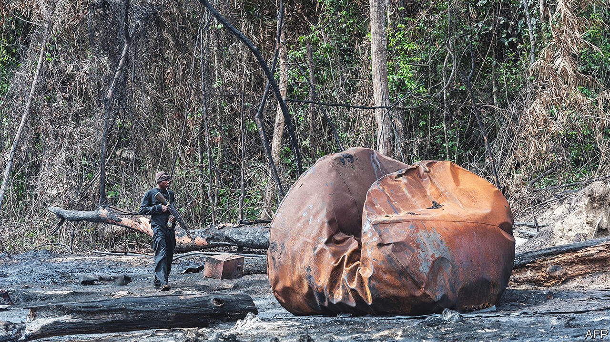
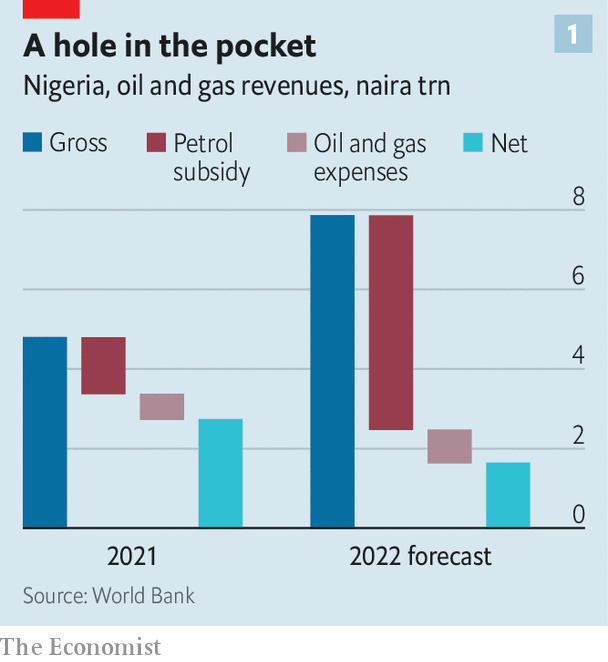
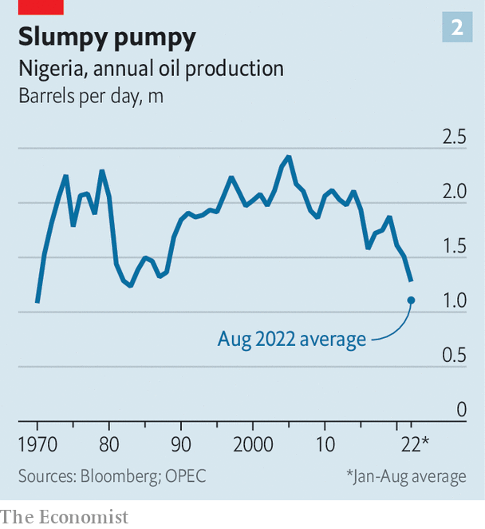

###### Missing an open goal

# How oil-rich Nigeria failed to profit from an oil boom 

##### Price controls, spluttering production and oil theft are to blame 

 

> Sep 11th 2022 

A surge in  can do astonishing things. In Saudi Arabia a futuristic city is planned to rise from the desert.  long-beleaguered currency has become one of the strongest performers against the greenback. In the Middle East and Central Asia oil exporters are cock-a-hoop. They may pocket an extra $320bn in oil revenues this year. Yet there is a conspicuous absentee from this merry petro-party. The net effect of the high oil price for the country that is usually Africa’s biggest oil producer is “nil or negative”, laments Zainab Ahmed, Nigeria’s minister of finance.

Africa’s most populous country, around 220m-strong, desperately needs the money an oil boom could bring. Some 40% of its people live on less than the equivalent of $1.90 a day. The  has contributed to the violence that afflicts much of the country. In the first half of this year, nearly 6,000 people were killed by jihadists, kidnappers, bandits or the army. 

Elsewhere, as the price of crude rises, drivers pay more at the pump. Not in Nigeria. Petrol is about 175 naira ($0.42) a litre, among the world’s cheapest, and the government has not raised this low fixed price since December 2020. In January President Muhammadu Buhari reneged on his latest promise to reform the system, leaving the government to pay for the vast gap between Nigeria’s official price and the global one. The state-owned Nigerian National Petroleum Corporation (nnpc) covers the fuel subsidy from its profits and sends what is left to the government. But in the first half of this year it sent nothing at all.

 


The prognosis is grim. The World Bank forecast in June that the government would spend 5.4trn naira ($12.6bn) on fuel subsidies this year, a threefold increase from last year. That is more than the increase in revenue the government will get from higher crude oil prices, reckons the World Bank (see chart 1). As a result, Nigeria’s net oil revenues are likely to be about 40% lower than last year. That squeezes everything else. In this year’s amended budget the government allocated more to the fuel subsidy than to education, health care and welfare combined. 

Price-fixing has other ill effects. Because petrol is artificially cheap, Nigerians burn more of it. Imports of petrol have risen from about 58m litres a day in 2021 to around 70m this year. Some Nigerians, unsurprisingly, buy subsidised petrol, smuggle it across the border and sell it at a huge mark-up in neighbouring countries. Although Nigeria pumps crude oil, its refineries are so dysfunctional they have been closed down, so it imports almost all its refined fuel. Rising domestic consumption thus weighs on the current account. 

 


Another reason Nigeria’s public finances benefit so little from high oil prices is that production itself has slumped to 1.1m barrels per day, the lowest in decades (see chart 2). Output has been dipping since 2005. This year it has dived. Angola’s output recently overtook Nigeria’s. 

Output is falling partly because the nnpc is so short of cash after paying for petrol subsidies that it struggles to cover production costs to pump oil. And a lot of the oil it pumps never makes it into official exports because it is stolen. 

Estimates vary, but the oil industry’s regulator says thieves are snaffling 108,000 barrels a day, about 7% of production. This cost the government $1bn in the first quarter of the year. Watchdogs reckon that 5-20% of Nigeria’s oil is stolen. The Trans Niger pipeline, which can transport 180,000 barrels a day (about 16% of the country’s current production), suffers so much theft that its flow has been halted since June. Another big pipeline that carries 150,000 barrels a day has also been repeatedly attacked. Shell, a big oil firm, has declared force majeure since March on all its exports of Bonny light, a high-quality crude, permitting it not to meet its contractual obligations. Nigeria could produce another 700,000 barrels a day but for theft and oil companies having to cut back production to avoid it, claims Mele Kyari, the nnpc’s head. The spate of vandalism at one point prompted the nnpc to shut down its entire network of pipelines, he said. 

One way to steal is to understate how much oil has been loaded in legitimate shipments. Another is to break into pipelines and siphon oil off, then cook it up in bush refineries before selling it. Five years ago the Stakeholder Democracy Network, a watchdog in the Niger Delta, carried out a survey that found more than a hundred such refineries in just two of Nigeria’s nine oil-producing states. Lacking other ways to make a good living, hundreds of thousands of young people are involved in illegal refining, says Ledum Mitee, a local leader from Ogoniland, a region in the Delta. 

Plenty of stolen crude goes straight into the international market. Small boats glide along the Delta’s canals, filling up from illegally tapped pipelines. They deliver it to offshore tankers or floating oil platforms. Sometimes the stolen crude is mixed with the legal variety, then sold to unknowing buyers. Much of it, however, is bought by traders who pretend not to know it is stolen, or simply do not care if it is or not. “There’s a huge black market off the coast of west Africa,” says Alexander Sewell of the Stakeholder Democracy Network. 

“This is being perpetrated by the big boys,” says Mr Mitee. Tapping into the pipes for large volumes, heated to keep the crude flowing, requires real expertise. It also requires complicity from some of the officials running the pipelines and from the security forces supposedly guarding them, says an observer who requests anonymity for safety. 

A galaxy of thieves

Exactly who the big boys are is hotly disputed. Mr Kyari recently alleged that army officers, government officials and even religious leaders are involved. The navy’s spokesmen claim that so large a scale of theft is implausible because—they argue perversely—their patrols would have spotted the boats and stopped them. The nnpc itself is “the north star in its [Nigeria’s] kleptocratic constellation”, says Matthew Page of Chatham House, a think-tank in London. This is “transnational organised crime run by a lot of violent people”, warns the anonymous observer. 

Mr Buhari has promised a crackdown. The nnpc’s first move was to hire private security firms to protect the pipelines—a telling indictment of the army. But it is unlikely to solve the problem. Two of the firms are part-owned by a former warlord, Government Ekpemupolo, better known as Tompolo. He led a guerrilla campaign in the 2000s for the locals to control the Delta’s oil, before agreeing to a deal whereby he would stop blowing up the pipelines in exchange for an amnesty—and for lucrative security contracts. That has fallen apart under Mr Buhari’s government, which in 2016 issued a warrant for his arrest. (A court subsequently threw out these charges.) Yet Tompolo, who denies wrongdoing, is now bizarrely both a government contractor and still on the wanted list of Nigeria’s anti-corruption agency.

Ordinary Nigerians may at least console themselves that their petrol is still cheap, even if it runs out, as price-controlled goods often do. This year there have been three bouts of shortages. Exasperated motorists in long queues ruminating on the country’s corruption may be forgiven for uttering a popular Yoruba catchphrase: , which means “emigrate”. ■

