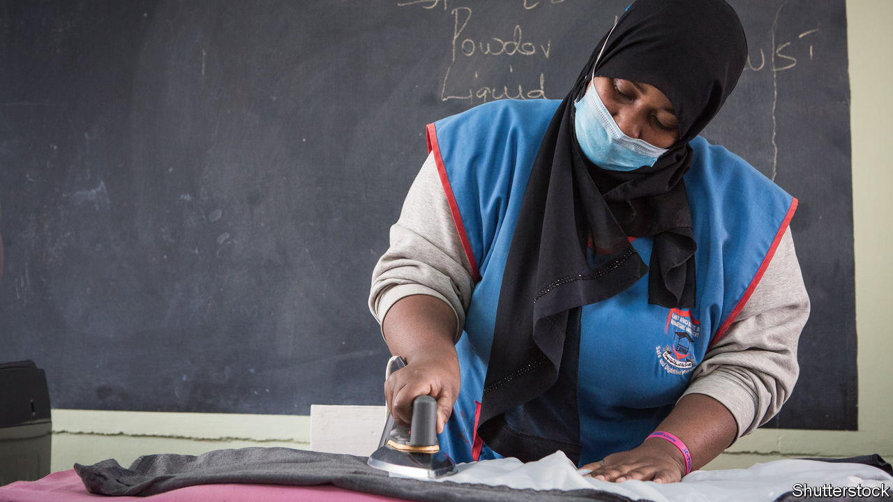
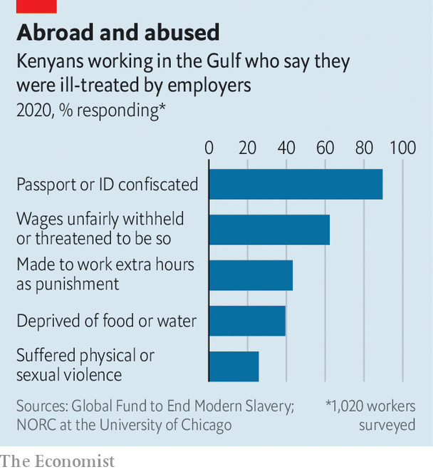

###### The ones who sweep

# In the Gulf 99% of Kenyan migrant workers are abused, a poll finds 

##### But they keep coming because wages are better than at home 

 

> Sep 15th 2022 

What does Rebecca Nakabiito hope for as she prepares to leave Uganda for the first time? “To be treated as a human,” she says softly. “I don’t want them to treat me as a slave.” Like thousands of others she is heading for Saudi Arabia, to work as a maid. A friend who travelled before her was scalded with hot water as punishment for oversleeping. She will go anyway. There are school fees to pay.

Most migrant workers in the Gulf are Asian, but a growing number of east Africans are joining them. Last year 87,000 Ugandans travelled to the Middle East under the government’s “labour externalisation” programme. About that many Kenyans made similar trips. Official routes to the Gulf are distinct from irregular migration, such as the overcrowded boats that smuggle Ethiopians and Eritreans across the Red Sea. But they are not risk-free. Returning workers tell stories of racism, abuse and exploitation.

For African governments, exporting workers is easier than creating jobs for them at home. Remittances sent back to Uganda by workers from abroad generate more foreign exchange than coffee, the main export crop. Labour migration is good business for more than 200 recruitment firms, some of which are owned by army officers and close relatives of the president, Yoweri Museveni.

Employers in the Gulf want African labour because it is cheap. Under bilateral agreements a Ugandan maid in Saudi Arabia gets 900 riyals ($240) a month—much more than she could make at home, but less than the 1,500 riyals which most Filipinos earn. African men are hired as builders or guards. “They regard us as people who are energetic but lazy in mind, so they give us the hardest jobs,” says Moses Kafirita, a Ugandan who worked on a building site in Dubai, where he was paid less than the Indians alongside him.

For most Africans, the Gulf means two years of drudgery, mixing long hours with grinding isolation. For some it is far worse. Jacky (not her real name) was raped by her boss in Saudi Arabia. She could not report it because he had taken her phone. When she returned to Uganda, six months pregnant, the recruitment company claimed it was consensual. She is so hard up that she has contemplated going back, she says, bouncing her pale baby on her knee.

 


Although Jacky’s case is extreme, mistreatment is rife. In a survey of Kenyan migrants to the Gulf by the Global Fund to End Modern Slavery, a campaign group, 99% said they had been abused. The most frequent complaints were the confiscation of passports or withholding of wages, but violence and rape were also depressingly common (see chart). Last year 28 Ugandans died while working in the Middle East. Activists suspect that some may have been killed by their bosses.

Abuses can arise in any workplace and do not stem from “migration per se”, insists Enid Nambuya of the Uganda Association of External Recruitment Agencies, an industry body. But that plays down the restrictions of the system, prevalent in the Gulf, which ties migrant workers to the employers who sponsored their visas. “The minute you leave your workplace without the employer’s permission, you can be deported as a runaway,” says Vani Saraswathi of Migrant-Rights.org, an advocacy group based in the Gulf. Last year Saudi Arabia loosened these rules for some workers, but not for maids or guards.

Why then do Ugandans still migrate? Some may be naive, but many are grimly realistic about their place in the world economy. Though recruiters advertise using glamorous images of soaring planes, people in Kampala, Uganda’s capital, call a migrant to a richer country —someone who sweeps.

This pragmatism is evident at a training session in Kampala, where a hundred recruits are learning how to make beds, wash a car and use a microwave. The course is run by the Platform for Labour Action, a civil-society group that teaches workers about their rights. If your boss calls you a monkey, try to shrug it off as a joke, the trainer advises. The women fidget with their new headscarves. Despite the risks, they see working abroad as the only way to fund their modest dreams of starting a hair salon, buying land or opening a shop.

Some migrants find solidarity and solace online. Abdallah Kayonde, an activist in Kampala, scrolls through a steady stream of WhatsApp messages from workers seeking help. “This network has given us a lot of information first-hand,” he says. His organisation, Migrant Workers’ Voice, has raised the alarm about workers who have died in the Gulf. Separately, campaigners in the Ugandan diaspora have created an app to get alerts from migrants if something goes wrong.

But activism has limits. Malcolm Bidali, a Kenyan security guard, was arrested in Qatar last year after blogging about his experiences there. He spent 26 days in solitary confinement and was eventually allowed to leave the country after paying a fine of 25,000 riyals for publishing “false news”. At least the food in prison was edible, he says. “That really tells you a lot about the country, that prisoners eat better than migrant workers,” he says. ■

