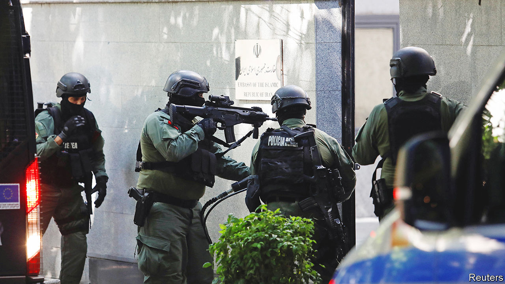
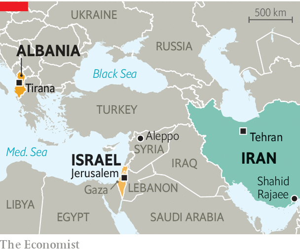

###### From ayatollahs to Albania

# Iran’s cyberwar goes global 

##### Its targets include not only Israel but at least one NATO member 

 

> Sep 14th 2022 

Iranian diplomats at their country’s embassy in Tirana, Albania’s capital, bundled sensitive documents into a barrel and set them alight in the early hours of September 8th, reported Reuters. They were in a rush; a day earlier, they had been given 24 hours to leave. Hours later local police stormed into the empty mission. The episode was a dramatic culmination of an Iranian cyber-offensive weeks earlier; it highlights Iran’s central role in a series of swirling cyber-conflicts. 

In late July, bomb threats and cyber-attacks forced the People’s Mujahedeen Organisation of Iran (pmoi), also known as the Mujahedeen-e Khalq (mek), an Iranian opposition movement-cum-cult, to cancel a planned summit in Albania, where around 3,000 of its members live in a camp 30km north-west of Tirana. The mek is reviled by Iran, not least for its support for Saddam Hussein in the Iran-Iraq war of the 1980s, and is patronised by some hawkish American and assorted European politicians. Though America and the eu no longer deem it a terrorist organisation as they once did, Iran continues to view the group as a threat. Last year an Iranian diplomat in Vienna was convicted by a Belgian court of attempting to bomb another mek rally.

 


On July 15th Iran evidently made a multi-pronged cyber-assault on Albanian networks. It targeted the website of the country’s parliament and prime minister’s office, as well as an online portal used to deliver government services. Some of the attacks used ransomware, which holds data hostage until a payment is made; others stole sensitive messages. Emails from the prime minister, Edi Rama, and from foreign-ministry officials were leaked, with some material released over a month after the initial intrusions. Though the attackers masqueraded as a disaffected Albanian group, Albania, America and Britain all say that Iran was responsible. 

On September 7th Mr Rama said he was severing ties with Iran. “This extreme response,” he said, “is fully proportionate to the gravity and risk of the cyber-attack that threatened to paralyse public services, erase digital systems and hack into state records, steal government intranet electronic communication and stir chaos and insecurity in the country.” It is the first time any country has ended diplomatic relations in response to cyber-aggression. 

It was “a notably brazen operation”, observed Mandiant, an American cyber-security firm, pointing to the fact that Albania is a member of nato, whose Article Five mutual-defence clause covers not just big cyber-attacks but also an accumulation of smaller ones. “It may indicate an increased tolerance of risk when employing disruptive tools against countries perceived to be working against Iranian interests,” concluded Mandiant. On September 9th Iran struck again, said Albania, this time against the country’s border-control systems. The same day, America’s government imposed sanctions on Iran’s Ministry of Intelligence and Security, a spy agency, for its “increasingly aggressive cyberactivities” since 2007. 

Iran’s cyber-attacks against Albania pale in comparison with the skirmishing under way with Israel. The two countries are fierce rivals, sparring over , which is expanding rapidly once more, and the activities of Iran-backed armed groups in Gaza, Lebanon, Syria and Yemen. That sparring is often violent and also, increasingly, digital.

In 2020 suspected Iranian hackers attempted to disrupt six Israeli water facilities. The riposte came within weeks: a cyber-attack on the Shahid Rajaee port on the Strait of Hormuz. Then in 2021 a hacking group known as Predatory Sparrow—widely thought to be a front for Israel—disrupted Iran’s rail network and the country’s fuel-distribution system, displayed anti-regime propaganda on electronic billboards and leaked footage from Evin prison, a jail which houses political prisoners. The attacks continued this summer.

On June 18th Iranian cyber-attacks set off air raid sirens in Jerusalem and Eilat, Israel’s southern port. Those attacks were a wake-up call, say Israeli officials, because they showed that some critical systems remained connected to the wider internet (most are physically disconnected, or “air-gapped”). Just over a week later Predatory Sparrow targeted three Iranian steel plants, allegedly taking control of machinery at one—a rare example of a cyber-attack directly causing physical destruction. The same month, suspected Iranian actors breached a large tourist company, obtaining the personal information of over 300,000 Israelis. On September 6th an Israeli court imprisoned Omri Goren, a former housekeeper for Benny Gantz, the country’s defence minister, for offering his services to Iranian hackers. 

“Some of the most interesting things in cyberspace over the past year have probably been happening not between Russia and Ukraine,” says one Western official, “but between Israel and Iran.” Taken together, these campaigns of sabotage, subversion and propaganda represent some of the most aggressive competition conducted over computer networks to date. As diplomacy over Iran’s nuclear plans falters, that competition is unlikely to abate. ■

