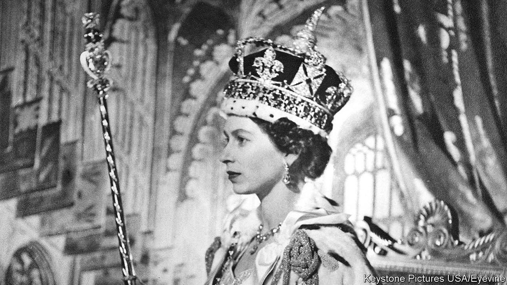

###### The weight of duty

# Elizabeth II never laid down the heavy weight of the crown 

##### Britain’s longest-serving monarch died on September 8th, aged 96 

 

> Sep 8th 2022 

For the millions who watched on June 2nd 1953—for it was the first time in history that a British coronation had been televised—the most moving part of the ceremony came near the end. It was then that the imperial state crown, encrusted with 2,868 diamonds and weighing more than a kilogram, was placed on the pretty, dark and fragile head of Elizabeth Windsor, proclaiming her, in the eyes of all, Queen Elizabeth II. 

For her, though, according to the few people who knew her well, the most charged part of the service had come earlier, in the only part which was not shown. Then, like monarchs before her back to medieval times, she had stripped to a shift behind screens and been anointed with holy oil: a sign that her election came not just from good Hanoverian blood, but from God. It was a reminder that kingship was a holy and permanent duty. And it was a lesson she never forgot. 


Tirelessly, the small and somewhat dumpy figure, with a large handbag and a taste for spring-bright coats, travelled the country and overseas. She was the target of much gentle mockery for her social chat (“Have you come far?”), her sempiternal gloves and hats and her high, clipped diction, all from another age. With that ribbing went an instinct to protect her, though it was clear, from the level stare and the flashes of dry wit in her speeches, that this was quite unnecessary, thank you. Outrage swept the British press when heedless foreign leaders touched her, Michelle Obama even stroking her back, but she would calmly ignore it. As a result of thousands of little human interactions—posies received, tribal dances watched, buildings opened, ships launched, waves bestowed—the institution of the monarchy burrowed deeper into public affection, at home and in the Commonwealth, in a way that was  and even more in the 21st. 

The woman behind it all was revealed only occasionally. There had surely been a much more carefree and relaxed Elizabeth, before in 1936 her father suddenly became king and before, on that sombre February morning in 1952, she had learned that she was now queen. And yet, on second thoughts, perhaps there had never been. Even as a child she had a dutiful look, the responsible elder daughter tending her garden or keeping her fun-loving sister in check. In the war, as a very young woman, she served in the women’s ats and drove trucks; uniform suited her. The wedding gown for her long and happy marriage to Prince Philip of Greece in 1947 was made by saving up donated clothing coupons. Not long into her reign she sent, on request, a handwritten recipe for buttermilk drop-scones to President Eisenhower. She could just about be imagined actually donning an apron and making them. 


Philip’s outspokenness in public suggested that she, too, probably had a merry and waspish tongue in private and some choice political opinions. She did not, of course, express them. Her 15 serving prime ministers, having negotiated the snappish and essential corgis, were all received with equanimity. She was said to have rather liked the dourly humorous Labour leader, Harold Wilson, and, despite several plays claiming the contrary, Margaret Thatcher also. Truly, no one outside her circle knew. The closest she ventured to a political statement came over Scottish independence in 2014, which would have split away the part of the kingdom she seemed, from her summers at Balmoral, to love best; on her way into church there, she warned her northern subjects to be careful. 

An explicit admission of sadness came in 1992, when Charles and Diana separated and Windsor Castle, her favourite, was badly damaged by fire: she called it her  An equally trying year was 2019, when a transatlantic sex scandal  and she herself was drawn into the  by being advised to approve , an action later ruled illegal. She said nothing, but was widely assumed to be furious that the Crown had been dragged into politics. For decades, until that point, she had kept a studied, necessary detachment, participating only to read, with as little expression as possible, the list of proposed new legislation at each state opening of “my” Parliament. 

Instead of deploying any actual power, her role was increasingly to hearten her people. When covid-19 came she encouraged the nation by channelling Vera Lynn, a favourite songster of the second world war; and when Philip, her “strength and stay”, , she continued her royal duties with barely a break. Not for her a black-veiled internal exile in the style of her great predecessor, Victoria. She had covid-weary subjects to think of.

For relaxation, from the beginning, there were always the races. Her most unaffected joy burst out there whenever her horse won. Horseflesh was her great love; books on horses were said to make up most of her reading, and she was regularly photographed at her country castles riding alone, save for a distantly following security man, in headscarf and Barbour in the rain.

, especially when the heir apparent was ageing fast himself, sometimes seemed curmudgeonly. Increasingly, though, it also looked like an exercise in shrewd management. To be head of “The Firm” would not, perhaps, suit Charles, with his dreamy and alternative ways; it might be safer in other hands. The very notion of the monarchy as a family business, assessing profit and loss and ceaselessly nurturing the brand, would have been unthinkable in other ages. Not so in hers. 

This was not all, however. In her last years, especially, her face expressed a determination to continue simply because she had promised before God never to do otherwise. Before her coronation, she got used to the weight of the crown by wearing it at breakfast; in a sense, she never again took it off. On that day in 1953 she was vested with a sacred duty to hold together a country which, in the ensuing decades, became more diverse, fissiparous, irreverent and distracted than it had ever been before. And so she did. ■


