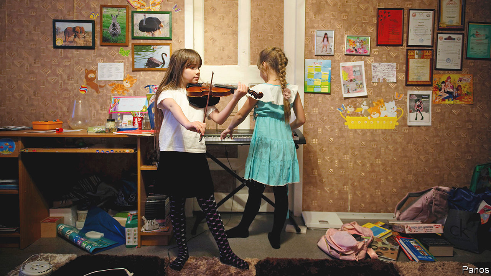

###### Music and the mind

# Playing an instrument is linked to better cognition 

##### Another of the many benefits of a musical education 

 

> Sep 14th 2022 

From strumming a guitar next to a campfire to entertaining guests with a piano piece at a formal dinner, being able to play a musical instrument is unquestionably rewarding. Yet, evidence suggests that the rewards go far beyond the elation of performing well in front of others—those who play instruments have often been found to perform better on cognitive tests too. 

Enhanced cognition is well-known to be linked to a range of positive life outcomes such as getting a better job and enjoying improved health. However, it has remained unclear whether these enhanced cognitive skills are just temporary. New research published in suggests that the benefits of musical instruments remain for decades.

Studies comparing the mental abilities of musicians and non-musicians often show that musical training is related to small, but significant, cognitive benefits even when confounding factors, such as socioeconomic status, are accounted for. Findings from experimental studies with children have also lent support to the idea that musical training might cause an improvement in cognitive ability. Indeed, there is evidence that just two years of such training enhances cognition.

Unfortunately, a major limitation of these studies is their duration. They almost always have short monitoring periods. This is not because psychologists do not yearn to monitor their participants for longer. It is more a matter of time and resources. Running experiments over the course of several decades is logistically challenging and expensive. This has made it impossible to determine if cognitive changes associated with learning how to play an instrument remain throughout a person’s lifetime. 

In their latest study, Judith Okely at Edinburgh University and her colleagues, Ian Deary and Katie Overy, identified a solution to that age-old problem: the Lothian Birth Cohort. On a single day in 1947, the Scottish government tested the intelligence of almost every 11-year-old child who attended school in the country. In 1997 Dr Deary contacted 1,091 of those people and tested them once more between 2004 and 2007. The study is still ongoing with participants returning for further cognitive testing every three years. 

Although information about musical ability was not initially collected as part of the study, while pondering the question of how learning an instrument shaped cognition over time in early 2017, Dr Overy, a researcher at Edinburgh University’s Reid School of Music, realised it was not too late to ask the original participants about their musical experiences.

The researchers worked together to develop a questionnaire that collected information about lifetime musical experience. This was completed by the surviving cohort members who returned to the study for further testing at age 82. The participants were asked how many instruments they played and what their training was like. They were also asked to record how many years of regular practice they had and what performance level (for example beginner, intermediate or advanced) they had reached. A total of 366 cohort members provided usable information and 117 revealed that they had some degree of experience with musical instruments. 

Overall, the researchers found that a significant positive relationship existed between playing an instrument and change in cognitive ability over time. More specifically, the more years and more hours of practice with an instrument that a person had, the more likely they were to show a positive cognitive change over the course of their life. The effect was small but it remained significant even when the findings were adjusted to take into account confounding factors like years of education and socioeconomic status.

Precisely why learning to play a musical instrument has these effects remains unclear. The researchers theorise that driving people to regularly use a mix of focused attention, co-ordination, auditory-motor skills and memory results in advantageous cognitive changes. Yet another reward, then, from a love of music. ■


