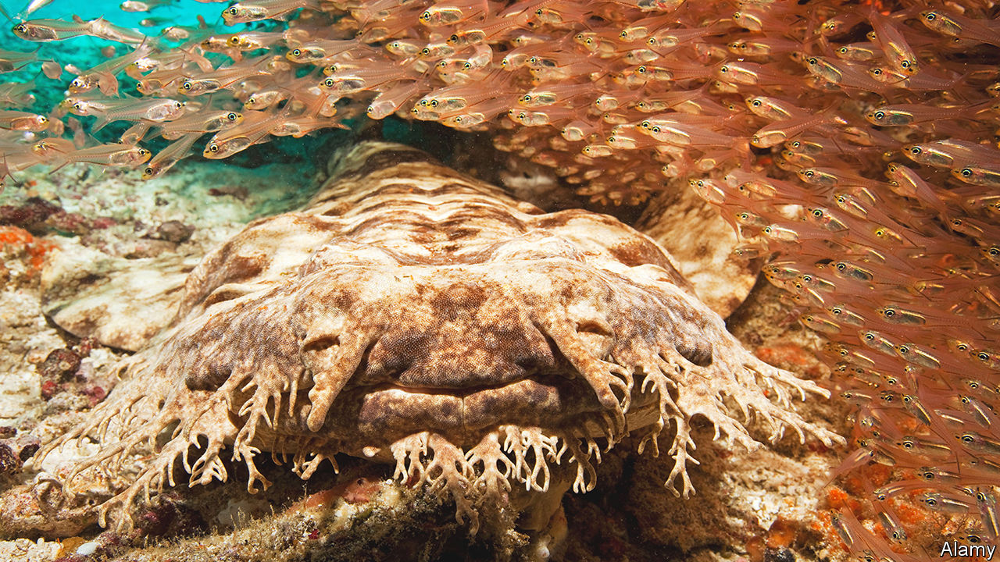

###### Camouflage

# The complex arms race between predator and prey 

##### A new study attempts to quantify how well disguise works in nature 

 

> Sep 14th 2022 

Camouflage is the by-product of an evolutionary arms race between one group—the predators—that want to eat another group—the prey. Prey seek to survive by tricking the perceptual and cognitive systems of the predators. And predators look to eat by breaking through the camouflage of the prey. 

To put it all more formally, predators need to maximise their perception of signal (their proposed meal) from the noise (the general environment); the goal of prey is to minimise that same signal-to-noise ratio. While the physical manifestations of camouflage might be diverse, they function in one of three ways: to impair detection, to impair identification or to redirect attack. Methods that impair detection trick the perceptual system of a predator into believing that the prey is simply not there. Octopuses change colour to match their backgrounds, for example. The tasselled wobbegong shark (pictured) conceals its shadow against the ocean floor by being incredibly wide and flat. The white bellies of penguins match the sky, and their black coats, the depths of the ocean, in what is known as “countershading”. The arctic fox sports white fur in the winter and brown or grey in the summer. The comb jelly is transparent. Deep-sea fish are very black. 

Often, the evolution of this kind of camouflage is detectable on a shorter timescale too—the populations of dark-coloured peppered moths grew in England, for example, as sooty pollution increased in the 19th century during the Industrial Revolution. Correspondingly, the population of light-coloured moths rose when pollution levels fell.

Impairing identification tricks the cognitive system of predators into thinking that whatever it is looking at is uninteresting (and definitely not food-like). The dead leaf butterfly, for example, looks like a dead leaf. Predators themselves use this too—leopards have high-contrast disruptive patterning which allows them to better blend into shadowy bushes and tall grass to avoid detection by their prey.

Redirecting attention is a way to try to reduce the lethality of attack, thereby increasing the chances of survival. The eyespots on the wings of a peacock butterfly, for example, divert attention towards less important regions of the insect’s body. Zebras’ stripes deploy a technique called “motion dazzle”, which disrupts a predator’s ability to work out which direction the animals are moving in.

How good are any of these camouflage tactics? A study published this week in  tries to find out. João Vitor de Alcantara Viana and colleagues from the State University of Campinas, in Brazil, compiled results from 84 studies on camouflage. They found that camouflage increased the amount of time a predator spent searching by over 60%, and it decreased the number of prey that were detected and attacked by around 25%. 

Peek-a-boo!

Masquerade (the dead leaf butterfly, for example) was the most effective technique, nearly quadrupling the time predators spent searching. Eyespots on butterfly wings seemingly provided no benefits in terms of hiding time from predators, but Mr Alcantara noted that this was not surprising since that tactic is not meant to interfere with detection, but rather to reduce the lethality of an attack.

Camouflage need not be visual. Bats, for example, perceive the world through sound. Some of the moths they predate have therefore evolved a “stealth coat”—made of tiny hairs and a layer of scales—that reduces their detectability through echolocation. Marc Holderied, a biologist at the University of Bristol, wanted to know how good the moths were at hiding from bats so he shaved off their hairs and then sent sound waves towards them, mimicking how bats might echolocate to find their prey. The moths’ one-and-a-half-millimetre layer of fur, it turned out, reduced their detectability by just over 40%.

In addition to the fur, moths also have a thin layer of scales, tens to hundreds of thousands of them, on each wing. The scales each respond to specific frequencies of sound waves and when a bat’s echolocation signals hits the moth’s wings, the scales start to vibrate. The acoustic energy from the echolocation is thus absorbed. 

Dr Holderied and his colleagues tested how well the scales worked and found that they were just as good at absorbing sound as the fur—they absorbed as much as 87% of the incoming sound energy, but at only one tenth of the fur’s thickness. In terms of their ability to absorb sounds, Dr Holderied says the moth’s scales outperform (and are much thinner than) any human-designed soundproofing used in homes and offices.

Camouflage not only provides a backdoor into glimpsing the magnificently diverse sensory worlds of animals, it has also inspired intriguing applications for people. Artists and anti-technology activists have invented make-up techniques, for example, known as “computer vision dazzle” that take their cues from natural camouflage and work by drawing high-contrast contours and colourful shapes on human faces so that they can evade detection by computer facial recognition. And Dr Holderied’s team has been taking inspiration from the miraculously sound-absorbing properties of moths to design wallpaper that can reduce the noise of road traffic for the occupants of a building. Though evolved in nature, camouflage can be useful in modern city life too. ■


