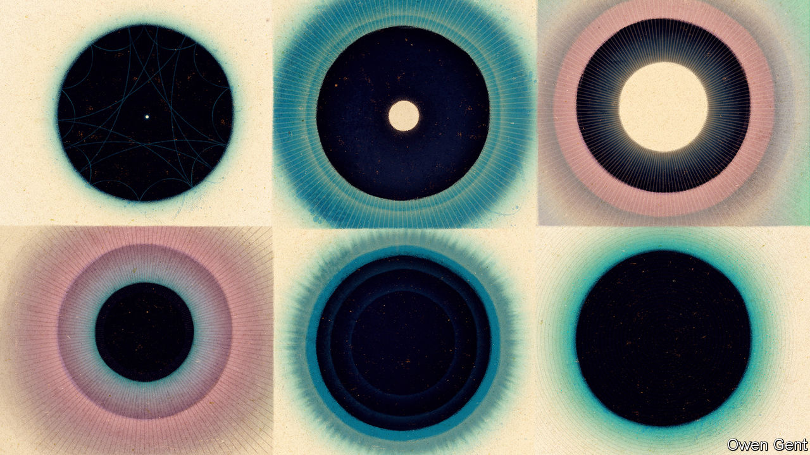
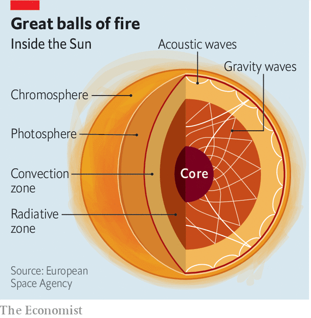

###### Asteroseismology

# Want to know what’s inside a star? Listen closely 

##### Sounds from stars are proving useful to astronomers 

 

> Sep 14th 2022 

In the 1960s astronomers discovered that the Sun was pulsating—expanding and contracting regularly every five minutes. As well as this main oscillation, they later found millions more, each with a unique rhythm. The oscillations were the result of pressure waves that had been bouncing around inside the Sun. As such, they carried with them valuable information about the gases and conditions inside the star. Just as geologists used seismic waves caused by earthquakes to glean information about the rocky innards of Earth, astronomers began to use “sunquakes” to take a peek inside the nearest star.

By “listening” to sound waves from the Sun, “helioseismology” has since allowed astronomers to work out the structure and dynamics of the star’s interior. New observatories are now extending this technique to stars beyond the solar system. “Asteroseismology” will give astronomers a glimpse of the interiors of faraway stars and also help them understand how the Milky Way, the Earth’s galaxy, has evolved.

As seismic waves move through the Earth, they are affected by the materials through which they travel. The speed of these waves, for example, is linked to the temperature, density and chemical composition of the rocks in the core and mantle. Acoustic waves travelling through stars are similarly affected by the composition of materials they encounter. 

Not just a ball of hot gas

At the centre of the Sun is a core in which nuclear fusion takes place; surrounding that is the “radiative zone” where energy is transported via radiation and thermal conduction. Beyond that is the “convection zone” where rising and descending bubbles of plasma create an unstable regime (see diagram).

 


This turbulence is the source of the acoustic waves that give rise to the Sun’s oscillations. While the seismic waves generated by an earthquake usually come from a point source in the Earth’s crust, the Sun’s oscillations are triggered by countless disturbances occurring throughout its convection zone. Like a bell, the Sun is continually ringing with the tones and overtones of the millions of oscillations.

The waves have been a useful way to accurately measure the Sun’s age. By tracking the variations in the speed of the acoustic waves inside the Sun, it was possible to infer the changes in density in the interior of the Sun. From that astronomers worked out how much helium and hydrogen exists in the star. Helium is created by the fusion of hydrogen nuclei in the Sun’s core (a process that makes all stars shine), and measuring the quantities of those elements confirmed that the Sun was 4.6bn years old, matching the ages of the oldest meteorites found on Earth (the other tried and tested way to measure the age of the solar system and, hence, the Sun).

By the end of the 20th century, the Sun’s acoustic waves had also helped solve a longstanding conundrum with the flux of solar neutrinos, a type of fundamental particle created in the fusion reactions at the hearts of stars. For decades there had been a puzzling mismatch between the number of neutrinos coming from the Sun, as measured by astronomers, and the number of neutrinos predicted by particle physicists. Seismological measurements showed that there was nothing wrong with astronomers’ models of how the Sun worked. Particle physicists were then forced to revise their theories about neutrinos, which they had long thought were massless particles. Neutrinos, they concluded, must in fact have a tiny amount of mass and be able to transform from one type to another as they travelled from the Sun to the Earth. This was confirmed experimentally in 2002.

Into the unknown

These successes gave helioseismologists confidence to broaden their horizons. By measuring how much and how fast the surfaces of faraway stars were moving inward or outward, Jørgen Christensen-Dalsgaard, an astrophysicist at Aarhus University in Denmark, was one of the first to detect seismic oscillations in another star—a binary system 37 light years away from Earth—in 1995. But progress on stars beyond the solar system was painfully slow. In order to record just a handful of stellar oscillations in a massive star ten times heavier than the Sun and located 690 light years away from Earth, Conny Aerts, an astrophysicist at ku Leuven, a university in Belgium, had to collate data from two decades of observations that stretched back to the early 1980s. 

Fortunately, Dr Aerts and her colleagues will not have to toil so hard in the future. Help (and lots of data) for asteroseismologists is flooding in from an allied branch of astronomy—the hunt for exoplanets. Looking for planets beyond the solar system requires watching faraway stars for long periods of time and looking for slight changes in their luminosity. These changes can come either from planets transiting across the stars or from oscillations in the stars themselves. Exoplanet observatories such as corot, launched by the French and European space agencies, and , built by nasa, have monitored thousands of stars in recent years with unprecedented precision. The data these missions have gathered has been a gold mine for asteroseismologists, who have used it to examine hundreds of Sun-like stars and several thousand red giants.

After this frenzy of activity, the details of many stars have been updated. A team of French astronomers, for example, recently found that Altair, a fast-rotating, bright star 17 light years away in the constellation Aquila, was only 100m years old, rather than 1bn years as previously thought. They used asteroseismological data from watching fluctuations of Altair’s luminosity, which were in turn caused by the oscillations, and thus the pressure waves, inside the star. In August a team of astronomers updated the age of the binary star 12 Boötis, which was observed by nasa’s Transiting Exoplanet Survey Satellite (tess) observatory. Writing in the journal , researchers calculated the star’s age at 2.67bn years, with a margin of error less than 160m years, or 6%. Traditional dating methods have uncertainties far above 10%. Data from  also revealed strong magnetic fields inside the cores of three red giant stars, situated near the constellations Cygnus and Lyra, each a few thousand light years away. 

tess will continue to provide asteroseismologists with new data, but even better instruments are on their way. The European Space Agency will launch a new exoplanet hunter, plato, in 2026. It will not only monitor hundreds of thousands of Sun-like stars but keep its eyes on tens of thousands of massive stars too.

Though massive stars that are at least eight times heavier than the Sun are a minority in the galaxy, astronomers have a special interest in them. They enrich interstellar environments with heavy elements when they die as supernovae. These remnants are chemical clues that can help to reconstruct the history of the Milky Way. Elements lighter than iron are produced in the cores of massive stars as they burn; heavier elements are created in supernova explosions. Understanding which elements are inside a star, through asteroseismology measurements, can reveal to which generation that star belongs, and so from how many predecessor stars it has been recycled. The Sun, for example, is thought to be a third-generation star, which means it originated from material from a previous star that already was enriched with heavy elements from another predecessor, probably a massive star that ended in a supernova.

“If we want to understand how the Milky Way was assembled, we need to know how each generation of stars behaved,” says Chris Lintott, an astrophysicist at Oxford University. “Understanding stellar evolution in detail is the next step in putting together the history of our galaxy.”■


